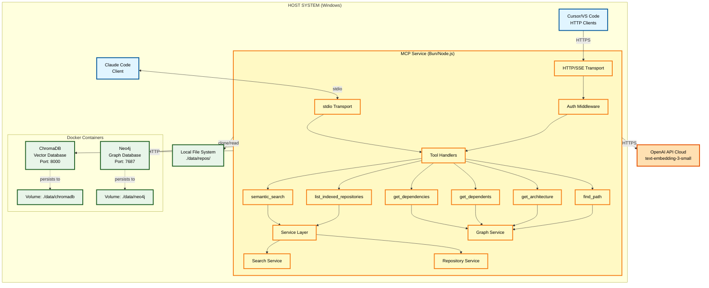

# Personal Knowledge MCP

An AI-first knowledge management service built on the Model Context Protocol (MCP) that enables Claude Code and other AI assistants to efficiently access, retrieve, and utilize knowledge from software development projects and educational materials.

[](https://github.com/sethb75/PersonalKnowledgeMCP/actions/workflows/ci.yml) []() []() []() []()

## Overview

Personal Knowledge MCP is a purpose-built MCP service that creates a semantic bridge between AI development workflows and diverse knowledge sources. Unlike traditional knowledge management systems retrofitted for AI access, this project is designed from the ground up for AI assistant integration.

**Current Status**: V1.0 Complete (Phases 1-5 Complete, Phase 4 Enterprise Features Framework Only)

### Current Capabilities

Personal Knowledge MCP provides a comprehensive suite of AI-powered code intelligence features:

| Capability | Description | Status |
|------------|-------------|--------|
| **Semantic Search** | Natural language code search across repositories | Complete |
| **Multi-Provider Embeddings** | OpenAI, Transformers.js (local), Ollama support | Complete |
| **Knowledge Graph** | Neo4j-powered code dependency analysis | Complete |
| **Dependency Analysis** | Forward dependencies (what code depends on) | Complete |
| **Impact Analysis** | Reverse dependencies (what depends on code) | Complete |
| **Architecture Insights** | Module structure and inter-module dependencies | Complete |
| **Path Finding** | Trace execution flow between code entities | Complete |
| **AST Parsing** | Code-aware indexing for 13 languages | Complete |
| **Incremental Updates** | Fast index updates after PR merges | Complete |
| **Multi-Instance Isolation** | Separate Private/Work/Public knowledge bases | Complete |
| **HTTP Transport** | Cursor, VS Code Continue, and other client support | Complete |
| **Token Authentication** | Secure API access with scoped tokens | Complete |
| **Rate Limiting** | Configurable per-minute/per-hour limits | Complete |
| **OIDC Framework** | Microsoft Entra ID, Auth0, Okta support | Framework Ready |

### When to Use What

| Use Case | Tool | Example Query |
|----------|------|---------------|
| Find code by concept | `semantic_search` | "JWT authentication middleware" |
| Pre-change analysis | `get_dependencies` | "What does auth.ts depend on?" |
| Refactoring impact | `get_dependents` | "What will break if I change validateToken?" |
| Understand structure | `get_architecture` | "Show me the module organization" |
| Trace execution flow | `find_path` | "How does login connect to database?" |
| Repository health | `get_graph_metrics` | "Show dependency statistics" |

### Key Features

- **MCP-Native Architecture**: Purpose-built for AI assistant integration via the Model Context Protocol
- **Semantic Code Search**: AI assistants can find relevant code and documentation without full codebase scans
- **Knowledge Graph**: Neo4j-powered dependency analysis and impact assessment
- **Private Repository Support**: Secure indexing of private GitHub repositories via PAT
- **Vector-Based Retrieval**: Fast, accurate semantic search using ChromaDB
- **Flexible Embedding Providers**: OpenAI (highest quality), Transformers.js (zero-config local), Ollama (GPU acceleration)
- **Multi-Transport Support**: stdio for Claude Code, HTTP/SSE for Cursor and VS Code
- **Local-First Deployment**: Runs entirely on localhost with Docker Compose

## Use Cases

### Software Project Knowledge Management

Manage knowledge for active coding projects with intelligent semantic indexing:

- Index GitHub repositories (private and public)
- Semantic search across code, documentation, and reference materials
- Code dependency analysis and impact assessment
- Efficient context retrieval for AI assistants (reduces token waste)
- Query response times under 500ms (95th percentile)

**Example Query**: *"Find authentication middleware that validates JWT tokens"*

## Technology Stack

| Component | Technology | Purpose |
|-----------|------------|---------|
| Runtime | Bun 1.0+ | Fast all-in-one JavaScript runtime |
| Language | TypeScript 5.3+ | Type-safe development |
| MCP SDK | @modelcontextprotocol/sdk | Official MCP implementation |
| Vector DB | ChromaDB | Semantic search and similarity |
| Graph DB | Neo4j Community 5.x | Code dependency graph and relationships |
| AST Parsing | tree-sitter (web-tree-sitter), Roslyn | Code entity extraction for 13 languages |
| Embeddings | OpenAI, Transformers.js, Ollama | Embedding generation |
| HTTP Server | Express 5.x | HTTP/SSE transport |
| Authentication | Bearer Token, OIDC | Secure API access |
| Deployment | Docker Compose | Container orchestration |
| Testing | Bun Test | Built-in test runner with coverage |

### Supported Languages

The following languages are supported for AST parsing, graph population, and semantic search filtering:

| Category | Languages | Parser |
|----------|-----------|--------|
| TypeScript/JavaScript | TypeScript, TSX, JavaScript, JSX | tree-sitter |
| Systems | Rust, C, C++ | tree-sitter |
| JVM | Java | tree-sitter |
| Go | Go | tree-sitter |
| Scripting | Python, Ruby, PHP | tree-sitter |
| .NET | C# | Roslyn |

## Architecture



## Getting Started

### Prerequisites

- **Bun**: 1.0 or later ([install](https://bun.sh/))
- **Docker Desktop**: For running ChromaDB and Neo4j
- **Git**: For repository cloning
- **OpenAI API Key**: For embedding generation (or use local alternatives)
- **GitHub PAT** (optional): For private repository access

### Quick Start

1. **Clone the repository**:
   ```bash
   git clone https://github.com/sethb75/PersonalKnowledgeMCP.git
   cd PersonalKnowledgeMCP
   ```

2. **Install dependencies**:
   ```bash
   bun install
   ```

3. **Configure environment**:
   ```bash
   cp .env.example .env
   # Edit .env and add your OPENAI_API_KEY and NEO4J_PASSWORD
   ```

4. **Start ChromaDB and Neo4j**:
   ```bash
   docker compose --profile default up -d
   ```

5. **Build the project**:
   ```bash
   bun run build
   ```

6. **Run database migrations** (for Neo4j):
   ```bash
   bun run cli graph migrate
   ```

7. **Index a repository**:
   ```bash
   bun run cli index https://github.com/user/repo.git
   ```

8. **Populate the knowledge graph**:
   ```bash
   bun run cli graph populate repo-name
   ```

9. **Configure Claude Code**:
   Add to your Claude Code MCP configuration (`~/.config/claude-code/mcp.json`):
   ```json
   {
     "mcpServers": {
       "personal-knowledge": {
         "command": "bun",
         "args": ["run", "C:/src/PersonalKnowledgeMCP/dist/index.js"],
         "env": {
           "OPENAI_API_KEY": "${OPENAI_API_KEY}",
           "GITHUB_PAT": "${GITHUB_PAT}",
           "NEO4J_URI": "bolt://localhost:7687",
           "NEO4J_USER": "neo4j",
           "NEO4J_PASSWORD": "${NEO4J_PASSWORD}"
         }
       }
     }
   }
   ```

10. **Query from Claude Code**:
    ```
    Use the semantic_search tool to find authentication middleware
    ```

### Docker Troubleshooting

If you encounter issues with Docker Compose:

**ChromaDB won't start:**

```bash
# Check if Docker Desktop is running
docker --version

# Check if port 8000 is in use
netstat -an | findstr :8000

# View detailed logs
docker compose logs chromadb
```

**Neo4j won't start:**

```bash
# View detailed logs
docker compose logs neo4j

# Check Neo4j health
docker compose exec neo4j cypher-shell -u neo4j -p YOUR_PASSWORD "RETURN 1"
```

**Need to reset data:**

```bash
# WARNING: This deletes all data
docker compose down -v
docker compose --profile default up -d
```

For detailed Docker operations guide, see [docs/docker-operations.md](docs/docker-operations.md).

## Claude Code Integration

Personal Knowledge MCP is designed to seamlessly integrate with Claude Code, providing AI-assisted code search and retrieval capabilities directly in your development workflow.

### Quick Setup

1. **Prerequisites**:
   - Personal Knowledge MCP built and containers running
   - At least one repository indexed and graph populated
   - Bun or Node.js installed

2. **Configure Claude Code**:

   Add the MCP server configuration to your Claude Code MCP settings file (location varies by platform):

   - **Windows**: `%APPDATA%\Claude Code\mcp.json`
   - **macOS**: `~/Library/Application Support/Claude Code/mcp.json`
   - **Linux**: `~/.config/claude-code/mcp.json`

   ```json
   {
     "mcpServers": {
       "personal-knowledge": {
         "command": "bun",
         "args": ["run", "/absolute/path/to/PersonalKnowledgeMCP/dist/index.js"],
         "env": {
           "OPENAI_API_KEY": "${OPENAI_API_KEY}",
           "GITHUB_PAT": "${GITHUB_PAT}",
           "CHROMADB_HOST": "localhost",
           "CHROMADB_PORT": "8000",
           "NEO4J_URI": "bolt://localhost:7687",
           "NEO4J_USER": "neo4j",
           "NEO4J_PASSWORD": "${NEO4J_PASSWORD}"
         }
       }
     }
   }
   ```

3. **Restart Claude Code** to load the new MCP server

4. **Verify Integration**:
   - In Claude Code, you should see tools available:
     - **`semantic_search`**: Search your indexed code semantically
     - **`list_indexed_repositories`**: View indexed repositories
     - **`get_dependencies`**: Analyze code dependencies
     - **`get_dependents`**: Analyze code impact
     - **`get_architecture`**: View module structure
     - **`find_path`**: Trace code connections

   Try asking: *"Can you list my indexed repositories?"*

### Usage Examples

Once integrated, Claude Code can help you find code across your indexed projects:

**Find specific implementations**:
```
Find authentication middleware that validates JWT tokens
```

**Explore code patterns**:
```
Show me examples of error handling in the API layer
```

**Dependency analysis**:
```
What does src/services/auth.ts depend on?
```

**Impact analysis before refactoring**:
```
What code will be affected if I change the validateToken function?
```

**Architecture overview**:
```
Show me the module organization of the services directory
```

**Cross-repository search**:
```
Find all implementations of rate limiting across my projects
```

### HTTP Client Configuration (Cursor, VS Code)

For clients that use HTTP transport instead of stdio:

1. **Enable HTTP transport** in your `.env`:
   ```bash
   HTTP_TRANSPORT_ENABLED=true
   HTTP_PORT=3001
   HTTP_HOST=127.0.0.1
   ```

2. **Create an authentication token**:
   ```bash
   bun run cli token create --name "cursor-dev" --scopes read,write
   ```

3. **Configure your client** with the HTTP endpoint:
   - **Endpoint**: `http://localhost:3001/api/v1/mcp`
   - **Authorization**: `Bearer <your-token>`

See [docs/client-configuration.md](docs/client-configuration.md) for detailed client setup.

### Incremental Update Workflow

After merging a PR to an indexed repository, update your index to include the latest changes:

**Typical Post-PR Workflow:**
```bash
# 1. After PR is merged, update the index
bun run cli update my-project

# 2. Update the knowledge graph
bun run cli graph populate my-project

# 3. Verify update completed
bun run cli status

# 4. (Optional) View update history
bun run cli history my-project
```

**Daily Sync for Multiple Projects:**
```bash
# Update all indexed repositories at once
bun run cli update-all
```

### Performance

The MCP integration is optimized for fast response times:
- Tool discovery: <100ms
- Repository listing: <50ms
- Semantic search: <500ms (95th percentile)
- Dependency queries: <300ms
- Architecture queries: <500ms

### Requirements

- **Bun 1.0+** or **Node.js 18+** (for running the MCP server)
- **Docker Desktop** (for ChromaDB and Neo4j)
- **OpenAI API Key** (for embedding generation, or use local alternatives)
- **At least one indexed repository** (use `bun run cli index <url>`)


## MCP Tools

### semantic_search

Search indexed repositories using natural language queries.

**Parameters**:
- `query` (string, required): Natural language search query
- `limit` (number, optional): Maximum results to return (default: 10, max: 50)
- `threshold` (number, optional): Minimum similarity score 0.0-1.0 (default: 0.7)
- `repository` (string, optional): Filter to specific repository
- `language` (string, optional): Filter by programming language

**Supported Languages for `language` filter**:
`typescript`, `tsx`, `javascript`, `jsx`, `python`, `java`, `go`, `rust`, `csharp`, `c`, `cpp`, `ruby`, `php`

**Example**:
```json
{
  "query": "error handling middleware",
  "limit": 5,
  "threshold": 0.75,
  "language": "typescript"
}
```

### list_indexed_repositories

List all indexed repositories with status and statistics.

**Returns**:
- Repository name and URL
- File count and chunk count
- Last indexed timestamp
- Indexing status (ready, indexing, error)

### get_dependencies

Query what a file, function, or class depends on. Returns imports, calls, and inheritance relationships.

**Parameters**:
- `entity_type` (string, required): Type of entity - `"file"`, `"function"`, or `"class"`
- `entity_path` (string, required): Path or identifier (e.g., `"src/auth/middleware.ts"`)
- `repository` (string, required): Repository name to scope the query
- `depth` (number, optional): Transitive dependency depth 1-5 (default: 1)
- `relationship_types` (array, optional): Filter by relationship type - `["imports", "calls", "extends", "implements", "references"]`

**Example**:
```json
{
  "entity_type": "file",
  "entity_path": "src/services/auth.ts",
  "repository": "my-api",
  "depth": 2
}
```

**Requires**: Neo4j graph database with indexed repository data.

### get_dependents

Query what depends on a file, function, or class. Use for impact analysis before refactoring.

**Parameters**:
- `entity_type` (string, required): Type of entity - `"file"`, `"function"`, `"class"`, or `"package"`
- `entity_path` (string, required): Path or identifier of the entity
- `repository` (string, optional): Repository name (omit to search all)
- `depth` (number, optional): Transitive dependent depth 1-5 (default: 1)
- `include_cross_repo` (boolean, optional): Search across repositories (default: false)

**Example**:
```json
{
  "entity_type": "function",
  "entity_path": "validateToken",
  "repository": "my-api",
  "depth": 2
}
```

**Response includes**:
- List of dependent entities with relationship types
- Impact analysis metrics (direct count, transitive count, impact score)

**Requires**: Neo4j graph database with indexed repository data.

### get_architecture

Get the module structure and inter-module dependencies for a repository.

**Parameters**:
- `repository` (string, required): Repository name
- `module_path` (string, optional): Specific module to analyze

**Returns**: Module hierarchy with dependency relationships.

### find_path

Find the shortest path between two code entities in the dependency graph.

**Parameters**:
- `source_type` (string, required): Source entity type
- `source_path` (string, required): Source entity path
- `target_type` (string, required): Target entity type
- `target_path` (string, required): Target entity path
- `repository` (string, required): Repository name

**Returns**: Path of entities connecting source to target.

> **Note**: Graph tools require Neo4j and AST-parsed repository data. See [Graph Tools Documentation](docs/graph-tools.md) for detailed setup and usage examples.

## Embedding Providers

Personal Knowledge MCP supports multiple embedding providers for generating vector representations of your code.

### Quick Comparison

| Provider | Best For | Requires | Quality | Offline |
|----------|----------|----------|---------|---------|
| **OpenAI** | Highest quality | API key + internet | Highest | No |
| **Transformers.js** | Zero-config, offline | Nothing (default) | Good | Yes |
| **Ollama** | GPU acceleration | Ollama server | Good-High | Yes |

### Default Behavior

- **With `OPENAI_API_KEY` set**: Uses OpenAI (highest quality)
- **Without API key**: Uses Transformers.js (zero-config local)

### Usage

```bash
# Automatic selection (OpenAI if API key set, otherwise Transformers.js)
bun run cli index https://github.com/user/repo

# Explicit provider selection
bun run cli index --provider openai https://github.com/user/repo
bun run cli index --provider transformersjs https://github.com/user/repo
bun run cli index --provider ollama https://github.com/user/repo

# Check available providers
bun run cli providers status
```

For detailed configuration, model options, offline usage, and troubleshooting, see the [Embedding Provider Guide](docs/embedding-providers.md).

## CLI Usage

The Personal Knowledge MCP includes a command-line interface (`pk-mcp`) for managing indexed repositories.

### Installation

After building the project, you can use the CLI directly or install it globally:

```bash
# Build the CLI
bun run build

# Run directly
bun run dist/cli.js --help

# Or install globally
bun link
pk-mcp --help
```

### Commands

#### index - Index a Repository

Clone and index a repository for semantic search.

```bash
pk-mcp index <repository-url> [options]
```

**Options:**
- `-n, --name <name>` - Custom repository name (defaults to repo name from URL)
- `-b, --branch <branch>` - Branch to clone (defaults to repository default branch)
- `-f, --force` - Force reindexing if repository already exists
- `--provider <provider>` - Embedding provider (openai, transformersjs, ollama)

**Examples:**

```bash
# Index a public repository
pk-mcp index https://github.com/user/my-project.git

# Index with custom name and specific branch
pk-mcp index https://github.com/user/repo.git --name my-repo --branch develop

# Reindex an existing repository
pk-mcp index https://github.com/user/repo.git --force
```

#### search - Semantic Search

Search indexed repositories using natural language queries.

```bash
pk-mcp search <query> [options]
```

**Options:**
- `-l, --limit <number>` - Maximum results (1-100, default: 10)
- `-t, --threshold <number>` - Similarity threshold (0.0-1.0, default: 0.7)
- `-r, --repo <name>` - Filter to specific repository
- `--json` - Output as JSON

#### status - List Repositories

List all indexed repositories with their status and statistics.

```bash
pk-mcp status [options]
```

**Options:**
- `--json` - Output as JSON

#### update - Update Repository Index

Incrementally update a repository's index with changes since last indexing.

```bash
pk-mcp update <repository-name> [options]
```

**Options:**
- `-f, --force` - Force full re-index instead of incremental update
- `--json` - Output as JSON
- `-v, --verbose` - Show all errors with actionable guidance

#### graph migrate - Run Graph Migrations

Set up or update the Neo4j schema.

```bash
pk-mcp graph migrate [options]
```

#### graph populate - Populate Knowledge Graph

Parse code and populate the Neo4j knowledge graph for a repository.

```bash
pk-mcp graph populate <repository-name> [options]
```

**Options:**
- `-f, --force` - Force full repopulation

#### graph populate-all - Populate All Repositories

Populate the knowledge graph for all indexed repositories.

```bash
pk-mcp graph populate-all [options]
```

#### token create - Create Authentication Token

Create a new authentication token for HTTP access.

```bash
pk-mcp token create --name <name> --scopes <scopes> [options]
```

**Options:**
- `--name <name>` - Token name (required)
- `--scopes <scopes>` - Comma-separated scopes: read, write, admin
- `--instances <instances>` - Comma-separated instance access: private, work, public
- `--expires <duration>` - Expiration: hours, days, weeks, months, years, never

#### health - Health Check

Check the health of all required services.

```bash
pk-mcp health
```

### CLI Configuration

The CLI uses the same environment variables as the MCP server:

```bash
# Required for OpenAI embeddings
OPENAI_API_KEY=sk-...

# Required for Neo4j
NEO4J_URI=bolt://localhost:7687
NEO4J_USER=neo4j
NEO4J_PASSWORD=your-password

# Optional (defaults shown)
CHROMADB_HOST=localhost
CHROMADB_PORT=8000
DATA_PATH=./data
CLONE_PATH=./data/repositories
LOG_LEVEL=warn
```

## Development

### Project Structure

```
PersonalKnowledgeMCP/
├── src/                          # Source code
│   ├── index.ts                  # MCP server entry point
│   ├── cli.ts                    # CLI entry point
│   ├── mcp/                      # MCP server implementation
│   │   └── tools/                # MCP tool handlers
│   ├── services/                 # Business logic
│   ├── providers/                # Embedding providers
│   ├── storage/                  # ChromaDB client
│   ├── graph/                    # Neo4j graph operations
│   │   ├── parsing/              # AST parsing (tree-sitter, Roslyn)
│   │   ├── extraction/           # Entity and relationship extraction
│   │   └── migration/            # Schema migrations
│   ├── http/                     # HTTP/SSE transport
│   ├── auth/                     # Authentication (token, OIDC)
│   └── ingestion/                # File processing
├── tests/                        # Test suite
│   ├── unit/                     # Unit tests
│   ├── integration/              # Integration tests
│   └── e2e/                      # End-to-end tests
├── docs/                         # Documentation
│   ├── architecture/             # Technical design docs
│   └── pm/                       # Project management
├── config/                       # Configuration files
├── docker-compose.yml            # Container deployment
└── package.json                  # Dependencies
```

### Available Scripts

```bash
bun run build         # Compile TypeScript with Bun
bun run dev           # Development mode with watch
bun test              # Run test suite with Bun's built-in runner
bun test --watch      # Run tests in watch mode
bun test --coverage   # Run tests with coverage report (90% minimum)
bun run lint          # Run ESLint
bun run format        # Format code with Prettier
bun run typecheck     # TypeScript type checking
bun run cli           # Run CLI commands
```

### Running Tests

```bash
# Run all tests
bun test

# Run with coverage (minimum 90% required)
bun test --coverage

# Run specific test file
bun test tests/unit/search-service.test.ts

# Run in watch mode
bun test --watch
```

## Documentation

### Getting Started
- **[Claude Code Setup Guide](docs/claude-code-setup.md)** - Complete MCP integration guide
- **[Client Configuration](docs/client-configuration.md)** - HTTP client setup (Cursor, VS Code)

### Reference Documentation
- **[CLI Commands Reference](docs/cli-commands-reference.md)** - Complete CLI command documentation
- **[MCP Tools API Reference](docs/mcp-tools-reference.md)** - Formal API documentation for all MCP tools
- **[Configuration Reference](docs/configuration-reference.md)** - All environment variables and settings

### Feature Guides
- **[Embedding Provider Guide](docs/embedding-providers.md)** - OpenAI, Transformers.js, and Ollama configuration
- **[Graph Tools Guide](docs/graph-tools.md)** - Dependency analysis and impact assessment tools
- **[Neo4j Setup Guide](docs/neo4j-setup.md)** - Knowledge graph database setup

### Operations
- **[Docker Operations Guide](docs/docker-operations.md)** - ChromaDB and container management
- **[Troubleshooting Guide](docs/troubleshooting.md)** - Common issues and solutions
- **[Performance Tuning Guide](docs/performance-tuning-guide.md)** - Optimization strategies

### Architecture & Design
- **[Feature Summary](docs/feature-summary.md)** - Complete feature list, status, and known limitations (all phases)
- **[System Design Document](docs/architecture/Phase1-System-Design-Document.md)** - Technical architecture and implementation details
- **[Docker Containerization PRD](docs/pm/Docker-Containerization-PRD.md)** - Multi-transport MCP, security architecture, and deployment strategy
- **[Knowledge Graph PRD](docs/pm/knowledge-graph-PRD.md)** - Graph database design and tools

### Development
- **[Project Configuration](.claude/CLAUDE.md)** - Development guidelines for Claude Code

## Performance Targets

### Query Performance

- MCP query response: **<500ms** (95th percentile)
- MCP query response: **<200ms** (50th percentile)
- Vector similarity search: **<200ms**
- Dependency queries: **<300ms**
- Architecture queries: **<500ms**

### Ingestion Performance

- Small repository (<500 files): **<5 minutes**
- Medium repository (500-2000 files): **<15 minutes**
- Batch embedding generation: **>100 files/min**

## Testing

The project maintains **90% minimum test coverage** across all components.

**Test Priorities**:
- MCP tool handlers: 95% coverage (P0)
- Search service: 95% coverage (P0)
- Embedding provider: 90% coverage (P0)
- ChromaDB client: 90% coverage (P0)
- Graph service: 90% coverage (P0)
- File processing: 85-95% coverage (P1)

## Security

- **Localhost Only**: No network exposure by default
- **Secret Management**: All secrets in `.env` files (never committed)
- **Input Validation**: All MCP tool inputs validated with Zod schemas
- **GitHub PAT**: Secure private repository access
- **No Credential Logging**: API keys and tokens never logged or exposed in errors
- **Bearer Token Auth**: Scoped tokens with configurable expiration
- **Rate Limiting**: Configurable per-minute/per-hour request limits

### ChromaDB Authentication

ChromaDB supports optional token-based authentication to secure the vector database from unauthorized access.

#### Enabling Authentication

1. **Generate a secure token**:
   ```bash
   openssl rand -hex 32
   ```

2. **Configure the token** in your `.env` file:
   ```bash
   CHROMADB_AUTH_TOKEN=your-generated-token-here
   ```

3. **Restart the services**:
   ```bash
   docker compose down
   docker compose --profile default up -d
   ```

## Roadmap

### Phase 1: Core MCP + Vector Search (Complete)
- MCP service with semantic_search and list_indexed_repositories tools
- ChromaDB vector storage
- OpenAI embedding generation
- GitHub repository cloning and indexing
- Private repository support via PAT
- CLI commands (index, search, status, remove, update, update-all, history)
- Incremental updates with change detection
- 90% test coverage
- Query response <500ms (p95)

### Phase 2: Code Intelligence + Multi-Provider Embeddings (Complete)
- **Local Embeddings** - Transformers.js (zero-config) and Ollama (GPU) support
- **Multi-Provider Architecture** - Pluggable embedding providers with per-repository configuration
- **Provider CLI Commands** - Status, setup, and provider selection

### Phase 3: Multi-Instance + Containerization (Complete)
- **Docker Compose Hardening** - Production-ready container configuration
- **Multi-Transport MCP** - HTTP/SSE transport alongside stdio for cross-client support
- **Bearer Token Authentication** - Secure HTTP endpoints with CLI management
- **Multi-Instance Architecture** - Private/Work/Public security tier isolation
- **Rate Limiting** - Configurable per-minute/per-hour limits
- **CORS Support** - Browser client compatibility

### Phase 4: Enterprise Features + Automation (Framework Ready)
- **OpenID Connect (OIDC)** - Microsoft Entra ID, Auth0, Okta integration framework
- **User Mapping** - Claim-based instance access control
- **PostgreSQL** - Configured in Docker Compose for document store
- **Kubernetes Deployment** - Helm charts prepared

### Phase 5: Knowledge Graph Search (Complete)
- **Neo4j Integration** - Graph database for code dependency analysis
- **AST Parsing** - Tree-sitter integration for 12 languages + Roslyn for C#
- **Graph MCP Tools** - get_dependencies, get_dependents, get_architecture, find_path, get_graph_metrics
- **Entity Extraction** - Functions, classes, interfaces, and relationships from code
- **Graph Schema Migrations** - CLI commands for database setup
- **Incremental Graph Updates** - Graph extraction integrated with update pipeline
- **Graph Query Metrics** - Performance monitoring and statistics

### Phase 6: Unstructured Document Ingestion (Planned)
- PDF document ingestion and text extraction
- Microsoft Word (.docx) document support
- Local folder watching with automatic re-indexing
- Image metadata extraction
- Markdown file processing with frontmatter support

See [Phase 6 PRD](docs/pm/Phase6-Document-Ingestion-PRD.md) for detailed requirements.

### Future Roadmap
- Automated update pipelines with GitHub webhooks
- Azure DevOps repository integration
- Cloud storage integration (OneDrive, Google Drive)

## Contributing

We welcome contributions! Please see [CONTRIBUTING.md](CONTRIBUTING.md) for detailed guidelines on:
- Setting up your development environment
- Code standards and conventions
- Testing requirements
- Pull request process

**Quick Start for Contributors**:
```bash
git clone https://github.com/YOUR_USERNAME/PersonalKnowledgeMCP.git
cd PersonalKnowledgeMCP
bun install
cp .env.example .env
# Edit .env with your API keys
docker compose --profile default up -d
bun test --coverage
```

Development workflow:
- Follow guidelines in [.claude/CLAUDE.md](.claude/CLAUDE.md)
- Work in feature branches (`feature/`, `fix/`, `docs/`)
- Create PRs for all changes
- Ensure tests pass and coverage >= 90%
- Pre-commit hooks will auto-format and lint your code

## Code Statistics

Generated with [cloc](https://github.com/AlDanial/cloc) (excluding node_modules, dist, .bun-cache, coverage, data):

| Language | Files | Blank | Comment | Code |
|:---------|------:|------:|--------:|-----:|
| TypeScript | 350 | 18,212 | 30,712 | 82,144 |
| Markdown | 53 | 7,271 | 9 | 23,418 |
| YAML | 68 | 332 | 580 | 3,188 |
| JSON | 14 | 5 | 0 | 2,529 |
| Bourne Shell | 9 | 479 | 527 | 1,956 |
| PowerShell | 4 | 399 | 281 | 1,232 |
| C# | 9 | 219 | 315 | 1,022 |
| Go | 1 | 38 | 40 | 154 |
| Rust | 1 | 42 | 47 | 150 |
| Java | 3 | 28 | 58 | 104 |
| Text | 3 | 31 | 0 | 91 |
| PHP | 1 | 22 | 70 | 87 |
| C++ | 1 | 22 | 15 | 65 |
| Python | 5 | 44 | 59 | 59 |
| INI | 2 | 0 | 0 | 50 |
| C | 1 | 12 | 20 | 38 |
| Dockerfile | 1 | 22 | 38 | 36 |
| Ruby | 1 | 10 | 20 | 35 |
| JavaScript | 2 | 7 | 9 | 33 |
| XML | 2 | 0 | 0 | 27 |
| TOML | 1 | 11 | 17 | 14 |
| SQL | 1 | 3 | 16 | 9 |
| **SUM** | **536** | **27,220** | **32,851** | **116,473** |

## License

This project is licensed under the MIT License - see the [LICENSE](LICENSE) file for details.

## Acknowledgments

Built using:
- [Model Context Protocol](https://modelcontextprotocol.io/) by Anthropic
- [Bun](https://bun.sh/) - Fast all-in-one JavaScript runtime
- [ChromaDB](https://www.trychroma.com/) vector database
- [Neo4j](https://neo4j.com/) graph database
- [OpenAI Embeddings API](https://platform.openai.com/docs/guides/embeddings)
- [tree-sitter](https://tree-sitter.github.io/) parser
- [simple-git](https://github.com/steveukx/git-js) for Git operations
- [TypeScript](https://www.typescriptlang.org/)
