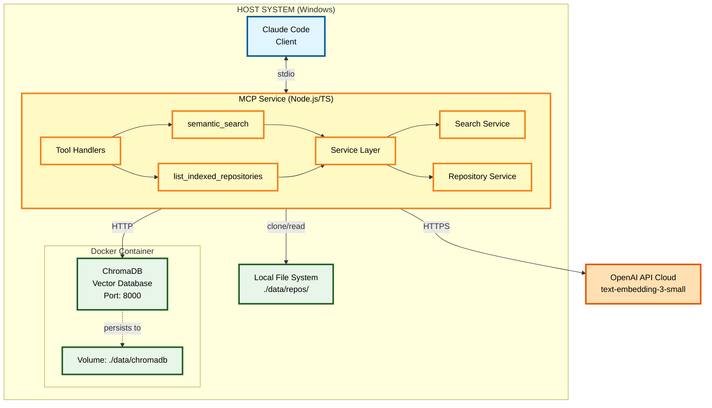

# Personal Knowledge MCP

An AI-first knowledge management service built on the Model Context Protocol (MCP) that enables Claude Code and other AI assistants to efficiently access, retrieve, and utilize knowledge from software development projects and educational materials.

[](https://github.com/sethb75/PersonalKnowledgeMCP/actions/workflows/ci.yml) []() []() []() []()

## Overview

Personal Knowledge MCP is a purpose-built MCP service that creates a semantic bridge between AI development workflows and diverse knowledge sources. Unlike traditional knowledge management systems retrofitted for AI access, this project is designed from the ground up for AI assistant integration.

**Current Phase**: Phase 1 - Core MCP + Vector Search

### Key Features

- **MCP-Native Architecture**: Purpose-built for AI assistant integration via the Model Context Protocol
- **Semantic Code Search**: AI assistants can find relevant code and documentation without full codebase scans
- **Private Repository Support**: Secure indexing of private GitHub repositories via PAT
- **Vector-Based Retrieval**: Fast, accurate semantic search using ChromaDB
- **OpenAI Embeddings**: High-quality semantic understanding with text-embedding-3-small
- **Local-First Deployment**: Runs entirely on localhost with Docker Compose

## Use Cases

### Software Project Knowledge Management

Manage knowledge for active coding projects with intelligent semantic indexing:

- Index GitHub repositories (private and public)
- Semantic search across code, documentation, and reference materials
- Efficient context retrieval for AI assistants (reduces token waste)
- Query response times under 500ms (95th percentile)

**Example Query**: *"Find authentication middleware that validates JWT tokens"*

## Technology Stack

### Phase 1 Stack

| Component | Technology | Purpose |
|-----------|------------|---------|
| Runtime | Bun 1.0+ | Fast all-in-one JavaScript runtime |
| Language | TypeScript 5.3+ | Type-safe development |
| MCP SDK | @modelcontextprotocol/sdk | Official MCP implementation |
| Vector DB | ChromaDB | Semantic search and similarity |
| Embeddings | OpenAI text-embedding-3-small | Embedding generation |
| Deployment | Docker Compose | ChromaDB containerization |
| Testing | Bun Test | Built-in test runner with coverage |

### Future Phases

- **Phase 2**: Tree-sitter (AST parsing), PostgreSQL (document store), local file ingestion
- **Phase 3**: Multi-instance architecture, Azure DevOps integration, authentication layer
- **Phase 4**: Neo4j (graph relationships), automated update pipelines

## Architecture



## Getting Started

### Prerequisites

- **Bun**: 1.0 or later ([install](https://bun.sh/))
- **Docker Desktop**: For running ChromaDB
- **Git**: For repository cloning
- **OpenAI API Key**: For embedding generation
- **GitHub PAT** (optional): For private repository access

### Quick Start

1. **Clone the repository**:
   ```bash
   git clone https://github.com/sethb75/PersonalKnowledgeMCP.git
   cd PersonalKnowledgeMCP
   ```

2. **Install dependencies**:
   ```bash
   bun install
   ```

3. **Configure environment**:
   ```bash
   cp .env.example .env
   # Edit .env and add your OPENAI_API_KEY
   ```

4. **Start ChromaDB**:
   ```bash
   docker-compose up -d
   ```

5. **Build the project**:
   ```bash
   bun run build
   ```

6. **Set up Git hooks** (optional but recommended):
   ```bash
   # Pre-commit hooks are automatically set up during install
   # They will run linting and formatting before each commit
   ```

7. **Index a repository** (CLI):
   ```bash
   bun run cli index https://github.com/user/repo.git
   ```

8. **Configure Claude Code**:
   Add to your Claude Code MCP configuration (`~/.config/claude-code/mcp.json`):
   ```json
   {
     "mcpServers": {
       "personal-knowledge": {
         "command": "bun",
         "args": ["run", "C:/src/PersonalKnowledgeMCP/dist/index.js"],
         "env": {
           "OPENAI_API_KEY": "${OPENAI_API_KEY}",
           "GITHUB_PAT": "${GITHUB_PAT}"
         }
       }
     }
   }
   ```

9. **Query from Claude Code**:
   ```
   Use the semantic_search tool to find authentication middleware
   ```

## MCP Tools

### semantic_search

Search indexed repositories using natural language queries.

**Parameters**:
- `query` (string, required): Natural language search query
- `limit` (number, optional): Maximum results to return (default: 10, max: 50)
- `threshold` (number, optional): Minimum similarity score 0.0-1.0 (default: 0.7)
- `repository` (string, optional): Filter to specific repository

**Example**:
```json
{
  "query": "error handling middleware",
  "limit": 5,
  "threshold": 0.75
}
```

### list_indexed_repositories

List all indexed repositories with status and statistics.

**Returns**:
- Repository name and URL
- File count and chunk count
- Last indexed timestamp
- Indexing status (ready, indexing, error)

## Development

### Project Structure

```
PersonalKnowledgeMCP/
├── src/                          # Source code
│   ├── index.ts                  # MCP server entry point
│   ├── cli.ts                    # CLI entry point
│   ├── mcp/                      # MCP server implementation
│   ├── services/                 # Business logic
│   ├── providers/                # Embedding providers
│   ├── storage/                  # ChromaDB client
│   └── ingestion/                # File processing
├── tests/                        # Test suite
│   ├── unit/                     # Unit tests
│   ├── integration/              # Integration tests
│   └── e2e/                      # End-to-end tests
├── docs/                         # Documentation
│   ├── Phase1-Core-MCP-Vector-Search-PRD.md
│   ├── architecture/             # Technical design docs
│   └── pm/                       # Project management
├── config/                       # Configuration files
├── docker-compose.yml            # ChromaDB deployment
└── package.json                  # Dependencies
```

### Available Scripts

```bash
bun run build         # Compile TypeScript with Bun
bun run dev           # Development mode with watch
bun test              # Run test suite with Bun's built-in runner
bun test --watch      # Run tests in watch mode
bun test --coverage   # Run tests with coverage report (90% minimum)
bun run lint          # Run ESLint
bun run format        # Format code with Prettier
bun run cli           # Run CLI commands
```

### Running Tests

```bash
# Run all tests
bun test

# Run with coverage (minimum 90% required)
bun test --coverage

# Run specific test file
bun test tests/unit/search-service.test.ts

# Run in watch mode
bun test --watch
```

### CLI Commands

```bash
# Index a repository
bun run cli index <repository-url> [--name <custom-name>]

# Search indexed code
bun run cli search "query text" [--limit 10] [--threshold 0.7]

# List indexed repositories
bun run cli status

# Remove a repository
bun run cli remove <repository-name>

# Health check
bun run cli health
```

## Documentation

- **[Phase 1 PRD](docs/Phase1-Core-MCP-Vector-Search-PRD.md)** - Product requirements for Phase 1
- **[System Design Document](docs/architecture/Phase1-System-Design-Document.md)** - Technical architecture and implementation details
- **[Project Configuration](.claude/CLAUDE.md)** - Development guidelines for Claude Code
- **[Review Summary](docs/pm/phase1-review-summary.md)** - Document review and issue creation strategy

## Performance Targets

### Query Performance (Phase 1)

- MCP query response: **<500ms** (95th percentile)
- MCP query response: **<200ms** (50th percentile)
- Vector similarity search: **<200ms**

### Ingestion Performance (Phase 1)

- Small repository (<500 files): **<5 minutes**
- Medium repository (500-2000 files): **<15 minutes**
- Batch embedding generation: **>100 files/min**

## Testing

The project maintains **90% minimum test coverage** across all components.

**Test Priorities**:
- MCP tool handlers: 95% coverage (P0)
- Search service: 95% coverage (P0)
- Embedding provider: 90% coverage (P0)
- ChromaDB client: 90% coverage (P0)
- File processing: 85-95% coverage (P1)

## Security

- **Localhost Only**: No network exposure by default
- **Secret Management**: All secrets in `.env` files (never committed)
- **Input Validation**: All MCP tool inputs validated with Zod schemas
- **GitHub PAT**: Secure private repository access
- **No Credential Logging**: API keys and tokens never logged or exposed in errors

## Roadmap

### ✅ Phase 0: Planning and Design (Complete)
- Product requirements and system design
- Technology decisions and architecture
- GitHub issues and project planning

### 🚧 Phase 1: Core MCP + Vector Search (In Progress)
**Target**: January 14, 2025

**Must Have**:
- MCP service with semantic_search and list_indexed_repositories tools
- ChromaDB vector storage
- OpenAI embedding generation
- GitHub repository cloning and indexing
- Private repository support via PAT
- CLI commands (index, search, status, remove)
- 90% test coverage
- Query response <500ms (p95)

### 📋 Phase 2: Code Intelligence + Local Files
- AST parsing with tree-sitter
- PostgreSQL document store
- Local folder ingestion with file watcher
- Markdown/PDF extraction

### 📋 Phase 3: Multi-Instance + Azure DevOps
- Multi-instance architecture
- Authentication layer
- Azure DevOps integration
- Instance-specific routing

### 📋 Phase 4: Graph Relationships + Automation
- Neo4j graph database
- Code dependency extraction
- Automated update pipelines
- GitHub webhook handler

## Contributing

We welcome contributions! Please see [CONTRIBUTING.md](CONTRIBUTING.md) for detailed guidelines on:
- Setting up your development environment
- Code standards and conventions
- Testing requirements
- Pull request process

**Quick Start for Contributors**:
```bash
git clone https://github.com/YOUR_USERNAME/PersonalKnowledgeMCP.git
cd PersonalKnowledgeMCP
bun install
cp .env.example .env
# Edit .env with your API keys
docker-compose up -d
bun test --coverage
```

Development workflow:
- Follow guidelines in [.claude/CLAUDE.md](.claude/CLAUDE.md)
- Work in feature branches (`feature/`, `fix/`, `docs/`)
- Create PRs for all changes
- Ensure tests pass and coverage ≥90%
- Pre-commit hooks will auto-format and lint your code

## License

*(To be determined)*

## Acknowledgments

Built using:
- [Model Context Protocol](https://modelcontextprotocol.io/) by Anthropic
- [Bun](https://bun.sh/) - Fast all-in-one JavaScript runtime
- [ChromaDB](https://www.trychroma.com/) vector database
- [OpenAI Embeddings API](https://platform.openai.com/docs/guides/embeddings)
- [simple-git](https://github.com/steveukx/git-js) for Git operations
- [TypeScript](https://www.typescriptlang.org/)
