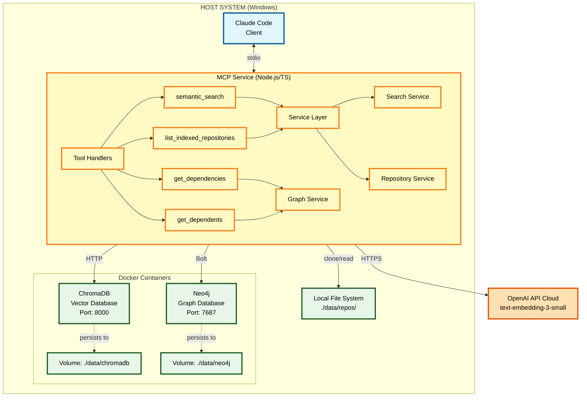

# Personal Knowledge MCP

An AI-first knowledge management service built on the Model Context Protocol (MCP) that enables Claude Code and other AI assistants to efficiently access, retrieve, and utilize knowledge from software development projects and educational materials.

[](https://github.com/sethb75/PersonalKnowledgeMCP/actions/workflows/ci.yml) []() []() []() []()

## Overview

Personal Knowledge MCP is a purpose-built MCP service that creates a semantic bridge between AI development workflows and diverse knowledge sources. Unlike traditional knowledge management systems retrofitted for AI access, this project is designed from the ground up for AI assistant integration.

**Current Phase**: Phase 1 - Core MCP + Vector Search

### Key Features

- **MCP-Native Architecture**: Purpose-built for AI assistant integration via the Model Context Protocol
- **Semantic Code Search**: AI assistants can find relevant code and documentation without full codebase scans
- **Private Repository Support**: Secure indexing of private GitHub repositories via PAT
- **Vector-Based Retrieval**: Fast, accurate semantic search using ChromaDB
- **OpenAI Embeddings**: High-quality semantic understanding with text-embedding-3-small
- **Local-First Deployment**: Runs entirely on localhost with Docker Compose

## Use Cases

### Software Project Knowledge Management

Manage knowledge for active coding projects with intelligent semantic indexing:

- Index GitHub repositories (private and public)
- Semantic search across code, documentation, and reference materials
- Efficient context retrieval for AI assistants (reduces token waste)
- Query response times under 500ms (95th percentile)

**Example Query**: *"Find authentication middleware that validates JWT tokens"*

## Technology Stack

### Phase 1 Stack

| Component | Technology | Purpose |
|-----------|------------|---------|
| Runtime | Bun 1.0+ | Fast all-in-one JavaScript runtime |
| Language | TypeScript 5.3+ | Type-safe development |
| MCP SDK | @modelcontextprotocol/sdk | Official MCP implementation |
| Vector DB | ChromaDB | Semantic search and similarity |
| Embeddings | OpenAI text-embedding-3-small | Embedding generation |
| Deployment | Docker Compose | ChromaDB containerization |
| Testing | Bun Test | Built-in test runner with coverage |

### Phase 2 Stack (Current)

| Component | Technology | Purpose |
|-----------|------------|---------|
| Graph DB | Neo4j Community | Code dependency graph and relationships |
| Graph Protocol | Bolt | Neo4j connection protocol |
| Graph Tools | get_dependencies, get_dependents | Dependency analysis MCP tools |

### Future Phases

- **Phase 2** (in progress): Tree-sitter (AST parsing), PostgreSQL (document store), local file ingestion
- **Phase 3**: Multi-instance architecture, Azure DevOps integration, authentication layer
- **Phase 4**: Automated update pipelines, GitHub webhooks

## Architecture



## Getting Started

### Prerequisites

- **Bun**: 1.0 or later ([install](https://bun.sh/))
- **Docker Desktop**: For running ChromaDB
- **Git**: For repository cloning
- **OpenAI API Key**: For embedding generation
- **GitHub PAT** (optional): For private repository access

### Quick Start

1. **Clone the repository**:
   ```bash
   git clone https://github.com/sethb75/PersonalKnowledgeMCP.git
   cd PersonalKnowledgeMCP
   ```

2. **Install dependencies**:
   ```bash
   bun install
   ```

3. **Configure environment**:
   ```bash
   cp .env.example .env
   # Edit .env and add your OPENAI_API_KEY
   ```

4. **Start ChromaDB**:
   ```bash
   docker-compose up -d
   ```

5. **Build the project**:
   ```bash
   bun run build
   ```

6. **Set up Git hooks** (optional but recommended):
   ```bash
   # Pre-commit hooks are automatically set up during install
   # They will run linting and formatting before each commit
   ```

7. **Index a repository** (CLI):
   ```bash
   bun run cli index https://github.com/user/repo.git
   ```

8. **Configure Claude Code**:
   Add to your Claude Code MCP configuration (`~/.config/claude-code/mcp.json`):
   ```json
   {
     "mcpServers": {
       "personal-knowledge": {
         "command": "bun",
         "args": ["run", "C:/src/PersonalKnowledgeMCP/dist/index.js"],
         "env": {
           "OPENAI_API_KEY": "${OPENAI_API_KEY}",
           "GITHUB_PAT": "${GITHUB_PAT}"
         }
       }
     }
   }
   ```

9. **Query from Claude Code**:
   ```
   Use the semantic_search tool to find authentication middleware
   ```

### Docker Troubleshooting

If you encounter issues with Docker Compose:

**ChromaDB won't start:**

```bash
# Check if Docker Desktop is running
docker --version

# Check if port 8000 is in use
netstat -an | findstr :8000

# View detailed logs
docker-compose logs chromadb
```

**API not responding:**

```bash
# Wait up to 30 seconds for initialization
# Then test the API endpoint
curl http://localhost:8000/api/v2/heartbeat

# Check container status
docker ps | grep pk-mcp-chromadb
```

**Need to reset data:**

```bash
# WARNING: This deletes all data
docker-compose down -v
docker-compose up -d
```

For detailed Docker operations guide, see [docs/docker-operations.md](docs/docker-operations.md).

## Claude Code Integration

Personal Knowledge MCP is designed to seamlessly integrate with Claude Code, providing AI-assisted code search and retrieval capabilities directly in your development workflow.

### Quick Setup

1. **Prerequisites**:
   - Personal Knowledge MCP built and ChromaDB running
   - At least one repository indexed
   - Bun or Node.js installed

2. **Configure Claude Code**:

   Add the MCP server configuration to your Claude Code MCP settings file (location varies by platform):

   - **Windows**: `%APPDATA%\Claude Code\mcp.json`
   - **macOS**: `~/Library/Application Support/Claude Code/mcp.json`
   - **Linux**: `~/.config/claude-code/mcp.json`

   ```json
   {
     "mcpServers": {
       "personal-knowledge": {
         "command": "bun",
         "args": ["run", "/absolute/path/to/PersonalKnowledgeMCP/dist/index.js"],
         "env": {
           "OPENAI_API_KEY": "${OPENAI_API_KEY}",
           "GITHUB_PAT": "${GITHUB_PAT}",
           "CHROMADB_HOST": "localhost",
           "CHROMADB_PORT": "8000"
         }
       }
     }
   }
   ```

3. **Restart Claude Code** to load the new MCP server

4. **Verify Integration**:
   - In Claude Code, you should see two new tools available:
     - **`semantic_search`**: Search your indexed code semantically
     - **`list_indexed_repositories`**: View indexed repositories

   Try asking: *"Can you list my indexed repositories?"*

### Usage Examples

Once integrated, Claude Code can help you find code across your indexed projects:

**Find specific implementations**:
```
Find authentication middleware that validates JWT tokens
```

**Explore code patterns**:
```
Show me examples of error handling in the API layer
```

**Understand architecture**:
```
Where is the database connection logic implemented?
```

**Cross-repository search**:
```
Find all implementations of rate limiting across my projects
```

**Dependency analysis** (with graph tools):
```
What does src/services/auth.ts depend on?
```

**Impact analysis before refactoring** (with graph tools):
```
What code will be affected if I change the validateToken function?
```

### Incremental Update Workflow

After merging a PR to an indexed repository, update your index to include the latest changes:

**Typical Post-PR Workflow:**
```bash
# 1. After PR is merged, update the index
bun run cli update my-project

# 2. Verify update completed
bun run cli status

# 3. (Optional) View update history
bun run cli history my-project
```

**Daily Sync for Multiple Projects:**
```bash
# Update all indexed repositories at once
bun run cli update-all
```

**Handling Stale or Problematic Index:**
```bash
# If updates fail or index seems stale, force full re-index
bun run cli update my-project --force

# Or re-index from scratch
bun run cli index https://github.com/user/my-project --force
```

**Agent Integration:**
When using Claude Code or other AI assistants, the agent can automatically trigger updates after completing PR-related tasks:
```
After merging this PR, please update the repository index.
```

### Performance

The MCP integration is optimized for fast response times:
- Tool discovery: <100ms
- Repository listing: <50ms
- Semantic search: <500ms (95th percentile)

### Advanced Configuration

For detailed setup instructions, troubleshooting, and advanced configuration options, see:
- **[Claude Code Setup Guide](docs/claude-code-setup.md)** - Complete setup and configuration
- **[Troubleshooting Guide](docs/troubleshooting.md)** - Common issues and solutions

### Requirements

- **Bun 1.0+** or **Node.js 18+** (for running the MCP server)
- **Docker Desktop** (for ChromaDB)
- **OpenAI API Key** (for embedding generation)
- **At least one indexed repository** (use `bun run cli index <url>`)


## MCP Tools

### semantic_search

Search indexed repositories using natural language queries.

**Parameters**:
- `query` (string, required): Natural language search query
- `limit` (number, optional): Maximum results to return (default: 10, max: 50)
- `threshold` (number, optional): Minimum similarity score 0.0-1.0 (default: 0.7)
- `repository` (string, optional): Filter to specific repository

**Example**:
```json
{
  "query": "error handling middleware",
  "limit": 5,
  "threshold": 0.75
}
```

### list_indexed_repositories

List all indexed repositories with status and statistics.

**Returns**:
- Repository name and URL
- File count and chunk count
- Last indexed timestamp
- Indexing status (ready, indexing, error)

### get_dependencies

Query what a file, function, or class depends on. Returns imports, calls, and inheritance relationships.

**Parameters**:
- `entity_type` (string, required): Type of entity - `"file"`, `"function"`, or `"class"`
- `entity_path` (string, required): Path or identifier (e.g., `"src/auth/middleware.ts"`)
- `repository` (string, required): Repository name to scope the query
- `depth` (number, optional): Transitive dependency depth 1-5 (default: 1)
- `relationship_types` (array, optional): Filter by relationship type - `["imports", "calls", "extends", "implements", "references"]`

**Example**:
```json
{
  "entity_type": "file",
  "entity_path": "src/services/auth.ts",
  "repository": "my-api",
  "depth": 2
}
```

**Requires**: Neo4j graph database with indexed repository data.

### get_dependents

Query what depends on a file, function, or class. Use for impact analysis before refactoring.

**Parameters**:
- `entity_type` (string, required): Type of entity - `"file"`, `"function"`, `"class"`, or `"package"`
- `entity_path` (string, required): Path or identifier of the entity
- `repository` (string, optional): Repository name (omit to search all)
- `depth` (number, optional): Transitive dependent depth 1-5 (default: 1)
- `include_cross_repo` (boolean, optional): Search across repositories (default: false)

**Example**:
```json
{
  "entity_type": "function",
  "entity_path": "validateToken",
  "repository": "my-api",
  "depth": 2
}
```

**Response includes**:
- List of dependent entities with relationship types
- Impact analysis metrics (direct count, transitive count, impact score)

**Requires**: Neo4j graph database with indexed repository data.

> **Note**: Graph tools require Neo4j and AST-parsed repository data. See [Graph Tools Documentation](docs/graph-tools.md) for detailed setup and usage examples.

## CLI Usage

The Personal Knowledge MCP includes a command-line interface (`pk-mcp`) for managing indexed repositories.

### Installation

After building the project, you can use the CLI directly or install it globally:

```bash
# Build the CLI
bun run build

# Run directly
bun run dist/cli.js --help

# Or install globally
bun link
pk-mcp --help
```

### Commands

#### index - Index a Repository

Clone and index a repository for semantic search.

```bash
pk-mcp index <repository-url> [options]
```

**Options:**
- `-n, --name <name>` - Custom repository name (defaults to repo name from URL)
- `-b, --branch <branch>` - Branch to clone (defaults to repository default branch)
- `-f, --force` - Force reindexing if repository already exists

**Examples:**

```bash
# Index a public repository
pk-mcp index https://github.com/user/my-project.git

# Index with custom name and specific branch
pk-mcp index https://github.com/user/repo.git --name my-repo --branch develop

# Reindex an existing repository
pk-mcp index https://github.com/user/repo.git --force
```

**Output:** Real-time progress through cloning, scanning, chunking, embedding, and storing phases. Shows final statistics including files processed, chunks created, embeddings generated, and duration.

#### search - Semantic Search

Search indexed repositories using natural language queries.

```bash
pk-mcp search <query> [options]
```

**Options:**
- `-l, --limit <number>` - Maximum results (1-100, default: 10)
- `-t, --threshold <number>` - Similarity threshold (0.0-1.0, default: 0.7)
- `-r, --repo <name>` - Filter to specific repository
- `--json` - Output as JSON

**Examples:**

```bash
# Basic search
pk-mcp search "authentication middleware"

# Search with custom limit and threshold
pk-mcp search "error handling" --limit 5 --threshold 0.8

# Search specific repository
pk-mcp search "database query" --repo my-api

# JSON output for programmatic use
pk-mcp search "API endpoints" --json
```

**Output:** Table showing rank, repository, file path, code snippet, and similarity score. JSON output includes full metadata.

#### status - List Repositories

List all indexed repositories with their status and statistics.

```bash
pk-mcp status [options]
```

**Options:**
- `--json` - Output as JSON

**Examples:**

```bash
# List repositories
pk-mcp status

# JSON output
pk-mcp status --json
```

**Output:** Table showing repository name, URL, file count, chunk count, last indexed timestamp, and status (✓ ready, ⟳ indexing, ✗ error).

#### remove - Remove Repository

Remove a repository from the index.

```bash
pk-mcp remove <repository-name> [options]
```

**Options:**
- `-f, --force` - Skip confirmation prompt
- `--delete-files` - Also delete local repository files

**Examples:**

```bash
# Remove with confirmation
pk-mcp remove my-repo

# Force remove without confirmation
pk-mcp remove my-repo --force

# Remove and delete local files
pk-mcp remove my-repo --force --delete-files
```

**Output:** Confirmation prompt (unless --force), progress spinner, success message indicating what was deleted.

#### health - Health Check

Check the health of all required services.

```bash
pk-mcp health
```

**Output:** Status of ChromaDB, OpenAI API, and Metadata Store with response times. Exit code 0 if all healthy, 1 if any unhealthy.

> **Note:** The OpenAI API health check verifies authentication (API key validity) but cannot detect quota exceeded or billing issues. These will only surface during actual embedding generation.

#### update - Update Repository Index

Incrementally update a repository's index with changes since last indexing. This is significantly faster than full re-indexing for typical PR changes.

```bash
pk-mcp update <repository-name> [options]
```

**Options:**
- `-f, --force` - Force full re-index instead of incremental update
- `--json` - Output as JSON
- `-v, --verbose` - Show all errors with actionable guidance

**Examples:**

```bash
# Incremental update after merging a PR
pk-mcp update my-api

# Force full re-index (e.g., after force push)
pk-mcp update my-api --force
```

**Output:** Summary showing commit range, files changed (added/modified/deleted), chunks upserted/deleted, and duration. Reports any file-level errors encountered during processing.

**When to use:**
- After merging a PR to an indexed repository
- When you want fresh index data without full re-indexing
- Regular maintenance to keep indexes current

**Automatic fallback to full re-index:**
- Force push detected (base commit no longer exists)
- More than 500 files changed (threshold for efficiency)

#### update-all - Update All Repositories

Update all indexed repositories sequentially.

```bash
pk-mcp update-all [options]
```

**Options:**
- `--json` - Output as JSON

**Examples:**

```bash
# Update all repositories at once
pk-mcp update-all
```

**Output:** Progress through each repository with individual results. Continues to next repository if one fails.

**Use case:** Daily sync to keep all indexed repositories current.

#### history - View Update History

View the history of incremental updates for a repository.

```bash
pk-mcp history <repository-name> [options]
```

**Options:**
- `-l, --limit <number>` - Number of updates to show (default: 10)
- `--json` - Output as JSON

**Examples:**

```bash
# View last 10 updates
pk-mcp history my-api

# View last 5 updates
pk-mcp history my-api --limit 5

# JSON output for scripting
pk-mcp history my-api --json
```

**Output:** Table showing timestamp, commit range, files changed, chunks affected, duration, and status for each update.

### CLI Configuration

The CLI uses the same environment variables as the MCP server:

```bash
# Required
OPENAI_API_KEY=sk-...

# Optional (defaults shown)
CHROMADB_HOST=localhost
CHROMADB_PORT=8000
DATA_PATH=./data
CLONE_PATH=./data/repositories
LOG_LEVEL=warn
```

### Troubleshooting

**ChromaDB Connection Failed:**
```bash
# Verify ChromaDB is running
docker-compose ps

# Start ChromaDB if needed
docker-compose up -d

# Check logs
docker-compose logs chromadb
```

**Repository Clone Failed:**
```bash
# For private repositories, set GitHub PAT
export GITHUB_PAT=ghp_...

# Verify URL is correct
# Ensure Git is installed and in PATH
```

**Enable Verbose Logging:**
```bash
LOG_LEVEL=debug pk-mcp <command>
```

**Incremental Updates Not Working:**

If you get an error when running `pk-mcp update <repo-name>` saying that incremental updates require `lastIndexedCommitSha`, this is a known limitation where the initial indexing doesn't record the commit SHA.

**Workaround (until [Issue #70](https://github.com/sethb75/PersonalKnowledgeMCP/issues/70) is fixed):**

1. Navigate to the cloned repository directory:
   ```bash
   cd data/repositories/<repo-name>
   ```

2. Get the current commit SHA:
   ```bash
   git rev-parse HEAD
   ```

3. Manually add the SHA to `data/repositories.json`:
   ```json
   {
     "repositories": {
       "repo-name": {
         "name": "repo-name",
         "lastIndexedCommitSha": "abc123def456...",
         ...
       }
     }
   }
   ```

4. Now incremental updates should work:
   ```bash
   pk-mcp update <repo-name>
   ```

**Alternatively**, you can force a full re-index which will record the commit SHA:
```bash
pk-mcp index <repository-url> --force
```

**Root Cause**: The `IngestionService` doesn't currently record `lastIndexedCommitSha` during initial indexing. This will be fixed in a future update (see [Issue #70](https://github.com/sethb75/PersonalKnowledgeMCP/issues/70)).

## Development

### Project Structure

```
PersonalKnowledgeMCP/
├── src/                          # Source code
│   ├── index.ts                  # MCP server entry point
│   ├── cli.ts                    # CLI entry point
│   ├── mcp/                      # MCP server implementation
│   ├── services/                 # Business logic
│   ├── providers/                # Embedding providers
│   ├── storage/                  # ChromaDB client
│   └── ingestion/                # File processing
├── tests/                        # Test suite
│   ├── unit/                     # Unit tests
│   ├── integration/              # Integration tests
│   └── e2e/                      # End-to-end tests
├── docs/                         # Documentation
│   ├── docker-operations.md      # Docker operations guide
│   ├── Phase1-Core-MCP-Vector-Search-PRD.md
│   ├── architecture/             # Technical design docs
│   └── pm/                       # Project management
├── config/                       # Configuration files
├── docker-compose.yml            # ChromaDB deployment
└── package.json                  # Dependencies
```

### Available Scripts

```bash
bun run build         # Compile TypeScript with Bun
bun run dev           # Development mode with watch
bun test              # Run test suite with Bun's built-in runner
bun test --watch      # Run tests in watch mode
bun test --coverage   # Run tests with coverage report (90% minimum)
bun run lint          # Run ESLint
bun run format        # Format code with Prettier
bun run cli           # Run CLI commands
```

### Running Tests

```bash
# Run all tests
bun test

# Run with coverage (minimum 90% required)
bun test --coverage

# Run specific test file
bun test tests/unit/search-service.test.ts

# Run in watch mode
bun test --watch
```

### CLI Commands

```bash
# Index a repository
bun run cli index <repository-url> [--name <custom-name>]

# Search indexed code
bun run cli search "query text" [--limit 10] [--threshold 0.7]

# List indexed repositories
bun run cli status

# Update a repository with latest changes
bun run cli update <repository-name>

# Force full re-index
bun run cli update <repository-name> --force

# Update all repositories
bun run cli update-all

# View update history for a repository
bun run cli history <repository-name> [--limit 10]

# Remove a repository
bun run cli remove <repository-name>

# Health check
bun run cli health
```

## Documentation

### Getting Started
- **[MCP Integration Guide](docs/MCP_INTEGRATION_GUIDE.md)** - Complete guide for integrating with Claude Code
- **[Graph Tools Guide](docs/graph-tools.md)** - Dependency analysis and impact assessment tools

### Phase 1: Core MCP + Vector Search
- **[Phase 1 Feature Summary](docs/phase1-feature-summary.md)** - Complete feature list, status, and known limitations
- **[Phase 1 PRD](docs/Phase1-Core-MCP-Vector-Search-PRD.md)** - Product requirements for Phase 1
- **[System Design Document](docs/architecture/Phase1-System-Design-Document.md)** - Technical architecture and implementation details
- **[Review Summary](docs/pm/phase1-review-summary.md)** - Document review and issue creation strategy

### Incremental Updates Feature
- **[Architecture Plan](docs/architecture/incremental-updates-plan.md)** - Technical design for incremental index updates
- **[Implementation Roadmap](docs/pm/incremental-updates-roadmap.md)** - Phased implementation plan with GitHub issues

### Docker Containerization (Phase 3+)
- **[Docker Containerization PRD](docs/pm/Docker-Containerization-PRD.md)** - Multi-transport MCP, security architecture, and deployment strategy

### Development
- **[Project Configuration](.claude/CLAUDE.md)** - Development guidelines for Claude Code

## Performance Targets

### Query Performance (Phase 1)

- MCP query response: **<500ms** (95th percentile)
- MCP query response: **<200ms** (50th percentile)
- Vector similarity search: **<200ms**

### Ingestion Performance (Phase 1)

- Small repository (<500 files): **<5 minutes**
- Medium repository (500-2000 files): **<15 minutes**
- Batch embedding generation: **>100 files/min**

## Testing

The project maintains **90% minimum test coverage** across all components.

**Test Priorities**:
- MCP tool handlers: 95% coverage (P0)
- Search service: 95% coverage (P0)
- Embedding provider: 90% coverage (P0)
- ChromaDB client: 90% coverage (P0)
- File processing: 85-95% coverage (P1)

## Security

- **Localhost Only**: No network exposure by default
- **Secret Management**: All secrets in `.env` files (never committed)
- **Input Validation**: All MCP tool inputs validated with Zod schemas
- **GitHub PAT**: Secure private repository access
- **No Credential Logging**: API keys and tokens never logged or exposed in errors

### ChromaDB Authentication (Phase 2)

ChromaDB supports optional token-based authentication to secure the vector database from unauthorized access. This is recommended for any deployment beyond local development.

#### Enabling Authentication

1. **Generate a secure token**:
   ```bash
   # Generate a 64-character hex token (256-bit)
   openssl rand -hex 32
   ```

2. **Configure the token** in your `.env` file:
   ```bash
   CHROMADB_AUTH_TOKEN=your-generated-token-here
   ```

3. **Restart the services**:
   ```bash
   docker-compose down
   docker-compose up -d
   ```

#### How It Works

- **When `CHROMADB_AUTH_TOKEN` is set**: ChromaDB requires a valid Bearer token for all API requests. The MCP service and CLI automatically include the token in requests.
- **When `CHROMADB_AUTH_TOKEN` is empty or unset**: ChromaDB accepts unauthenticated requests (suitable for local development).

This design maintains backward compatibility while allowing production deployments to enable security.

#### Token Rotation

To rotate the authentication token:

1. Generate a new token: `openssl rand -hex 32`
2. Update the token in your `.env` file
3. Restart all services: `docker-compose down && docker-compose up -d`

**Note**: During token rotation, there will be brief downtime while services restart.

#### Troubleshooting Authentication

**"Unauthorized" or "401" errors**:
- Verify `CHROMADB_AUTH_TOKEN` in `.env` matches what ChromaDB was started with
- Ensure you've restarted the MCP service after changing the token
- Check container logs: `docker-compose logs chromadb`

**Connection works locally but fails remotely**:
- Verify the auth token is configured in the remote environment
- Check that the token is being passed correctly in the client configuration

## Roadmap

### ✅ Phase 0: Planning and Design (Complete)
- Product requirements and system design
- Technology decisions and architecture
- GitHub issues and project planning

### 🚧 Phase 1: Core MCP + Vector Search (In Progress)
**Target**: January 14, 2025

**Must Have**:
- MCP service with semantic_search and list_indexed_repositories tools
- ChromaDB vector storage
- OpenAI embedding generation
- GitHub repository cloning and indexing
- Private repository support via PAT
- CLI commands (index, search, status, remove)
- 90% test coverage
- Query response <500ms (p95)

**Planned Extension - Incremental Updates** ([Epic #41](https://github.com/sethb75/PersonalKnowledgeMCP/issues/41)):
- On-demand index updates when PRs are merged (CLI-triggered)
- Change detection via GitHub Compare API
- Update history tracking and observability
- See [Architecture Plan](docs/architecture/incremental-updates-plan.md) for details

### 📋 Phase 2: Code Intelligence + Local Files
- AST parsing with tree-sitter
- PostgreSQL document store
- Local folder ingestion with file watcher
- Markdown/PDF extraction

### 📋 Phase 3: Multi-Instance + Containerization + Azure DevOps
- **Docker Compose Hardening** - Production-ready container configuration
- **Multi-Transport MCP** - HTTP/SSE transport alongside stdio for cross-client support
- **Bearer Token Authentication** - Secure HTTP endpoints for network access
- Multi-instance architecture (Private/Work/Public security tiers)
- Azure DevOps integration
- Instance-specific routing

See [Docker Containerization PRD](docs/pm/Docker-Containerization-PRD.md) for detailed requirements.

### 📋 Phase 4: Graph Relationships + Automation + Enterprise
- Neo4j graph database
- Code dependency extraction
- Automated update pipelines
- GitHub webhook handler
- **OpenID Connect (OIDC)** - Microsoft 365 integration for enterprise auth
- **Kubernetes Deployment** - Helm charts for production scaling

## Contributing

We welcome contributions! Please see [CONTRIBUTING.md](CONTRIBUTING.md) for detailed guidelines on:
- Setting up your development environment
- Code standards and conventions
- Testing requirements
- Pull request process

**Quick Start for Contributors**:
```bash
git clone https://github.com/YOUR_USERNAME/PersonalKnowledgeMCP.git
cd PersonalKnowledgeMCP
bun install
cp .env.example .env
# Edit .env with your API keys
docker-compose up -d
bun test --coverage
```

Development workflow:
- Follow guidelines in [.claude/CLAUDE.md](.claude/CLAUDE.md)
- Work in feature branches (`feature/`, `fix/`, `docs/`)
- Create PRs for all changes
- Ensure tests pass and coverage ≥90%
- Pre-commit hooks will auto-format and lint your code

## Code Statistics

Generated with [cloc](https://github.com/AlDanial/cloc) (excluding node_modules, dist, .bun-cache, coverage, data):

| Language | Files | Blank | Comment | Code |
|:---------|------:|------:|--------:|-----:|
| TypeScript | 290 | 13,424 | 24,470 | 59,245 |
| Markdown | 45 | 6,076 | 9 | 19,966 |
| YAML | 68 | 330 | 578 | 3,179 |
| Bourne Shell | 3 | 224 | 241 | 900 |
| JSON | 8 | 5 | 0 | 705 |
| PowerShell | 2 | 185 | 133 | 576 |
| Text | 1 | 31 | 0 | 40 |
| Dockerfile | 1 | 22 | 38 | 36 |
| JavaScript | 2 | 7 | 9 | 33 |
| TOML | 1 | 11 | 17 | 14 |
| SQL | 1 | 3 | 16 | 9 |
| Python | 4 | 5 | 24 | 2 |
| **SUM** | **426** | **20,323** | **25,535** | **84,705** |

## License

This project is licensed under the MIT License - see the [LICENSE](LICENSE) file for details.

## Acknowledgments

Built using:
- [Model Context Protocol](https://modelcontextprotocol.io/) by Anthropic
- [Bun](https://bun.sh/) - Fast all-in-one JavaScript runtime
- [ChromaDB](https://www.trychroma.com/) vector database
- [OpenAI Embeddings API](https://platform.openai.com/docs/guides/embeddings)
- [simple-git](https://github.com/steveukx/git-js) for Git operations
- [TypeScript](https://www.typescriptlang.org/)
