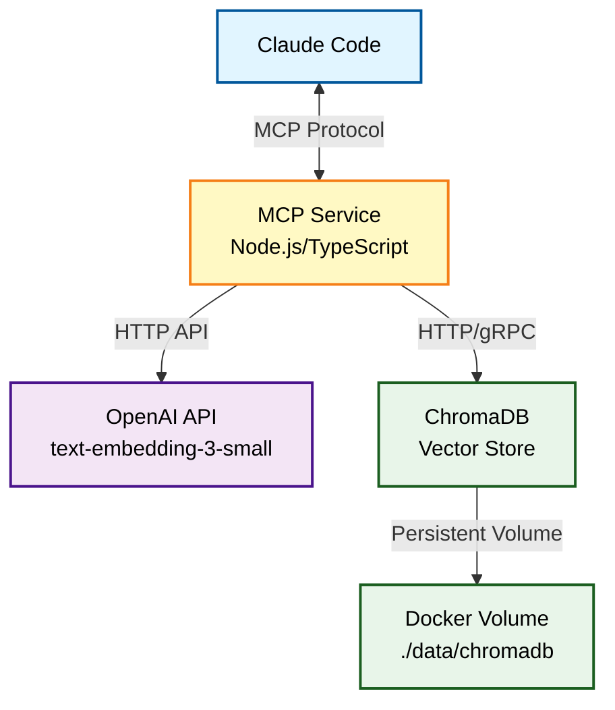
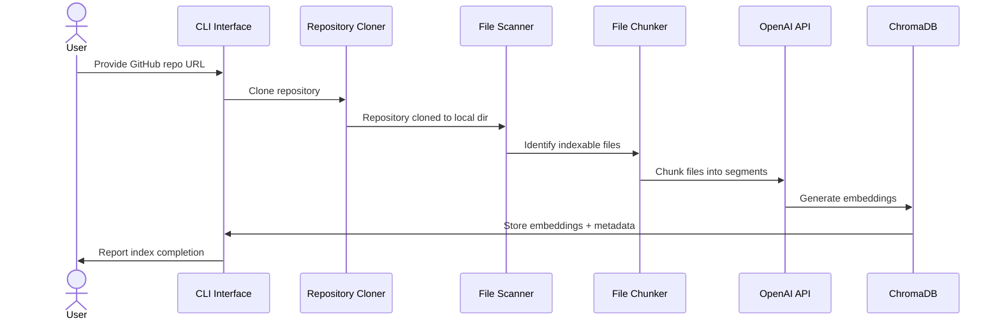
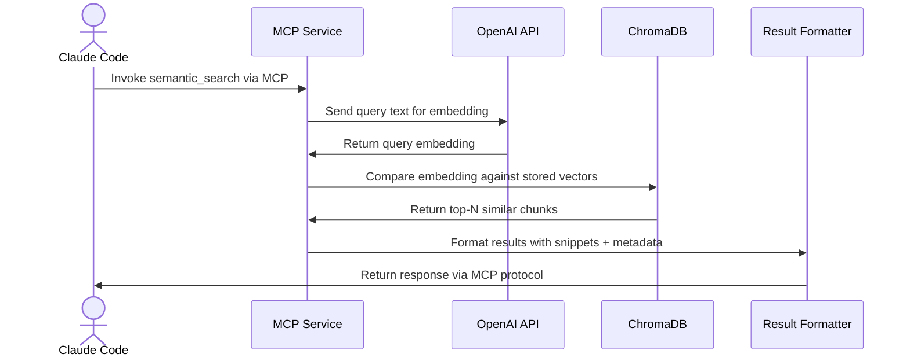

# Phase 1: Core MCP + Vector Search - Product Requirements Document

**Version:** 1.1
**Date:** December 10, 2025
**Status:** Final
**Phase:** 1 of 4
**Parent Document:** [High-level Personal Knowledge MCP PRD](./High-level-Personal-Knowledge-MCP-PRD.md)

---

## Executive Summary

Phase 1 establishes the foundational infrastructure for the Personal Knowledge MCP system. The primary goal is to enable Claude Code to perform semantic searches across indexed code repositories through a Model Context Protocol (MCP) service.

**Phase 1 Goal:** Get Claude Code querying indexed code semantically.

**Success Metric:** Claude Code can perform semantic search across one fully indexed repository with query response times under 500ms (95th percentile).

**Timeline Estimate:** 2-3 weeks of focused development effort (with 1-week risk buffer).

---

## Scope Definition

### In Scope (Phase 1 Deliverables)

| Component | Description | Priority |
|-----------|-------------|----------|
| **MCP Service** | Read-only MCP server exposing semantic search capabilities | P0 |
| **Vector Database** | ChromaDB instance for storing code embeddings | P0 |
| **Repository Cloner** | GitHub repository cloning functionality | P0 |
| **File Ingestion Pipeline** | Basic file reading and text extraction | P0 |
| **Embedding Generation** | OpenAI API integration for text embeddings | P0 |
| **Semantic Search** | Vector similarity search with configurable parameters | P0 |
| **Container Deployment** | Docker Compose configuration for local deployment | P1 |
| **Basic Health Monitoring** | Service health check endpoints | P1 |

### Out of Scope (Deferred to Later Phases)

| Component | Deferred To | Rationale |
|-----------|-------------|-----------|
| AST/Code-aware parsing | Phase 2 | Adds complexity; basic text works for MVP validation |
| Graph database (Neo4j) | Phase 4 | Not needed for initial semantic search |
| Document store (PostgreSQL) | Phase 2 | Full artifact storage can wait |
| Multi-instance architecture | Phase 3 | Security tiers add deployment complexity |
| Azure DevOps integration | Phase 3 | GitHub-first simplifies initial scope |
| Local folder ingestion | Phase 2 | Repository ingestion proves the concept |
| Ollama/local embeddings | Phase 2+ | OpenAI API is faster to integrate |
| File watchers/webhooks | Phase 4 | Manual/CLI triggers suffice for Phase 1 |
| Authentication layer | Phase 3 | Localhost-only deployment may not require auth |
| Admin UI | Phase 2+ | MCP-first; CLI/API primary interface for Phase 1 |
| Backup/restore automation | Post-MVP | Manual backups acceptable initially |
| PDF/DOCX extraction | Phase 2 | Focus on code files first |

---

## Technology Stack

### Primary Languages

| Role | Technology | Rationale |
|------|------------|-----------|
| **MCP Service** | Node.js 20+ with TypeScript | Official MCP TypeScript SDK, fast prototyping, native JSON handling |
| **Scripting/Utilities** | Node.js with TypeScript | Consistent tooling, single language stack |
| **Admin UI** | React (Deferred to Phase 2+) | Not needed for core functionality validation |

### Infrastructure Components

| Component | Technology | Version | Deployment |
|-----------|------------|---------|------------|
| **Vector Database** | ChromaDB | Latest stable | Docker container (Linux) |
| **Embedding API** | OpenAI | text-embedding-3-small | Cloud API |
| **Container Runtime** | Docker Desktop | 24.x+ | Windows host |
| **Orchestration** | Docker Compose | v2.x | Local development |

### Embedding Strategy

| Aspect | Phase 1 Decision | Future Consideration |
|--------|------------------|---------------------|
| **Default Provider** | OpenAI API | Abstracted for future swap |
| **Model** | text-embedding-3-small | Configurable via environment variable |
| **Local Embeddings** | Deferred to Phase 2+ | HuggingFace or Ollama options |
| **Architecture** | EmbeddingProvider interface | Allows provider swap without core changes |

**Embedding Provider Interface Concept:**
- Abstract embedding generation behind a consistent interface
- Phase 1: OpenAI implementation only
- Phase 2+: Add HuggingFace (sentence-transformers) or Ollama implementations
- Model selection via `EMBEDDING_PROVIDER` and `EMBEDDING_MODEL` environment variables

### Development Tools

| Tool | Purpose |
|------|---------|
| **Package Manager** | npm |
| **Testing Framework** | Jest with ts-jest |
| **Linting** | ESLint with TypeScript rules |
| **Formatting** | Prettier |
| **Type Checking** | TypeScript strict mode |

### Deployment Environment

| Aspect | Configuration |
|--------|---------------|
| **Host OS** | Windows with Docker Desktop |
| **Container OS** | Minimal Linux (Alpine or Debian slim) |
| **Network** | Localhost only (no external exposure) |
| **Authentication** | None required (localhost security model) |

---

## Functional Requirements

### FR-1: MCP Service Implementation

**Description:** Standards-compliant Model Context Protocol server exposing knowledge retrieval capabilities.

**Acceptance Criteria:**
- [ ] Implements MCP protocol specification for tool/function exposure
- [ ] Exposes `semantic_search` tool with parameters: `query` (string), `limit` (int, default 10)
- [ ] Exposes `list_indexed_repositories` tool to show available knowledge sources
- [ ] Responds to MCP capability negotiation correctly
- [ ] Returns structured results with file path, content snippet, and similarity score
- [ ] Handles malformed requests gracefully with appropriate error responses
- [ ] Integrates with Claude Code as an MCP server

**MCP Tool Definitions:**

```
Tool: semantic_search
Description: Search indexed code repositories using natural language queries
Parameters:
  - query (string, required): Natural language search query
  - limit (integer, optional): Maximum results to return (default: 10, max: 50)
  - threshold (float, optional): Minimum similarity score (default: 0.7, range: 0.0-1.0)
Returns:
  - results: Array of {file_path, content_snippet, similarity_score, repository}
  - total_matches: Number of matches found
  - query_time_ms: Query execution time

Tool: list_indexed_repositories
Description: List all repositories currently indexed in the knowledge base
Parameters: none
Returns:
  - repositories: Array of {name, url, file_count, last_indexed, status}
```

### FR-2: ChromaDB Vector Storage

**Description:** Containerized ChromaDB instance for storing and querying code embeddings.

**Acceptance Criteria:**
- [ ] ChromaDB runs as a Docker container with persistent volume
- [ ] Supports collection creation per repository
- [ ] Stores embeddings with metadata: file_path, repository_name, content_hash, indexed_at
- [ ] Supports similarity search with configurable distance metric (cosine similarity default)
- [ ] Exposes health check endpoint
- [ ] Data persists across container restarts

### FR-3: GitHub Repository Cloner

**Description:** Clone GitHub repositories for indexing.

**Acceptance Criteria:**
- [ ] Clones public repositories via HTTPS URL
- [ ] Clones private repositories using Personal Access Token (PAT)
- [ ] Stores cloned repositories in configurable local directory
- [ ] Handles clone failures gracefully with meaningful error messages
- [ ] Supports shallow clone option for faster initial indexing
- [ ] Validates repository URL format before attempting clone

### FR-4: File Ingestion Pipeline

**Description:** Read files from cloned repositories and prepare for embedding.

**Acceptance Criteria:**
- [ ] Recursively reads files from repository directory
- [ ] Respects `.gitignore` patterns (excludes ignored files)
- [ ] Filters files by configurable extensions (e.g., `.ts`, `.js`, `.cs`, `.py`, `.md`)
- [ ] Excludes common non-code directories: `node_modules`, `bin`, `obj`, `.git`, `dist`, `build`
- [ ] Chunks large files into segments (configurable max chunk size, default 1000 tokens)
- [ ] Preserves file metadata: path, extension, size, last modified
- [ ] Reports progress during ingestion (files processed, total files)

**Supported File Types (Phase 1):**
- Source code: `.js`, `.ts`, `.jsx`, `.tsx`, `.cs`, `.py`, `.java`, `.go`, `.rs`, `.cpp`, `.c`, `.h`
- Documentation: `.md`, `.txt`, `.rst`
- Configuration: `.json`, `.yaml`, `.yml`, `.toml`

### FR-5: OpenAI Embedding Integration

**Description:** Generate vector embeddings for code content using OpenAI API.

**Acceptance Criteria:**
- [ ] Integrates with OpenAI embeddings API (text-embedding-3-small model)
- [ ] Handles API rate limiting with exponential backoff
- [ ] Batches embedding requests for efficiency (configurable batch size)
- [ ] Stores API key securely via environment variable (never in code)
- [ ] Reports embedding generation progress
- [ ] Caches embeddings to avoid re-embedding unchanged content (via content hash)

### FR-6: Semantic Search

**Description:** Query the vector database using natural language.

**Acceptance Criteria:**
- [ ] Accepts natural language query string
- [ ] Generates query embedding using same model as indexing
- [ ] Performs cosine similarity search against stored embeddings
- [ ] Returns top-N results with similarity scores
- [ ] Includes original content snippet in results (configurable snippet length)
- [ ] Filters results by minimum similarity threshold
- [ ] Returns results within performance targets

### FR-7: CLI Interface

**Description:** Command-line interface for repository management and manual operations.

**Acceptance Criteria:**
- [ ] `index <repository-url>` - Clone and index a repository
- [ ] `search <query>` - Perform semantic search (for testing)
- [ ] `status` - Show indexed repositories and system status
- [ ] `remove <repository-name>` - Remove repository from index
- [ ] Clear, helpful error messages for all commands
- [ ] `--help` documentation for all commands

---

## Non-Functional Requirements

### NFR-1: Performance

| Metric | Target | Measurement Method |
|--------|--------|-------------------|
| Query response time (p95) | < 500ms | Instrumented logging |
| Query response time (p50) | < 200ms | Instrumented logging |
| Embedding generation | < 100 files/minute | Progress reporting |
| Small repo indexing (<500 files) | < 5 minutes | End-to-end timing |
| Medium repo indexing (500-2000 files) | < 15 minutes | End-to-end timing |

### NFR-2: Reliability

| Requirement | Target |
|-------------|--------|
| Service uptime during active use | > 99% |
| Graceful degradation on API errors | Required |
| Data persistence across restarts | Required |
| Recovery from container restart | < 30 seconds |

### NFR-3: Resource Constraints

| Resource | Limit | Rationale |
|----------|-------|-----------|
| Memory (MCP Service) | < 512 MB | Home lab efficiency |
| Memory (ChromaDB) | < 2 GB | Typical dataset size |
| Disk (per repository) | ~2x repo size | Embeddings + metadata |
| CPU | Efficient on 2-4 cores | Home lab hardware |

### NFR-4: Security (Phase 1 Minimal)

| Requirement | Implementation |
|-------------|----------------|
| API key storage | Environment variables only |
| Network exposure | Localhost only (default) |
| Repository credentials | PAT via environment variable |
| No secrets in logs | Redact sensitive data |

### NFR-5: Observability

| Requirement | Implementation |
|-------------|----------------|
| Health endpoint | `/health` returning service status |
| Structured logging | JSON format with timestamp, level, message |
| Error reporting | Stack traces in logs, user-friendly messages in responses |
| Metrics (basic) | Query count, average latency, index size |

---

## User Stories

### US-1: Index a GitHub Repository
**As a** developer using Claude Code
**I want to** index a GitHub repository into the knowledge base
**So that** I can search its contents semantically during development

**Acceptance Criteria:**
- Given a valid GitHub repository URL
- When I run the index command
- Then the repository is cloned, files are processed, and embeddings are stored
- And I receive confirmation of successful indexing with file count

### US-2: Semantic Code Search
**As a** developer using Claude Code
**I want to** search indexed code using natural language
**So that** I can find relevant code without knowing exact file locations or function names

**Acceptance Criteria:**
- Given an indexed repository
- When I search for "authentication middleware"
- Then I receive ranked results showing relevant code snippets
- And results include file paths and similarity scores

### US-3: Claude Code Integration
**As a** developer
**I want** Claude Code to query my indexed repositories via MCP
**So that** it can provide contextually relevant assistance

**Acceptance Criteria:**
- Given the MCP service is running
- When Claude Code is configured to use this MCP server
- Then Claude Code can discover and invoke the semantic_search tool
- And receives useful results to incorporate into responses

### US-4: Check System Status
**As a** developer
**I want to** see which repositories are indexed and system health
**So that** I can verify the system is working correctly

**Acceptance Criteria:**
- Given the system is running
- When I request status
- Then I see a list of indexed repositories with metadata
- And I see service health indicators

---

## Architecture Overview

### Component Diagram



### Data Flow: Indexing



### Data Flow: Querying



### Error Message and Logging Design

#### Repository Name Sanitization Decision

**Context:** During code review of the SearchService implementation (PR #33), a recommendation was made to sanitize repository names in error messages to prevent potential information disclosure.

**Decision:** Repository names will **NOT** be sanitized or redacted in error messages and logs.

**Rationale:**
1. **Not Sensitive Information**: Repository names are typically not sensitive data
   - They are already visible throughout the system (MCP responses, CLI output, status endpoints)
   - They are required for users to identify which repository encountered an error
   - They do not contain credentials, API keys, or personal information

2. **Critical for Debugging**: Repository names are essential for troubleshooting
   - Users need to know which repository failed to clone, index, or search
   - Support and debugging become significantly harder without context
   - Error messages like "Repository not found: [REDACTED]" provide no actionable information

3. **System Design**: The architecture already exposes repository names
   - MCP tool responses include repository names in search results
   - CLI status command lists all repository names
   - Repository names are part of the public API surface

4. **Security Context**: Phase 1 operates in a trusted environment
   - Localhost-only deployment (no network exposure)
   - Single-user system on developer's local machine
   - No authentication layer required for Phase 1

**Implementation Guidelines:**
- Repository names remain visible in all error messages
- Actual secrets (GitHub PAT, OpenAI API keys) continue to be excluded from logs and error messages
- File paths from repositories may be logged for debugging purposes
- URLs are logged but authentication tokens are stripped

**Review Date:** This decision should be revisited in Phase 3 when multi-instance architecture and authentication are introduced.

---

## Configuration

### Environment Variables

| Variable | Required | Description | Default |
|----------|----------|-------------|---------|
| `OPENAI_API_KEY` | Yes | OpenAI API key for embeddings | - |
| `GITHUB_PAT` | Yes* | GitHub Personal Access Token for private repos | - |
| `CHROMADB_HOST` | No | ChromaDB server host | `localhost` |
| `CHROMADB_PORT` | No | ChromaDB server port | `8000` |
| `REPO_CLONE_PATH` | No | Directory for cloned repos | `./data/repos` |
| `LOG_LEVEL` | No | Logging verbosity | `info` |
| `MCP_PORT` | No | MCP service port | `3000` |
| `EMBEDDING_PROVIDER` | No | Embedding provider (future extensibility) | `openai` |
| `EMBEDDING_MODEL` | No | Embedding model name | `text-embedding-3-small` |

*Required for private repository access (primary use case).

### Docker Compose Configuration

```yaml
# docker-compose.yml (reference structure)
version: '3.8'
services:
  chromadb:
    image: chromadb/chroma:latest
    ports:
      - "8000:8000"
    volumes:
      - ./data/chromadb:/chroma/chroma

  mcp-service:
    build: ./src/mcp-service
    ports:
      - "3000:3000"
    environment:
      - OPENAI_API_KEY=${OPENAI_API_KEY}
      - CHROMADB_HOST=chromadb
    depends_on:
      - chromadb
    volumes:
      - ./data/repos:/app/repos
```

---

## Success Criteria

### Phase 1 Completion Checklist

**Must Have (All Required):**
- [ ] MCP service starts and responds to Claude Code queries
- [ ] At least one private repository successfully indexed (via PAT)
- [ ] Semantic search returns relevant results for natural language queries
- [ ] Query response time < 500ms for 95th percentile
- [ ] Docker Compose deployment works on Windows with Docker Desktop
- [ ] Basic CLI commands functional (index, search, status)
- [ ] Private repository indexing via GitHub PAT

**Should Have:**
- [ ] Health check endpoint operational
- [ ] Structured logging implemented
- [ ] Documentation for setup and usage
- [ ] Multiple repositories indexed simultaneously

**Nice to Have:**
- [ ] Performance metrics exposed
- [ ] Configurable chunking strategies
- [ ] Public repository support (secondary to private repos)

### Validation Test Cases

1. **Index Small Repository**
   - Input: Public GitHub repo with <100 files
   - Expected: Indexed in <2 minutes, all code files processed

2. **Semantic Search - Exact Match**
   - Input: Search for function name that exists
   - Expected: Function file returned in top 3 results

3. **Semantic Search - Conceptual Match**
   - Input: Search for "handle user login" in repo with auth code
   - Expected: Authentication-related code returned

4. **Claude Code Integration**
   - Input: Configure Claude Code with MCP server
   - Expected: semantic_search tool appears in available tools

5. **Error Handling**
   - Input: Invalid repository URL
   - Expected: Clear error message, no crash

---

## Risks and Mitigations

| Risk | Impact | Probability | Mitigation |
|------|--------|-------------|------------|
| OpenAI API rate limits | Medium | Medium | Implement exponential backoff; batch requests; cache embeddings |
| ChromaDB performance at scale | Medium | Low | Test with target repository sizes early; monitor memory usage |
| MCP protocol compatibility | High | Low | Use official SDK if available; test with Claude Code frequently |
| Large file handling | Low | Medium | Implement chunking; set reasonable max file size |
| Network latency to OpenAI | Low | Medium | Measure and report; consider embedding caching aggressively |

---

## Dependencies

### External Services
- **OpenAI API**: Required for embedding generation (paid service)
- **GitHub**: Repository hosting (public repos free, private requires PAT)

### Software Dependencies
- **Docker Desktop**: Container runtime (Windows)
- **Docker Compose**: Orchestration (included with Docker Desktop)
- **Node.js 20+**: MCP service runtime
- **TypeScript 5+**: Type-safe development
- **ChromaDB**: Vector database

### Development Prerequisites
- GitHub account with repository access (PAT with repo scope for private repos)
- OpenAI API key with billing enabled
- Docker Desktop for Windows
- Development environment (VS Code recommended)
- npm (included with Node.js)

---

## Technology Decisions

This section documents the finalized technology decisions for Phase 1 based on product owner input.

### Decision Summary

| Decision Area | Choice | Rationale |
|---------------|--------|-----------|
| **Primary Language** | Node.js with TypeScript | Official MCP SDK support, fast prototyping, single-language stack |
| **Embedding Provider** | OpenAI API (text-embedding-3-small) | Fastest time-to-value, high quality, minimal setup |
| **Admin UI** | Deferred to Phase 2+ | Focus on core MCP functionality and token efficiency |
| **Authentication** | None (localhost only) | Acceptable security for local development phase |
| **Target Repositories** | Node.js/TypeScript | Aligns with tech stack, simplifies testing |
| **Deployment Environment** | Windows + Docker Desktop | Primary development environment |
| **Private Repos** | Must-have (P0) | Primary use case requires private repository access |
| **n8n Orchestration** | Deferred to Phase 4 | No complex workflow needs in Phase 1 |
| **Python** | Not included | Single-language stack preferred; revisit if local embeddings needed |

---

### TD-1: Primary Language - Node.js with TypeScript

**Decision:** Use Node.js 20+ with TypeScript as the sole language for Phase 1.

**Rationale:**
- Official MCP TypeScript SDK is well-maintained and feature-complete
- Native JSON handling aligns well with MCP protocol
- Single language reduces cognitive load, build complexity, and deployment configuration
- TypeScript provides strong typing without requiring a separate runtime

**What this means:**
- All MCP service code in TypeScript
- All CLI tooling in TypeScript
- All utility scripts in TypeScript
- No Python components in Phase 1

---

### TD-2: Embedding Strategy - OpenAI with Abstraction

**Decision:** Use OpenAI API for Phase 1, but abstract behind a provider interface.

**Phase 1 Implementation:**
- Default provider: OpenAI `text-embedding-3-small`
- Cost: approximately $0.02 per 1M tokens (minimal for MVP volumes)
- Configuration via `EMBEDDING_MODEL` environment variable

**Architecture Decision:**
- Implement `EmbeddingProvider` interface from the start
- Phase 1 includes only OpenAI implementation
- Interface enables future HuggingFace/Ollama implementations without core changes

**Local Embedding Evaluation (Deferred to Phase 2+):**

| Option | Pros | Cons | When to Consider |
|--------|------|------|------------------|
| **HuggingFace** | Free, local, many models | Requires Python, setup complexity | Phase 2 if cost/privacy critical |
| **Ollama** | Local, private, simple setup | Lower quality for code, resource-heavy | Phase 2 if offline operation needed |

**Key Insight:** No agent is needed for embedding generation - it is a simple API call, not a reasoning task.

---

### TD-3: n8n Orchestration - Deferred

**Decision:** Do not include n8n in Phase 1. Revisit in Phase 4.

**Rationale:**
- Phase 1 indexing pipeline is linear: clone -> scan -> chunk -> embed -> store
- No complex conditional logic or multi-step orchestration needed
- n8n adds container complexity without proportional Phase 1 value
- CLI commands are sufficient for manual triggering

**When n8n becomes valuable:**
- Phase 4: Event-driven pipelines (webhook triggers)
- Phase 4: Scheduled re-indexing workflows
- Phase 3+: Multi-repository orchestration with conditional logic

---

### TD-4: Admin UI - Deferred to Phase 2+

**Decision:** No React admin UI in Phase 1.

**Rationale:**
- Primary goal is MCP functionality for AI assistant integration
- Focus on reducing lookups, increasing discovery, economizing token use
- CLI and logs provide sufficient visibility for Phase 1 validation
- UI development effort better spent on core semantic search quality

**Phase 2 Trigger:** UI becomes priority when:
- Multiple users need to manage the system
- Visual debugging of search results becomes necessary
- Configuration complexity exceeds CLI ergonomics

---

### TD-5: Authentication - Localhost Only

**Decision:** No authentication layer in Phase 1. Service binds to localhost only.

**Security Model:**
- MCP service only accessible from local machine
- No network exposure by default
- Secrets stored in `.env` file (never in code or logs)
- GitHub PAT for private repository access

**Phase 3 Enhancement:** Add authentication when multi-instance deployment or remote access required.

---

### TD-6: Target Repository Types - Node.js/TypeScript

**Decision:** Optimize and test exclusively with Node.js/TypeScript repositories in Phase 1.

**Rationale:**
- Aligns with primary language choice
- Simplifies test case development
- Common file patterns (.ts, .js, .tsx, .jsx) well understood
- Product owner's primary codebase type

**Validation:** Test with small, medium, and larger Node.js/TypeScript repositories to validate indexing and search quality.

---

### TD-7: Private Repository Support - Must Have

**Decision:** Private repository indexing is P0 (must-have) for Phase 1.

**Implementation:**
- GitHub PAT support required from day one
- `GITHUB_PAT` environment variable for authentication
- PAT already in use for existing GH CLI and MCP tools

**Implications:**
- Clone functionality must handle authenticated HTTPS URLs
- Error messaging must distinguish auth failures from other errors
- Documentation must cover PAT setup and permissions

---

## Deferred to Future Phases

Capabilities explicitly deferred based on Phase 1 scope decisions:

| Capability | Deferred To | Rationale |
|------------|-------------|-----------|
| **React Admin UI** | Phase 2+ | Focus on core MCP functionality first |
| **Local embeddings (HuggingFace/Ollama)** | Phase 2+ | OpenAI faster to integrate; abstract for future swap |
| **n8n workflow orchestration** | Phase 4 | No complex workflow needs in Phase 1 |
| **Python components** | Phase 2+ | Single-language stack for simplicity |
| **Authentication layer** | Phase 3 | Localhost-only acceptable for Phase 1 |
| **.NET/C# repository optimization** | Phase 2+ | Focus on Node.js/TypeScript first |
| **Multi-instance deployment** | Phase 3 | Single instance validates core functionality |
| **AST-aware code parsing** | Phase 2 | Basic text chunking sufficient for MVP |

---

## Timeline Estimate (Refined)

Based on finalized technology decisions:

| Week | Focus Area | Key Deliverables |
|------|------------|------------------|
| **Week 1** | Foundation | Project scaffolding, Docker Compose setup, ChromaDB integration, basic file scanner |
| **Week 2** | Core Features | OpenAI embedding integration, MCP service with semantic_search tool, vector storage |
| **Week 3** | Integration & Polish | CLI commands, Claude Code integration testing, private repo support, documentation |

**Total Estimate:** 2-3 weeks active development

**Risk Buffer:** +1 week for MCP protocol edge cases or embedding quality tuning

**Factors enabling faster timeline:**
- Single language (Node.js/TypeScript)
- No admin UI
- Localhost-only (no auth complexity)
- OpenAI API (no local model setup)
- Clear, focused scope

---

## Appendix A: MCP Protocol Reference

The Model Context Protocol (MCP) defines how AI assistants interact with external tools and data sources. Key concepts for Phase 1:

- **Tools**: Functions exposed by the MCP server that Claude Code can invoke
- **Resources**: Data sources that can be read (not implemented in Phase 1)
- **Prompts**: Pre-defined prompt templates (not implemented in Phase 1)

Phase 1 focuses exclusively on the **Tools** capability for semantic search.

---

## Appendix B: ChromaDB Considerations

ChromaDB is an open-source embedding database optimized for AI applications. Key characteristics:

- **Persistence**: Supports persistent storage via Docker volumes
- **Distance Metrics**: Cosine similarity (default), L2, inner product
- **Metadata Filtering**: Supports filtering results by metadata fields
- **Scaling**: Single-node sufficient for Phase 1 volumes (<100K embeddings)

---

## Document History

| Version | Date | Author | Changes |
|---------|------|--------|---------|
| 1.0 | 2025-12-10 | Product Team | Initial Phase 1 PRD based on high-level PRD and technology stack changes |
| 1.1 | 2025-12-10 | Product Team | Finalized technology decisions based on product owner answers; replaced Open Questions with Technology Decisions section; updated timeline to 2-3 weeks; marked private repos as P0; added embedding abstraction strategy |

---

**Next Steps:**
1. Create initial project structure with TypeScript configuration
2. Set up Docker Compose with ChromaDB
3. Implement EmbeddingProvider interface with OpenAI implementation
4. Build core MCP service with semantic_search tool
5. Develop CLI for repository indexing and search testing
