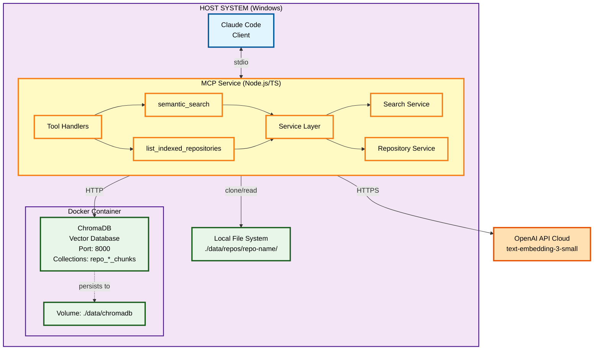
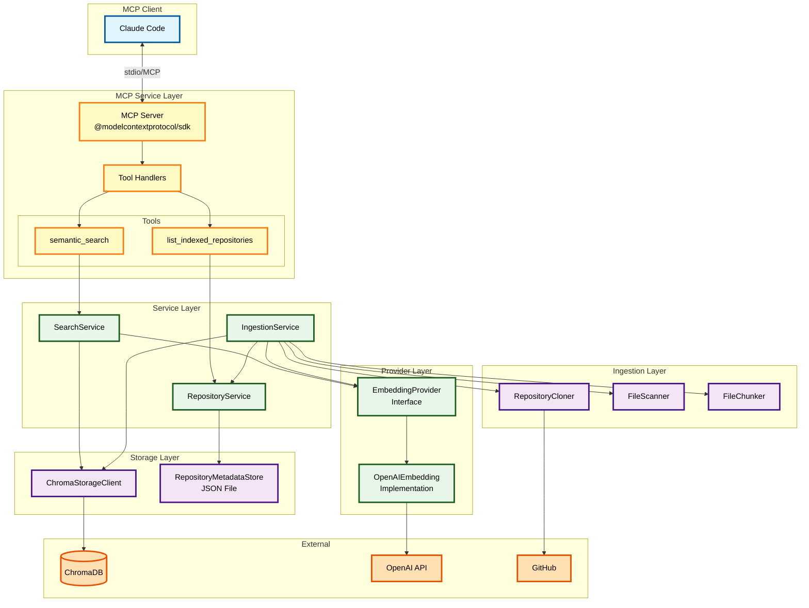
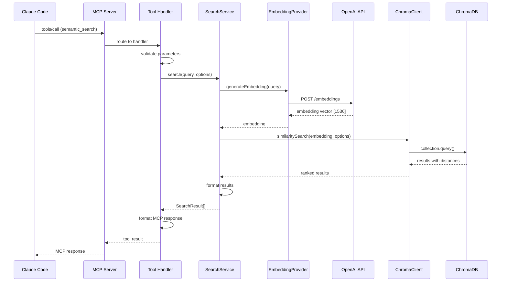
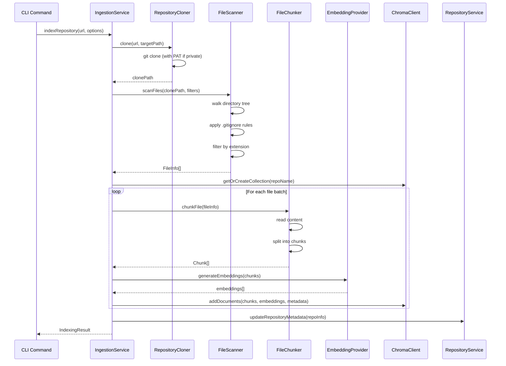
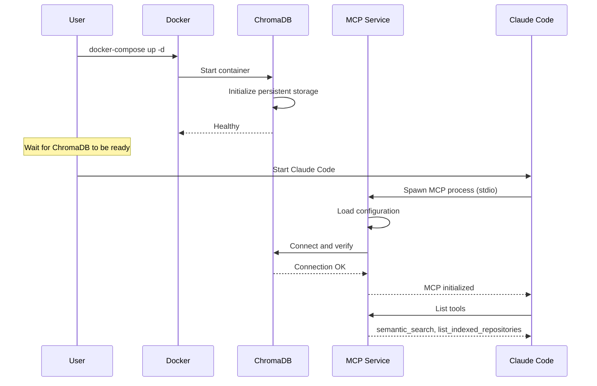
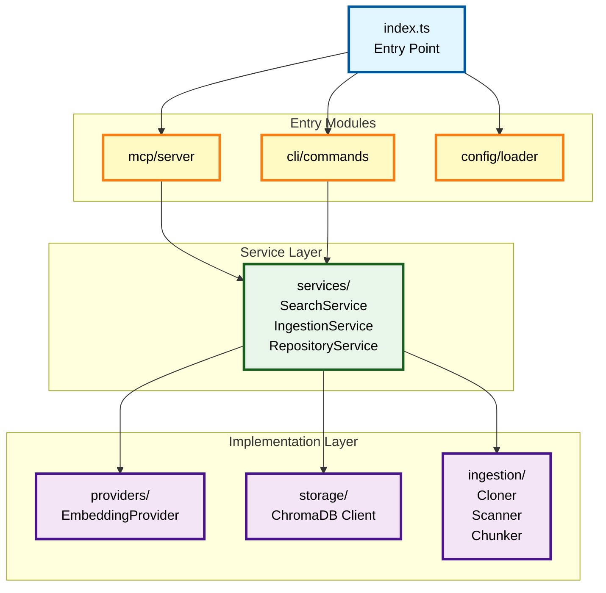

# Phase 1: Core MCP + Vector Search - System Design Document

**Version:** 1.0
**Date:** December 10, 2025
**Status:** Draft
**Parent PRD:** [Phase 1 PRD](../Phase1-Core-MCP-Vector-Search-PRD.md)

---

## Table of Contents

1. [Executive Summary](#1-executive-summary)
2. [System Architecture](#2-system-architecture)
3. [MCP Protocol API Specification](#3-mcp-protocol-api-specification)
4. [Internal APIs and Interfaces](#4-internal-apis-and-interfaces)
5. [Data Models](#5-data-models)
6. [Component Design](#6-component-design)
7. [Technology Stack Details](#7-technology-stack-details)
8. [Configuration Management](#8-configuration-management)
9. [Error Handling and Observability](#9-error-handling-and-observability)
10. [Security Design](#10-security-design)
11. [Performance Design](#11-performance-design)
12. [Testing Strategy](#12-testing-strategy)
13. [Deployment Architecture](#13-deployment-architecture)
14. [Project Structure](#14-project-structure)
15. [Implementation Sequence](#15-implementation-sequence)

---

## 1. Executive Summary

This document provides the technical design for Phase 1 of the Personal Knowledge MCP system. Phase 1 establishes the foundational infrastructure: a Model Context Protocol (MCP) service that enables Claude Code to perform semantic searches across indexed GitHub repositories using ChromaDB as the vector store and OpenAI for embedding generation.

### Design Goals

1. **Simplicity**: Minimal viable architecture that proves the concept
2. **Extensibility**: Clean interfaces that support future phases
3. **Performance**: Meet sub-500ms query response targets
4. **Developer Experience**: Clear code organization and comprehensive testing

### Key Design Decisions

| Decision | Choice | Rationale |
|----------|--------|-----------|
| Language | Node.js/TypeScript | Official MCP SDK, single-language stack |
| Vector DB | ChromaDB | Simple setup, good performance, Docker-ready |
| Embeddings | OpenAI API | Fast integration, high quality, abstracted interface |
| Transport | stdio (MCP) | Standard MCP transport for Claude Code integration |
| Deployment | Docker Compose | Appropriate for local single-user deployment |

---

## 2. System Architecture

### 2.1 High-Level Architecture



### 2.2 Component Diagram



### 2.3 Data Flow: Query Execution



### 2.4 Data Flow: Repository Indexing



---

## 3. MCP Protocol API Specification

### 3.1 Server Capabilities

The MCP server advertises the following capabilities during initialization:

```typescript
{
  capabilities: {
    tools: {}  // Supports tool invocation
  },
  serverInfo: {
    name: "personal-knowledge-mcp",
    version: "1.0.0"
  }
}
```

### 3.2 Tool: semantic_search

**Purpose:** Search indexed code repositories using natural language queries.

**MCP Tool Definition:**

```json
{
  "name": "semantic_search",
  "description": "Search indexed code repositories using natural language queries. Returns relevant code snippets ranked by semantic similarity.",
  "inputSchema": {
    "type": "object",
    "properties": {
      "query": {
        "type": "string",
        "description": "Natural language search query describing what you're looking for",
        "minLength": 1,
        "maxLength": 1000
      },
      "limit": {
        "type": "integer",
        "description": "Maximum number of results to return",
        "default": 10,
        "minimum": 1,
        "maximum": 50
      },
      "threshold": {
        "type": "number",
        "description": "Minimum similarity score (0.0 to 1.0). Higher values return more relevant but fewer results.",
        "default": 0.7,
        "minimum": 0.0,
        "maximum": 1.0
      },
      "repository": {
        "type": "string",
        "description": "Filter results to a specific repository name. If omitted, searches all indexed repositories."
      }
    },
    "required": ["query"]
  }
}
```

**Response Schema:**

```typescript
interface SemanticSearchResponse {
  results: SearchResult[];
  metadata: {
    total_matches: number;
    query_time_ms: number;
    repositories_searched: string[];
  };
}

interface SearchResult {
  file_path: string;           // Relative path within repository
  repository: string;          // Repository name
  content_snippet: string;     // Matched content (truncated to ~500 chars)
  similarity_score: number;    // 0.0 to 1.0, higher is better
  chunk_index: number;         // Position within file if chunked
  metadata: {
    file_extension: string;
    file_size_bytes: number;
    indexed_at: string;        // ISO 8601 timestamp
  };
}
```

**Example Request:**

```json
{
  "method": "tools/call",
  "params": {
    "name": "semantic_search",
    "arguments": {
      "query": "authentication middleware that validates JWT tokens",
      "limit": 5,
      "threshold": 0.75
    }
  }
}
```

**Example Response:**

```json
{
  "content": [
    {
      "type": "text",
      "text": "{\"results\":[{\"file_path\":\"src/middleware/auth.ts\",\"repository\":\"my-api\",\"content_snippet\":\"export async function validateJWT(req: Request, res: Response, next: NextFunction) {\\n  const token = req.headers.authorization?.split(' ')[1];\\n  if (!token) {\\n    return res.status(401).json({ error: 'No token provided' });\\n  }\\n  try {\\n    const decoded = jwt.verify(token, process.env.JWT_SECRET);\\n    req.user = decoded;\\n    next();\\n  } catch (err) {\\n    return res.status(401).json({ error: 'Invalid token' });\\n  }\\n}\",\"similarity_score\":0.92,\"chunk_index\":0,\"metadata\":{\"file_extension\":\".ts\",\"file_size_bytes\":1234,\"indexed_at\":\"2025-12-10T15:30:00Z\"}}],\"metadata\":{\"total_matches\":1,\"query_time_ms\":145,\"repositories_searched\":[\"my-api\"]}}"
    }
  ]
}
```

### 3.3 Tool: list_indexed_repositories

**Purpose:** List all repositories currently indexed in the knowledge base.

**MCP Tool Definition:**

```json
{
  "name": "list_indexed_repositories",
  "description": "List all repositories currently indexed in the knowledge base. Shows repository names, file counts, and indexing status.",
  "inputSchema": {
    "type": "object",
    "properties": {},
    "required": []
  }
}
```

**Response Schema:**

```typescript
interface ListRepositoriesResponse {
  repositories: RepositoryInfo[];
  summary: {
    total_repositories: number;
    total_files_indexed: number;
    total_chunks: number;
  };
}

interface RepositoryInfo {
  name: string;                // Repository identifier
  url: string;                 // Original clone URL
  file_count: number;          // Number of files indexed
  chunk_count: number;         // Total chunks (may exceed file_count)
  last_indexed: string;        // ISO 8601 timestamp
  status: "ready" | "indexing" | "error";
  index_duration_ms?: number;  // Time taken to index
  error_message?: string;      // If status is "error"
}
```

**Example Response:**

```json
{
  "content": [
    {
      "type": "text",
      "text": "{\"repositories\":[{\"name\":\"my-api\",\"url\":\"https://github.com/user/my-api.git\",\"file_count\":127,\"chunk_count\":342,\"last_indexed\":\"2025-12-10T15:30:00Z\",\"status\":\"ready\",\"index_duration_ms\":45230}],\"summary\":{\"total_repositories\":1,\"total_files_indexed\":127,\"total_chunks\":342}}"
    }
  ]
}
```

---

## 4. Internal APIs and Interfaces

### 4.1 EmbeddingProvider Interface

```typescript
/**
 * Abstract interface for embedding generation providers.
 * Allows swapping between OpenAI, HuggingFace, Ollama, etc.
 */
interface EmbeddingProvider {
  /**
   * Provider identifier (e.g., "openai", "ollama")
   */
  readonly providerId: string;

  /**
   * Model identifier being used
   */
  readonly modelId: string;

  /**
   * Dimensionality of generated embeddings
   */
  readonly dimensions: number;

  /**
   * Generate embedding for a single text input
   * @param text - Text to embed (will be truncated if exceeds model limit)
   * @returns Embedding vector as number array
   */
  generateEmbedding(text: string): Promise<number[]>;

  /**
   * Generate embeddings for multiple texts (batched for efficiency)
   * @param texts - Array of texts to embed
   * @returns Array of embedding vectors (same order as input)
   */
  generateEmbeddings(texts: string[]): Promise<number[][]>;

  /**
   * Check if the provider is properly configured and reachable
   */
  healthCheck(): Promise<boolean>;
}

/**
 * Configuration for embedding providers
 */
interface EmbeddingProviderConfig {
  provider: "openai" | "ollama" | "huggingface";
  model: string;
  apiKey?: string;           // Required for OpenAI
  baseUrl?: string;          // For self-hosted providers
  maxBatchSize?: number;     // Provider-specific batch limits
  maxRetries?: number;       // Retry count for transient failures
  timeoutMs?: number;        // Request timeout
}
```

### 4.2 ChromaStorageClient Interface

```typescript
/**
 * Client for interacting with ChromaDB vector storage
 */
interface ChromaStorageClient {
  /**
   * Initialize connection to ChromaDB
   */
  connect(): Promise<void>;

  /**
   * Check connection health
   */
  healthCheck(): Promise<boolean>;

  /**
   * Get or create a collection for a repository
   * @param name - Collection name (sanitized repository name)
   * @returns Collection handle
   */
  getOrCreateCollection(name: string): Promise<ChromaCollection>;

  /**
   * Delete a collection (when removing a repository)
   */
  deleteCollection(name: string): Promise<void>;

  /**
   * List all collections
   */
  listCollections(): Promise<CollectionInfo[]>;

  /**
   * Add documents to a collection
   */
  addDocuments(
    collectionName: string,
    documents: DocumentInput[]
  ): Promise<void>;

  /**
   * Perform similarity search across one or more collections
   */
  similaritySearch(
    query: SimilarityQuery
  ): Promise<SimilarityResult[]>;

  /**
   * Get collection statistics
   */
  getCollectionStats(name: string): Promise<CollectionStats>;
}

interface DocumentInput {
  id: string;                    // Unique document ID
  content: string;               // Text content
  embedding: number[];           // Pre-computed embedding vector
  metadata: DocumentMetadata;    // Associated metadata
}

interface DocumentMetadata {
  file_path: string;
  repository: string;
  chunk_index: number;
  total_chunks: number;
  file_extension: string;
  file_size_bytes: number;
  content_hash: string;          // For deduplication
  indexed_at: string;
}

interface SimilarityQuery {
  embedding: number[];
  collections: string[];         // Collections to search
  limit: number;
  threshold: number;             // Minimum similarity (0-1)
}

interface SimilarityResult {
  id: string;
  content: string;
  metadata: DocumentMetadata;
  distance: number;              // Lower is more similar
  similarity: number;            // Converted to 0-1 scale
}

interface CollectionStats {
  name: string;
  documentCount: number;
  createdAt: string;
}
```

### 4.3 SearchService Interface

```typescript
/**
 * High-level service for semantic search operations
 */
interface SearchService {
  /**
   * Perform semantic search across indexed repositories
   */
  search(query: SearchQuery): Promise<SearchResponse>;
}

interface SearchQuery {
  query: string;
  limit: number;
  threshold: number;
  repository?: string;           // Optional repository filter
}

interface SearchResponse {
  results: SearchResult[];
  metadata: {
    total_matches: number;
    query_time_ms: number;
    repositories_searched: string[];
  };
}
```

### 4.4 IngestionService Interface

```typescript
/**
 * Service for ingesting and indexing repositories
 */
interface IngestionService {
  /**
   * Index a repository from URL
   */
  indexRepository(
    url: string,
    options?: IndexOptions
  ): Promise<IndexResult>;

  /**
   * Re-index an existing repository (full refresh)
   */
  reindexRepository(name: string): Promise<IndexResult>;

  /**
   * Remove a repository from the index
   */
  removeRepository(name: string): Promise<void>;

  /**
   * Get current indexing status
   */
  getStatus(): Promise<IngestionStatus>;
}

interface IndexOptions {
  name?: string;                 // Override repository name
  branch?: string;               // Branch to clone (default: default branch)
  shallow?: boolean;             // Shallow clone (default: true)
  includeExtensions?: string[];  // Override default extensions
  excludePatterns?: string[];    // Additional exclude patterns
}

interface IndexResult {
  repository: string;
  status: "success" | "partial" | "failed";
  filesProcessed: number;
  chunksCreated: number;
  durationMs: number;
  errors?: string[];
}

interface IngestionStatus {
  isIndexing: boolean;
  currentRepository?: string;
  progress?: {
    filesProcessed: number;
    totalFiles: number;
    chunksCreated: number;
  };
}
```

### 4.5 RepositoryService Interface

```typescript
/**
 * Service for managing repository metadata
 */
interface RepositoryService {
  /**
   * List all indexed repositories
   */
  listRepositories(): Promise<RepositoryInfo[]>;

  /**
   * Get details for a specific repository
   */
  getRepository(name: string): Promise<RepositoryInfo | null>;

  /**
   * Update repository metadata after indexing
   */
  updateRepository(info: RepositoryInfo): Promise<void>;

  /**
   * Remove repository metadata
   */
  removeRepository(name: string): Promise<void>;
}
```

---

## 5. Data Models

### 5.1 ChromaDB Collection Schema

Each repository is stored in its own ChromaDB collection with the following structure:

**Collection Naming Convention:**
```
repo_<sanitized_name>
```
Where `sanitized_name` is the repository name with special characters replaced by underscores.

**Document Structure:**

| Field | Type | Description |
|-------|------|-------------|
| `id` | string | Unique identifier: `{repo}:{file_path}:{chunk_index}` |
| `document` | string | Text content of the chunk |
| `embedding` | float[] | 1536-dimensional vector (for text-embedding-3-small) |
| `metadata` | object | See metadata schema below |

**Metadata Schema:**

```typescript
{
  // File identification
  file_path: string;           // "src/auth/middleware.ts"
  repository: string;          // "my-api"

  // Chunk information
  chunk_index: number;         // 0, 1, 2, ...
  total_chunks: number;        // Total chunks for this file
  chunk_start_line: number;    // Starting line number in original file
  chunk_end_line: number;      // Ending line number

  // File metadata
  file_extension: string;      // ".ts"
  file_size_bytes: number;     // 4523

  // Deduplication
  content_hash: string;        // SHA-256 of chunk content

  // Timestamps
  indexed_at: string;          // ISO 8601: "2025-12-10T15:30:00Z"
  file_modified_at: string;    // File's last modified timestamp
}
```

### 5.2 Repository Metadata Store

Repository metadata is stored in a JSON file at `./data/repositories.json`:

```typescript
interface RepositoryMetadataStore {
  version: "1.0";
  repositories: Record<string, RepositoryMetadata>;
}

interface RepositoryMetadata {
  name: string;
  url: string;
  localPath: string;            // Path to cloned repo
  collectionName: string;       // ChromaDB collection name

  // Statistics
  fileCount: number;
  chunkCount: number;

  // Indexing info
  lastIndexedAt: string;        // ISO 8601
  indexDurationMs: number;
  status: "ready" | "indexing" | "error";
  errorMessage?: string;

  // Configuration used
  branch: string;
  includeExtensions: string[];
  excludePatterns: string[];
}
```

**Example:**

```json
{
  "version": "1.0",
  "repositories": {
    "my-api": {
      "name": "my-api",
      "url": "https://github.com/user/my-api.git",
      "localPath": "./data/repos/my-api",
      "collectionName": "repo_my_api",
      "fileCount": 127,
      "chunkCount": 342,
      "lastIndexedAt": "2025-12-10T15:30:00Z",
      "indexDurationMs": 45230,
      "status": "ready",
      "branch": "main",
      "includeExtensions": [".ts", ".js", ".md"],
      "excludePatterns": ["node_modules/**", "dist/**"]
    }
  }
}
```

### 5.3 File Chunk Model

```typescript
interface FileChunk {
  id: string;                   // Unique chunk identifier
  filePath: string;             // Original file path
  repository: string;           // Repository name
  content: string;              // Chunk text content
  chunkIndex: number;           // Position in file (0-based)
  totalChunks: number;          // Total chunks for file
  startLine: number;            // Starting line in original
  endLine: number;              // Ending line in original
  metadata: {
    extension: string;
    sizeBytes: number;
    contentHash: string;
    fileModifiedAt: Date;
  };
}
```

---

## 6. Component Design

### 6.1 MCP Server Component

**File:** `src/mcp/server.ts`

**Responsibilities:**
- Initialize MCP server with stdio transport
- Register tool handlers
- Handle capability negotiation
- Route tool calls to appropriate handlers

**Key Implementation Details:**

```typescript
import { Server } from "@modelcontextprotocol/sdk/server/index.js";
import { StdioServerTransport } from "@modelcontextprotocol/sdk/server/stdio.js";

class PersonalKnowledgeMCPServer {
  private server: Server;
  private searchService: SearchService;
  private repositoryService: RepositoryService;

  constructor(config: ServerConfig) {
    this.server = new Server(
      { name: "personal-knowledge-mcp", version: "1.0.0" },
      { capabilities: { tools: {} } }
    );

    this.registerTools();
    this.registerHandlers();
  }

  private registerTools(): void {
    // Register semantic_search and list_indexed_repositories
  }

  private registerHandlers(): void {
    this.server.setRequestHandler(ListToolsRequestSchema, async () => {
      return { tools: this.getToolDefinitions() };
    });

    this.server.setRequestHandler(CallToolRequestSchema, async (request) => {
      return this.handleToolCall(request);
    });
  }

  async start(): Promise<void> {
    const transport = new StdioServerTransport();
    await this.server.connect(transport);
  }
}
```

### 6.2 OpenAI Embedding Provider

**File:** `src/providers/openai-embedding.ts`

**Responsibilities:**
- Generate embeddings using OpenAI API
- Handle rate limiting with exponential backoff
- Batch requests for efficiency

**Key Implementation Details:**

```typescript
import OpenAI from "openai";

class OpenAIEmbeddingProvider implements EmbeddingProvider {
  readonly providerId = "openai";
  readonly modelId: string;
  readonly dimensions = 1536;  // text-embedding-3-small

  private client: OpenAI;
  private maxBatchSize = 100;  // OpenAI limit
  private maxRetries = 3;

  constructor(config: OpenAIEmbeddingConfig) {
    this.modelId = config.model || "text-embedding-3-small";
    this.client = new OpenAI({ apiKey: config.apiKey });
  }

  async generateEmbedding(text: string): Promise<number[]> {
    const result = await this.generateEmbeddings([text]);
    return result[0];
  }

  async generateEmbeddings(texts: string[]): Promise<number[][]> {
    const batches = this.createBatches(texts, this.maxBatchSize);
    const results: number[][] = [];

    for (const batch of batches) {
      const response = await this.callWithRetry(batch);
      results.push(...response.data.map(d => d.embedding));
    }

    return results;
  }

  private async callWithRetry(texts: string[]): Promise<OpenAI.Embeddings.CreateEmbeddingResponse> {
    // Implement exponential backoff
  }
}
```

**Rate Limiting Strategy:**
- Initial delay: 1 second
- Backoff multiplier: 2x
- Maximum delay: 60 seconds
- Maximum retries: 3

### 6.3 ChromaDB Storage Client

**File:** `src/storage/chroma-client.ts`

**Responsibilities:**
- Manage ChromaDB connections
- Create and manage collections
- Execute similarity searches

**Key Implementation Details:**

```typescript
import { ChromaClient, Collection } from "chromadb";

class ChromaStorageClientImpl implements ChromaStorageClient {
  private client: ChromaClient;
  private collections: Map<string, Collection> = new Map();

  constructor(config: ChromaConfig) {
    this.client = new ChromaClient({
      path: `http://${config.host}:${config.port}`
    });
  }

  async connect(): Promise<void> {
    await this.healthCheck();
  }

  async getOrCreateCollection(name: string): Promise<Collection> {
    if (this.collections.has(name)) {
      return this.collections.get(name)!;
    }

    const collection = await this.client.getOrCreateCollection({
      name,
      metadata: { "hnsw:space": "cosine" }  // Cosine similarity
    });

    this.collections.set(name, collection);
    return collection;
  }

  async similaritySearch(query: SimilarityQuery): Promise<SimilarityResult[]> {
    const allResults: SimilarityResult[] = [];

    for (const collectionName of query.collections) {
      const collection = await this.getOrCreateCollection(collectionName);

      const results = await collection.query({
        queryEmbeddings: [query.embedding],
        nResults: query.limit,
        include: ["documents", "metadatas", "distances"]
      });

      // Convert distances to similarity scores and filter by threshold
      const processed = this.processResults(results, query.threshold);
      allResults.push(...processed);
    }

    // Sort by similarity and return top N
    return allResults
      .sort((a, b) => b.similarity - a.similarity)
      .slice(0, query.limit);
  }

  private processResults(results: QueryResponse, threshold: number): SimilarityResult[] {
    // Convert cosine distance to similarity: similarity = 1 - distance
  }
}
```

### 6.4 Repository Cloner

**File:** `src/ingestion/repository-cloner.ts`

**Responsibilities:**
- Clone GitHub repositories
- Handle authentication (PAT for private repos)
- Support shallow clones

**Key Implementation Details:**

```typescript
import simpleGit, { SimpleGit } from "simple-git";

class RepositoryCloner {
  private git: SimpleGit;
  private basePath: string;
  private githubPat?: string;

  constructor(config: ClonerConfig) {
    this.git = simpleGit();
    this.basePath = config.repoClonePath;
    this.githubPat = config.githubPat;
  }

  async clone(url: string, options: CloneOptions = {}): Promise<string> {
    const repoName = this.extractRepoName(url);
    const targetPath = path.join(this.basePath, repoName);

    // Check if already cloned
    if (await this.exists(targetPath)) {
      if (options.fresh) {
        await fs.rm(targetPath, { recursive: true });
      } else {
        return targetPath;  // Use existing
      }
    }

    // Build authenticated URL if PAT provided
    const authUrl = this.buildAuthenticatedUrl(url);

    const cloneOptions: string[] = [];
    if (options.shallow !== false) {
      cloneOptions.push("--depth", "1");
    }
    if (options.branch) {
      cloneOptions.push("--branch", options.branch);
    }

    await this.git.clone(authUrl, targetPath, cloneOptions);

    return targetPath;
  }

  private buildAuthenticatedUrl(url: string): string {
    if (!this.githubPat) return url;

    const parsed = new URL(url);
    if (parsed.hostname === "github.com") {
      parsed.username = this.githubPat;
      parsed.password = "x-oauth-basic";
    }
    return parsed.toString();
  }

  private extractRepoName(url: string): string {
    // Extract "repo-name" from "https://github.com/user/repo-name.git"
  }
}
```

### 6.5 File Scanner

**File:** `src/ingestion/file-scanner.ts`

**Responsibilities:**
- Recursively scan repository directories
- Apply .gitignore rules
- Filter by file extension

**Key Implementation Details:**

```typescript
import { glob } from "glob";
import ignore from "ignore";

class FileScanner {
  private defaultExtensions = [
    ".js", ".ts", ".jsx", ".tsx",    // JavaScript/TypeScript
    ".cs",                            // C#
    ".py",                            // Python
    ".java", ".go", ".rs",           // Other languages
    ".cpp", ".c", ".h",              // C/C++
    ".md", ".txt", ".rst",           // Documentation
    ".json", ".yaml", ".yml", ".toml" // Configuration
  ];

  private defaultExcludes = [
    "node_modules/**",
    ".git/**",
    "dist/**",
    "build/**",
    "bin/**",
    "obj/**",
    "*.min.js",
    "*.min.css",
    "package-lock.json",
    "yarn.lock"
  ];

  async scanFiles(repoPath: string, options: ScanOptions = {}): Promise<FileInfo[]> {
    const extensions = options.includeExtensions || this.defaultExtensions;
    const excludes = [...this.defaultExcludes, ...(options.excludePatterns || [])];

    // Load .gitignore if present
    const gitignore = await this.loadGitignore(repoPath);

    // Build glob patterns
    const patterns = extensions.map(ext => `**/*${ext}`);

    const files = await glob(patterns, {
      cwd: repoPath,
      ignore: excludes,
      nodir: true,
      absolute: false
    });

    // Apply gitignore filtering
    const filtered = gitignore.filter(files);

    // Get file info
    return Promise.all(filtered.map(f => this.getFileInfo(repoPath, f)));
  }

  private async loadGitignore(repoPath: string): Promise<Ignore> {
    const ig = ignore();
    const gitignorePath = path.join(repoPath, ".gitignore");

    if (await this.exists(gitignorePath)) {
      const content = await fs.readFile(gitignorePath, "utf-8");
      ig.add(content);
    }

    return ig;
  }
}

interface FileInfo {
  relativePath: string;
  absolutePath: string;
  extension: string;
  sizeBytes: number;
  modifiedAt: Date;
}
```

### 6.6 File Chunker

**File:** `src/ingestion/file-chunker.ts`

**Responsibilities:**
- Split files into embedding-appropriate chunks
- Preserve code structure where possible
- Track chunk positions for context

**Key Implementation Details:**

```typescript
class FileChunker {
  private maxChunkTokens: number;
  private chunkOverlap: number;

  constructor(config: ChunkerConfig = {}) {
    this.maxChunkTokens = config.maxChunkTokens || 500;
    this.chunkOverlap = config.overlapTokens || 50;
  }

  async chunkFile(fileInfo: FileInfo, repository: string): Promise<FileChunk[]> {
    const content = await fs.readFile(fileInfo.absolutePath, "utf-8");
    const contentHash = this.computeHash(content);

    // For small files, don't chunk
    if (this.estimateTokens(content) <= this.maxChunkTokens) {
      return [{
        id: this.createChunkId(repository, fileInfo.relativePath, 0),
        filePath: fileInfo.relativePath,
        repository,
        content,
        chunkIndex: 0,
        totalChunks: 1,
        startLine: 1,
        endLine: content.split("\n").length,
        metadata: {
          extension: fileInfo.extension,
          sizeBytes: fileInfo.sizeBytes,
          contentHash,
          fileModifiedAt: fileInfo.modifiedAt
        }
      }];
    }

    // Split into chunks with overlap
    return this.splitIntoChunks(content, fileInfo, repository, contentHash);
  }

  private splitIntoChunks(
    content: string,
    fileInfo: FileInfo,
    repository: string,
    contentHash: string
  ): FileChunk[] {
    const lines = content.split("\n");
    const chunks: FileChunk[] = [];

    let currentChunk: string[] = [];
    let currentTokens = 0;
    let chunkStartLine = 1;
    let chunkIndex = 0;

    for (let i = 0; i < lines.length; i++) {
      const line = lines[i];
      const lineTokens = this.estimateTokens(line);

      if (currentTokens + lineTokens > this.maxChunkTokens && currentChunk.length > 0) {
        // Save current chunk
        chunks.push(this.createChunk(
          currentChunk,
          fileInfo,
          repository,
          contentHash,
          chunkIndex,
          chunkStartLine,
          chunkStartLine + currentChunk.length - 1
        ));

        // Start new chunk with overlap
        const overlapLines = this.getOverlapLines(currentChunk);
        currentChunk = [...overlapLines, line];
        currentTokens = this.estimateTokens(currentChunk.join("\n"));
        chunkStartLine = i + 1 - overlapLines.length;
        chunkIndex++;
      } else {
        currentChunk.push(line);
        currentTokens += lineTokens;
      }
    }

    // Don't forget the last chunk
    if (currentChunk.length > 0) {
      chunks.push(this.createChunk(
        currentChunk,
        fileInfo,
        repository,
        contentHash,
        chunkIndex,
        chunkStartLine,
        chunkStartLine + currentChunk.length - 1
      ));
    }

    // Update total chunks count
    chunks.forEach(c => c.totalChunks = chunks.length);

    return chunks;
  }

  private estimateTokens(text: string): number {
    // Rough estimation: ~4 characters per token for code
    return Math.ceil(text.length / 4);
  }

  private computeHash(content: string): string {
    return crypto.createHash("sha256").update(content).digest("hex");
  }

  private createChunkId(repo: string, path: string, index: number): string {
    return `${repo}:${path}:${index}`;
  }
}
```

---

## 7. Technology Stack Details

### 7.1 Runtime and Language

| Technology | Version | Purpose |
|------------|---------|---------|
| Node.js | 20 LTS | Runtime environment |
| TypeScript | 5.3+ | Type-safe development |
| npm | 10+ | Package management |

**TypeScript Configuration:**

```json
{
  "compilerOptions": {
    "target": "ES2022",
    "module": "NodeNext",
    "moduleResolution": "NodeNext",
    "lib": ["ES2022"],
    "outDir": "./dist",
    "rootDir": "./src",
    "strict": true,
    "esModuleInterop": true,
    "skipLibCheck": true,
    "forceConsistentCasingInFileNames": true,
    "resolveJsonModule": true,
    "declaration": true,
    "declarationMap": true,
    "sourceMap": true
  },
  "include": ["src/**/*"],
  "exclude": ["node_modules", "dist"]
}
```

### 7.2 Core Dependencies

| Package | Version | Purpose |
|---------|---------|---------|
| `@modelcontextprotocol/sdk` | ^1.0.0 | Official MCP SDK |
| `openai` | ^4.0.0 | OpenAI API client |
| `chromadb` | ^1.8.0 | ChromaDB client |
| `simple-git` | ^3.22.0 | Git operations |
| `glob` | ^10.0.0 | File pattern matching |
| `ignore` | ^5.3.0 | Gitignore parsing |
| `zod` | ^3.22.0 | Schema validation |
| `pino` | ^8.17.0 | Structured logging |
| `commander` | ^12.0.0 | CLI framework |

### 7.3 Development Dependencies

| Package | Version | Purpose |
|---------|---------|---------|
| `typescript` | ^5.3.0 | TypeScript compiler |
| `jest` | ^29.7.0 | Testing framework |
| `ts-jest` | ^29.1.0 | Jest TypeScript support |
| `@types/node` | ^20.0.0 | Node.js type definitions |
| `eslint` | ^8.56.0 | Linting |
| `@typescript-eslint/eslint-plugin` | ^6.0.0 | TypeScript ESLint rules |
| `prettier` | ^3.2.0 | Code formatting |

### 7.4 ChromaDB Details

**Image:** `chromadb/chroma:latest`

**Configuration:**
- Port: 8000
- Persistence: Volume mount at `/chroma/chroma`
- Distance metric: Cosine similarity (default)
- Collection per repository

**Resource Requirements:**
- Memory: 512MB - 2GB depending on collection sizes
- Storage: ~2x embedding size (1536 floats * 4 bytes * num_documents)

---

## 8. Configuration Management

### 8.1 Environment Variables

**Required:**

| Variable | Description | Example |
|----------|-------------|---------|
| `OPENAI_API_KEY` | OpenAI API key for embeddings | `sk-...` |

**Optional (with defaults):**

| Variable | Description | Default |
|----------|-------------|---------|
| `GITHUB_PAT` | GitHub Personal Access Token for private repos | - |
| `CHROMADB_HOST` | ChromaDB server hostname | `localhost` |
| `CHROMADB_PORT` | ChromaDB server port | `8000` |
| `REPO_CLONE_PATH` | Directory for cloned repositories | `./data/repos` |
| `DATA_PATH` | Base data directory | `./data` |
| `LOG_LEVEL` | Logging verbosity | `info` |
| `EMBEDDING_MODEL` | OpenAI embedding model | `text-embedding-3-small` |
| `CHUNK_MAX_TOKENS` | Maximum tokens per chunk | `500` |
| `CHUNK_OVERLAP_TOKENS` | Token overlap between chunks | `50` |

### 8.2 Configuration File

**File:** `config/default.json`

```json
{
  "server": {
    "name": "personal-knowledge-mcp",
    "version": "1.0.0"
  },
  "chromadb": {
    "host": "${CHROMADB_HOST:localhost}",
    "port": "${CHROMADB_PORT:8000}"
  },
  "embedding": {
    "provider": "openai",
    "model": "${EMBEDDING_MODEL:text-embedding-3-small}",
    "batchSize": 100,
    "maxRetries": 3,
    "timeoutMs": 30000
  },
  "ingestion": {
    "repoClonePath": "${REPO_CLONE_PATH:./data/repos}",
    "chunkMaxTokens": "${CHUNK_MAX_TOKENS:500}",
    "chunkOverlapTokens": "${CHUNK_OVERLAP_TOKENS:50}",
    "defaultExtensions": [
      ".js", ".ts", ".jsx", ".tsx",
      ".cs", ".py", ".java", ".go", ".rs",
      ".cpp", ".c", ".h",
      ".md", ".txt", ".rst",
      ".json", ".yaml", ".yml", ".toml"
    ],
    "defaultExcludes": [
      "node_modules/**", ".git/**", "dist/**", "build/**",
      "bin/**", "obj/**", "*.min.js", "*.min.css",
      "package-lock.json", "yarn.lock"
    ]
  },
  "search": {
    "defaultLimit": 10,
    "maxLimit": 50,
    "defaultThreshold": 0.7,
    "snippetMaxLength": 500
  },
  "logging": {
    "level": "${LOG_LEVEL:info}",
    "format": "json"
  }
}
```

### 8.3 .env.example

```bash
# Required: OpenAI API key for embedding generation
OPENAI_API_KEY=sk-your-api-key-here

# Optional: GitHub PAT for private repository access
# Create at: https://github.com/settings/tokens
# Required scopes: repo (for private repos)
GITHUB_PAT=ghp_your-token-here

# ChromaDB connection (defaults work with docker-compose)
CHROMADB_HOST=localhost
CHROMADB_PORT=8000

# Data paths
REPO_CLONE_PATH=./data/repos
DATA_PATH=./data

# Logging
LOG_LEVEL=info

# Embedding configuration
EMBEDDING_MODEL=text-embedding-3-small

# Chunking configuration
CHUNK_MAX_TOKENS=500
CHUNK_OVERLAP_TOKENS=50
```

---

## 9. Error Handling and Observability

### 9.1 Error Handling Strategy

**Error Categories:**

| Category | Handling | User Message |
|----------|----------|--------------|
| Validation | Return 400-level error | Specific validation failure |
| Authentication | Return 401 error | "Invalid or missing credentials" |
| External Service | Retry with backoff | "Service temporarily unavailable" |
| Internal | Log, return 500 | "Internal error occurred" |

**Error Response Format (MCP):**

```typescript
interface MCPError {
  code: number;           // MCP error code
  message: string;        // Human-readable message
  data?: {
    details?: string;     // Additional details
    retryable?: boolean;  // Can the operation be retried?
  };
}
```

**Custom Error Classes:**

```typescript
class KnowledgeMCPError extends Error {
  constructor(
    message: string,
    public code: string,
    public statusCode: number,
    public retryable: boolean = false
  ) {
    super(message);
    this.name = "KnowledgeMCPError";
  }
}

class ValidationError extends KnowledgeMCPError {
  constructor(message: string) {
    super(message, "VALIDATION_ERROR", 400, false);
  }
}

class EmbeddingError extends KnowledgeMCPError {
  constructor(message: string, retryable: boolean = true) {
    super(message, "EMBEDDING_ERROR", 503, retryable);
  }
}

class StorageError extends KnowledgeMCPError {
  constructor(message: string, retryable: boolean = true) {
    super(message, "STORAGE_ERROR", 503, retryable);
  }
}
```

### 9.2 Logging Strategy

**Log Levels:**

| Level | Usage |
|-------|-------|
| `error` | Unrecoverable errors, exceptions |
| `warn` | Recoverable issues, deprecations |
| `info` | Key operations, state changes |
| `debug` | Detailed operation flow |
| `trace` | Very detailed debugging |

**Structured Log Format:**

```typescript
interface LogEntry {
  timestamp: string;      // ISO 8601
  level: string;
  message: string;
  context: {
    component: string;    // "mcp-server", "search-service", etc.
    operation?: string;   // "semantic_search", "index_repository"
    requestId?: string;   // For tracing
  };
  data?: Record<string, unknown>;  // Operation-specific data
  error?: {
    name: string;
    message: string;
    stack?: string;
  };
}
```

**Example Log Output:**

```json
{
  "timestamp": "2025-12-10T15:30:00.000Z",
  "level": "info",
  "message": "Semantic search completed",
  "context": {
    "component": "search-service",
    "operation": "semantic_search",
    "requestId": "req-123"
  },
  "data": {
    "query": "authentication middleware",
    "resultsCount": 5,
    "durationMs": 145,
    "repositoriesSearched": ["my-api"]
  }
}
```

### 9.3 Health Check Endpoint

**CLI Command:** `npx pk-mcp health`

**Health Check Response:**

```typescript
interface HealthStatus {
  status: "healthy" | "degraded" | "unhealthy";
  timestamp: string;
  version: string;
  components: {
    chromadb: ComponentHealth;
    openai: ComponentHealth;
  };
}

interface ComponentHealth {
  status: "up" | "down" | "degraded";
  latencyMs?: number;
  message?: string;
}
```

### 9.4 Metrics (Basic)

For Phase 1, metrics are collected in-memory and exposed via CLI:

| Metric | Description |
|--------|-------------|
| `queries_total` | Total semantic search queries |
| `query_duration_ms` | Query response time histogram |
| `embeddings_generated` | Total embeddings generated |
| `embedding_duration_ms` | Embedding generation time |
| `indexing_files_processed` | Files processed during indexing |
| `indexing_duration_ms` | Total indexing time |

---

## 10. Security Design

### 10.1 Security Model

Phase 1 operates under a **localhost-only security model**:

- MCP service accessible only from local machine
- No network exposure by default
- No authentication layer (deferred to Phase 3)
- Secrets stored in environment variables

### 10.2 Secret Management

**Secrets:**
- `OPENAI_API_KEY` - OpenAI API key
- `GITHUB_PAT` - GitHub Personal Access Token

**Storage:**
- `.env` file (never committed to version control)
- Environment variables at runtime

**Protection Measures:**
- `.env` in `.gitignore`
- Never log secrets (redaction in logging)
- Never include in error messages

### 10.3 Input Validation

All MCP tool inputs are validated using Zod schemas:

```typescript
const semanticSearchSchema = z.object({
  query: z.string().min(1).max(1000),
  limit: z.number().int().min(1).max(50).default(10),
  threshold: z.number().min(0).max(1).default(0.7),
  repository: z.string().optional()
});
```

**URL Validation for Repository Cloning:**

```typescript
function validateGitHubUrl(url: string): boolean {
  const pattern = /^https:\/\/github\.com\/[\w.-]+\/[\w.-]+(\.git)?$/;
  return pattern.test(url);
}
```

### 10.4 File System Security

- Cloned repositories isolated in `./data/repos/`
- No path traversal allowed in file operations
- Repository names sanitized before use in paths

---

## 11. Performance Design

### 11.1 Performance Targets

| Metric | Target | Measurement |
|--------|--------|-------------|
| Query response (p95) | < 500ms | End-to-end MCP call |
| Query response (p50) | < 200ms | End-to-end MCP call |
| Embedding generation | < 100 files/min | Batch processing |
| Small repo indexing | < 5 min | < 500 files |
| Medium repo indexing | < 15 min | 500-2000 files |

### 11.2 Optimization Strategies

**Embedding Generation:**
- Batch requests (up to 100 texts per API call)
- Skip unchanged files (content hash comparison)
- Rate limit compliance with backoff

**Vector Search:**
- Per-repository collections (smaller search space)
- Configurable result limits
- Early termination at threshold

**File Processing:**
- Stream large files
- Parallel file reading (limited concurrency)
- Skip binary files

### 11.3 Caching Strategy

**Phase 1 Caching (Minimal):**
- Embedding cache: Content hash -> embedding (in ChromaDB metadata)
- Collection handles: In-memory cache of ChromaDB collection references

**Future Caching (Phase 2+):**
- Query result caching
- LRU cache for frequent queries
- Pre-computed embeddings for common patterns

### 11.4 Resource Limits

```typescript
const RESOURCE_LIMITS = {
  maxFileSize: 1024 * 1024,        // 1MB per file
  maxFilesPerBatch: 50,            // Files processed in parallel
  maxChunksPerFile: 100,           // Safety limit
  maxEmbeddingBatchSize: 100,      // OpenAI limit
  maxQueryResults: 50,             // Per search
  maxConcurrentIndexing: 1         // One repo at a time (Phase 1)
};
```

---

## 12. Testing Strategy

### 12.1 Test Coverage Requirements

**Minimum Coverage:** 90% line coverage

**Coverage by Component:**

| Component | Target | Priority |
|-----------|--------|----------|
| MCP Tool Handlers | 95% | P0 |
| SearchService | 95% | P0 |
| EmbeddingProvider | 90% | P0 |
| ChromaStorageClient | 90% | P0 |
| FileChunker | 95% | P1 |
| FileScanner | 85% | P1 |
| RepositoryCloner | 80% | P2 |

### 12.2 Test Types

**Unit Tests:**
- Pure function testing
- Mock external dependencies
- Fast execution (< 100ms per test)

**Integration Tests:**
- Real ChromaDB (Docker container)
- Mocked OpenAI API
- File system operations

**End-to-End Tests:**
- Full MCP protocol flow
- Real repository indexing (small test repos)
- Performance validation

### 12.3 Test Structure

```
tests/
├── unit/
│   ├── mcp/
│   │   └── tool-handlers.test.ts
│   ├── services/
│   │   ├── search-service.test.ts
│   │   └── ingestion-service.test.ts
│   ├── providers/
│   │   └── openai-embedding.test.ts
│   ├── storage/
│   │   └── chroma-client.test.ts
│   └── ingestion/
│       ├── file-scanner.test.ts
│       └── file-chunker.test.ts
├── integration/
│   ├── chromadb.integration.test.ts
│   ├── search-flow.integration.test.ts
│   └── indexing-flow.integration.test.ts
├── e2e/
│   ├── mcp-protocol.e2e.test.ts
│   └── full-workflow.e2e.test.ts
├── fixtures/
│   ├── sample-repo/           # Small test repository
│   ├── embeddings.json        # Pre-computed test embeddings
│   └── search-queries.json    # Test queries with expected results
└── helpers/
    ├── mocks.ts
    ├── fixtures.ts
    └── assertions.ts
```

### 12.4 Mocking Strategy

**OpenAI API Mocking:**

```typescript
const mockEmbeddingProvider: EmbeddingProvider = {
  providerId: "mock",
  modelId: "mock-embedding",
  dimensions: 1536,

  generateEmbedding: jest.fn().mockResolvedValue(
    new Array(1536).fill(0).map(() => Math.random())
  ),

  generateEmbeddings: jest.fn().mockImplementation((texts: string[]) =>
    Promise.resolve(texts.map(() =>
      new Array(1536).fill(0).map(() => Math.random())
    ))
  ),

  healthCheck: jest.fn().mockResolvedValue(true)
};
```

**ChromaDB Mocking (Unit Tests):**

```typescript
const mockChromaClient: ChromaStorageClient = {
  connect: jest.fn().mockResolvedValue(undefined),
  healthCheck: jest.fn().mockResolvedValue(true),
  getOrCreateCollection: jest.fn().mockResolvedValue(mockCollection),
  // ... etc
};
```

### 12.5 Performance Tests

**Query Latency Test:**

```typescript
describe("Performance: Query Latency", () => {
  it("should respond within 500ms for p95", async () => {
    const latencies: number[] = [];

    for (let i = 0; i < 100; i++) {
      const start = performance.now();
      await searchService.search({ query: testQueries[i % testQueries.length] });
      latencies.push(performance.now() - start);
    }

    latencies.sort((a, b) => a - b);
    const p95 = latencies[Math.floor(latencies.length * 0.95)];

    expect(p95).toBeLessThan(500);
  });
});
```

---

## 13. Deployment Architecture

### 13.1 Docker Compose Configuration

**File:** `docker-compose.yml`

```yaml
version: '3.8'

services:
  chromadb:
    image: chromadb/chroma:latest
    container_name: pk-mcp-chromadb
    ports:
      - "8000:8000"
    volumes:
      - chromadb-data:/chroma/chroma
    environment:
      - IS_PERSISTENT=TRUE
      - ANONYMIZED_TELEMETRY=FALSE
    healthcheck:
      test: ["CMD", "curl", "-f", "http://localhost:8000/api/v1/heartbeat"]
      interval: 30s
      timeout: 10s
      retries: 3
    restart: unless-stopped

volumes:
  chromadb-data:
    driver: local
```

### 13.2 MCP Service Deployment

The MCP service runs as a Node.js process on the host (not containerized) because:
1. Uses stdio transport (requires direct process communication)
2. Needs access to local git for cloning
3. Simpler development workflow

**Claude Code Configuration:**

Add to Claude Code's MCP configuration (`~/.config/claude-code/mcp.json` or equivalent):

```json
{
  "mcpServers": {
    "personal-knowledge": {
      "command": "node",
      "args": ["C:/src/PersonalKnowledgeMCP/dist/index.js"],
      "env": {
        "OPENAI_API_KEY": "${OPENAI_API_KEY}",
        "GITHUB_PAT": "${GITHUB_PAT}",
        "CHROMADB_HOST": "localhost",
        "CHROMADB_PORT": "8000"
      }
    }
  }
}
```

### 13.3 Directory Structure (Runtime)

```
PersonalKnowledgeMCP/
├── data/
│   ├── repos/                    # Cloned repositories
│   │   ├── my-api/
│   │   └── another-repo/
│   ├── chromadb/                 # ChromaDB volume mount (if not using Docker volume)
│   └── repositories.json         # Repository metadata
├── logs/                         # Application logs
│   └── pk-mcp.log
└── dist/                         # Compiled TypeScript
    └── index.js
```

### 13.4 Startup Sequence



### 13.5 Shutdown Sequence

1. Claude Code terminates MCP process (SIGTERM)
2. MCP service completes in-flight requests (graceful shutdown)
3. User runs `docker-compose down` to stop ChromaDB
4. Data persisted in Docker volume

---

## 14. Project Structure

### 14.1 Directory Layout

```
PersonalKnowledgeMCP/
├── .claude/                      # Claude Code configuration
│   └── CLAUDE.md
├── .github/                      # GitHub workflows
│   └── workflows/
│       └── ci.yml
├── config/                       # Configuration files
│   └── default.json
├── data/                         # Runtime data (gitignored)
│   ├── repos/
│   └── repositories.json
├── docs/                         # Documentation
│   ├── architecture/
│   │   ├── adr/
│   │   └── Phase1-System-Design-Document.md
│   ├── High-level-Personal-Knowledge-MCP-PRD.md
│   └── Phase1-Core-MCP-Vector-Search-PRD.md
├── src/                          # Source code
│   ├── index.ts                  # Main entry point
│   ├── cli.ts                    # CLI entry point
│   ├── mcp/                      # MCP server implementation
│   │   ├── server.ts
│   │   ├── tools/
│   │   │   ├── semantic-search.ts
│   │   │   └── list-repositories.ts
│   │   └── types.ts
│   ├── services/                 # Business logic
│   │   ├── search-service.ts
│   │   ├── ingestion-service.ts
│   │   └── repository-service.ts
│   ├── providers/                # External service integrations
│   │   ├── embedding-provider.ts       # Interface
│   │   └── openai-embedding.ts         # OpenAI implementation
│   ├── storage/                  # Data storage
│   │   ├── chroma-client.ts
│   │   └── repository-metadata.ts
│   ├── ingestion/                # File processing
│   │   ├── repository-cloner.ts
│   │   ├── file-scanner.ts
│   │   └── file-chunker.ts
│   ├── config/                   # Configuration loading
│   │   └── index.ts
│   ├── logging/                  # Logging setup
│   │   └── index.ts
│   └── types/                    # Shared type definitions
│       └── index.ts
├── tests/                        # Test files
│   ├── unit/
│   ├── integration/
│   ├── e2e/
│   ├── fixtures/
│   └── helpers/
├── .env.example                  # Environment template
├── .eslintrc.json               # ESLint configuration
├── .gitignore
├── .prettierrc                   # Prettier configuration
├── docker-compose.yml            # Docker Compose for ChromaDB
├── jest.config.js                # Jest configuration
├── package.json
├── README.md
└── tsconfig.json                 # TypeScript configuration
```

### 14.2 Module Dependencies



---

## 15. Implementation Sequence

### 15.1 Week 1: Foundation

**Day 1-2: Project Setup**
- [ ] Initialize Node.js/TypeScript project
- [ ] Configure ESLint, Prettier, Jest
- [ ] Set up Docker Compose with ChromaDB
- [ ] Create directory structure
- [ ] Set up logging infrastructure

**Day 3-4: Storage Layer**
- [ ] Implement ChromaStorageClient
- [ ] Write ChromaDB integration tests
- [ ] Implement RepositoryMetadataStore
- [ ] Add health check functionality

**Day 5: Embedding Provider**
- [ ] Define EmbeddingProvider interface
- [ ] Implement OpenAIEmbeddingProvider
- [ ] Add rate limiting and retry logic
- [ ] Write unit tests with mocked API

### 15.2 Week 2: Core Features

**Day 6-7: Ingestion Pipeline**
- [ ] Implement RepositoryCloner
- [ ] Implement FileScanner with gitignore support
- [ ] Implement FileChunker
- [ ] Integrate into IngestionService
- [ ] Write integration tests

**Day 8-9: Search Service**
- [ ] Implement SearchService
- [ ] Query embedding generation
- [ ] Result formatting and ranking
- [ ] Write unit and integration tests

**Day 10: MCP Server**
- [ ] Set up MCP server with SDK
- [ ] Implement semantic_search tool handler
- [ ] Implement list_indexed_repositories tool handler
- [ ] Test with mock MCP client

### 15.3 Week 3: Integration and Polish

**Day 11-12: CLI Implementation**
- [ ] Implement `index` command
- [ ] Implement `search` command
- [ ] Implement `status` command
- [ ] Implement `remove` command
- [ ] Add `--help` documentation

**Day 13: Claude Code Integration**
- [ ] Configure MCP server in Claude Code
- [ ] Test semantic_search from Claude Code
- [ ] Test list_indexed_repositories
- [ ] Document configuration process

**Day 14-15: Testing and Documentation**
- [ ] Achieve 90% test coverage
- [ ] Performance testing against targets
- [ ] Write setup documentation
- [ ] Create usage examples
- [ ] Final code review and cleanup

### 15.4 Deliverables Checklist

**Must Have (Phase 1 Complete):**
- [ ] MCP service responds to Claude Code
- [ ] semantic_search returns relevant results
- [ ] list_indexed_repositories shows indexed repos
- [ ] At least one private repo indexed via PAT
- [ ] Query response < 500ms (p95)
- [ ] Docker Compose deployment works
- [ ] CLI commands functional
- [ ] 90% test coverage

**Should Have:**
- [ ] Health check endpoint
- [ ] Structured JSON logging
- [ ] Setup documentation
- [ ] Multiple repos indexed

**Nice to Have:**
- [ ] Performance metrics
- [ ] Configurable chunking
- [ ] Public repo support

---

## Appendix A: MCP SDK Usage Reference

### A.1 Server Setup

```typescript
import { Server } from "@modelcontextprotocol/sdk/server/index.js";
import { StdioServerTransport } from "@modelcontextprotocol/sdk/server/stdio.js";
import {
  CallToolRequestSchema,
  ListToolsRequestSchema,
} from "@modelcontextprotocol/sdk/types.js";

const server = new Server(
  {
    name: "personal-knowledge-mcp",
    version: "1.0.0",
  },
  {
    capabilities: {
      tools: {},
    },
  }
);

server.setRequestHandler(ListToolsRequestSchema, async () => {
  return {
    tools: [
      {
        name: "semantic_search",
        description: "Search indexed code repositories...",
        inputSchema: {
          type: "object",
          properties: {
            query: { type: "string" },
            // ...
          },
          required: ["query"],
        },
      },
    ],
  };
});

server.setRequestHandler(CallToolRequestSchema, async (request) => {
  const { name, arguments: args } = request.params;

  if (name === "semantic_search") {
    const result = await handleSemanticSearch(args);
    return {
      content: [
        {
          type: "text",
          text: JSON.stringify(result),
        },
      ],
    };
  }

  throw new Error(`Unknown tool: ${name}`);
});

async function main() {
  const transport = new StdioServerTransport();
  await server.connect(transport);
}

main().catch(console.error);
```

### A.2 Error Handling in MCP

```typescript
import { McpError, ErrorCode } from "@modelcontextprotocol/sdk/types.js";

// Throwing MCP errors
throw new McpError(
  ErrorCode.InvalidParams,
  "Query parameter is required"
);

// Error codes
ErrorCode.ParseError        // -32700
ErrorCode.InvalidRequest    // -32600
ErrorCode.MethodNotFound    // -32601
ErrorCode.InvalidParams     // -32602
ErrorCode.InternalError     // -32603
```

---

## Appendix B: ChromaDB Query Reference

### B.1 Collection Operations

```typescript
import { ChromaClient } from "chromadb";

const client = new ChromaClient({ path: "http://localhost:8000" });

// Create collection
const collection = await client.getOrCreateCollection({
  name: "repo_my_api",
  metadata: { "hnsw:space": "cosine" }
});

// Add documents
await collection.add({
  ids: ["doc1", "doc2"],
  embeddings: [[0.1, 0.2, ...], [0.3, 0.4, ...]],
  documents: ["content1", "content2"],
  metadatas: [{ file: "a.ts" }, { file: "b.ts" }]
});

// Query
const results = await collection.query({
  queryEmbeddings: [[0.1, 0.2, ...]],
  nResults: 10,
  include: ["documents", "metadatas", "distances"]
});
```

### B.2 Distance to Similarity Conversion

ChromaDB returns cosine distance (0 = identical, 2 = opposite).
Convert to similarity score (1 = identical, 0 = orthogonal):

```typescript
function distanceToSimilarity(distance: number): number {
  // Cosine distance to cosine similarity
  return 1 - (distance / 2);
}
```

---

## Document History

| Version | Date | Author | Changes |
|---------|------|--------|---------|
| 1.0 | 2025-12-10 | Architecture Team | Initial Phase 1 System Design Document |

---

**Next Steps:**
1. Review and approve this design document
2. Create ADRs for key decisions (vector DB selection, embedding strategy)
3. Begin implementation per Week 1 schedule
4. Set up CI/CD pipeline for automated testing
