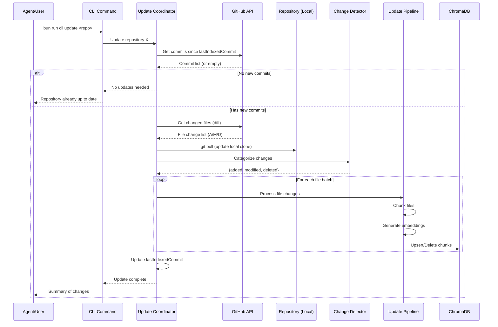

# Incremental Updates Architecture Plan

**Version:** 1.1
**Date:** December 14, 2025
**Status:** Approved - Ready for Implementation
**Parent Issue:** Phase 4 - Automation Pipeline

---

## Table of Contents

1. [Executive Summary](#1-executive-summary)
2. [Problem Statement](#2-problem-statement)
3. [Current System Analysis](#3-current-system-analysis)
4. [Architecture Options](#4-architecture-options)
5. [Recommended Architecture](#5-recommended-architecture)
6. [Incremental Update Pipeline](#6-incremental-update-pipeline)
7. [Chunk Management Strategy](#7-chunk-management-strategy)
8. [Error Handling and Recovery](#8-error-handling-and-recovery)
9. [Security Considerations](#9-security-considerations)
10. [Implementation Phases](#10-implementation-phases)
11. [Decisions Summary](#11-decisions-summary)
12. [Appendices](#12-appendices)

---

## 1. Executive Summary

This document proposes an architecture for incrementally updating the Personal Knowledge MCP vector index when Pull Requests are merged to monitored GitHub repositories. The goal is to maintain index freshness without requiring expensive full re-indexing operations.

### Key Goals

1. **Efficiency**: Update only affected chunks when PRs merge (<1 minute for typical PRs)
2. **Consistency**: Maintain index integrity across add/update/delete operations
3. **Reliability**: Graceful handling of failures with automatic recovery
4. **Simplicity**: On-demand triggering integrated with PR workflow

### Design Principles

- **Incremental over Full**: Never re-index entire repositories for normal changes
- **Idempotent Operations**: Safe to retry any update operation
- **Eventual Consistency**: Accept brief periods of staleness for reliability
- **Observable**: Full visibility into update status and history via CLI and logs
- **On-Demand First**: Manual/agent-triggered updates rather than continuous polling

---

## 2. Problem Statement

### Current Behavior

The system currently supports only full repository indexing:

1. Clone entire repository
2. Scan all matching files
3. Chunk all files
4. Generate embeddings for all chunks
5. Store all documents in ChromaDB (replacing any existing)

For a medium-sized repository (1,000+ files), this takes 15-30 minutes and consumes significant OpenAI API credits.

### Desired Behavior

When a PR is merged to an indexed repository:

1. Agent or user triggers update (via CLI command)
2. Identify changed files from the PR
3. Update only the affected chunks in the vector index
4. Complete within 1 minute for typical PRs (5-20 files changed)

### Constraints

- **Platform**: Primary workflow is GitHub (Azure DevOps support deferred to Phase 3)
- **Deployment**: Local/single-user initially (no public webhook endpoint by default)
- **Budget**: Minimize embedding API costs
- **Complexity**: MVP-appropriate solution, not over-engineered
- **Trigger Model**: On-demand (agent/manual) rather than automated polling

---

## 3. Current System Analysis

### Existing Components

The current system has most building blocks needed for incremental updates:

```
Component                   Status    Gap for Incremental Updates
-------------------------   --------  -----------------------------------
RepositoryCloner            Ready     Need: git pull / sparse checkout
FileScanner                 Ready     Need: scan specific files only
FileChunker                 Ready     Ready (stateless, file-by-file)
EmbeddingProvider           Ready     Ready (batch API)
ChromaStorageClient         Ready     Need: update/delete by ID
RepositoryMetadataStore     Ready     Need: track last indexed commit
```

### ChromaDB Capabilities

ChromaDB supports the required operations for incremental updates:

```typescript
// Current: Add documents (used for full indexing)
collection.add({ ids, embeddings, documents, metadatas });

// Needed: Update existing documents
collection.update({ ids, embeddings, documents, metadatas });

// Needed: Upsert (add or update)
collection.upsert({ ids, embeddings, documents, metadatas });

// Needed: Delete documents by ID
collection.delete({ ids });

// Needed: Get documents by ID (to check existence)
collection.get({ ids });
```

### Document ID Schema

The current ID format supports incremental updates:

```
Format: {repository}:{file_path}:{chunk_index}
Example: my-api:src/auth/middleware.ts:0
```

This allows:
- Finding all chunks for a file: `my-api:src/auth/middleware.ts:*`
- Efficient deletion of a file's chunks
- Preservation of unaffected chunks

### Gap Analysis

| Capability | Current State | Required Change |
|------------|---------------|-----------------|
| Change detection | None | Add commit tracking + GitHub API integration |
| Partial file scan | Scan all files | Add file path filtering to FileScanner |
| Document update | Add only | Implement upsert/delete in ChromaStorageClient |
| Commit tracking | Not stored | Add `lastIndexedCommitSha` to RepositoryInfo |
| Update triggering | Manual CLI | Add `update` CLI command (on-demand model) |

---

## 4. Architecture Options

### Option A: GitHub Webhooks (Push Model)

```
GitHub --> Webhook --> MCP Service --> Update Pipeline
```

**How it works:**
1. Configure GitHub webhook on repository
2. GitHub POSTs to MCP service endpoint when PR merges
3. MCP service processes update immediately

**Pros:**
- Real-time updates (seconds after merge)
- No polling overhead
- GitHub-native pattern

**Cons:**
- Requires public endpoint (ngrok, Tailscale Funnel, or cloud deployment)
- Webhook configuration per repository
- Security considerations (signature verification, rate limiting)
- More complex local development setup

**Best for:** Production deployments with public infrastructure

**Status:** Deferred to future phase

### Option B: Polling (Pull Model)

```
Scheduler --> GitHub API --> Detect Changes --> Update Pipeline
```

**How it works:**
1. Background scheduler runs periodically (e.g., every 5 minutes)
2. For each indexed repository, check for new commits since last indexed
3. If new commits exist, fetch changed files and process updates

**Pros:**
- No public endpoint required
- Works behind firewalls/VPNs
- Simple to implement and debug
- Graceful degradation (missed poll = slight delay, not lost data)

**Cons:**
- Update latency (up to polling interval)
- API rate limit consumption
- Continuous resource usage even when no changes

**Best for:** Local development, private networks

**Status:** Not selected for MVP (on-demand preferred)

### Option C: Hybrid (Webhook + Polling Fallback)

```
Primary:   GitHub --> Webhook --> Update Pipeline
Fallback:  Scheduler --> GitHub API --> Update Pipeline
```

**How it works:**
1. Configure webhooks where possible (public repos, cloud deployments)
2. Run polling as fallback for missed webhooks or repos without webhooks
3. Deduplicate updates using commit SHA tracking

**Pros:**
- Best of both worlds
- Resilient to webhook failures
- Flexible deployment options

**Cons:**
- Most complex to implement
- More testing scenarios
- Potential for duplicate processing

**Best for:** Production systems requiring high reliability

**Status:** Future consideration

### Option D: On-Demand Trigger with Change Detection (Selected)

```
User/Agent/CI --> CLI Command --> Detect Changes --> Update Pipeline
```

**How it works:**
1. Agent runs `bun run cli update <repo>` after closing/merging PR
2. System detects changes since last indexed commit
3. Processes only changed files

**Pros:**
- Simplest implementation
- Full user/agent control
- No background processes
- Works in any environment
- No API rate limit concerns from polling
- Integrates naturally with PR closure workflow

**Cons:**
- Requires explicit trigger (agent integration or manual)
- May fall behind if not triggered

**Best for:** Agent-driven workflows, CI/CD integration, initial MVP

**Status:** Selected for implementation

---

## 5. Recommended Architecture

### Selected Approach: On-Demand Updates

Based on stakeholder decisions, implement **Option D (On-Demand Trigger)** as the primary update mechanism:

```
                     +-----------------+
                     |  CLI: update    |
                     |  bun run cli    |
                     |  update <repo>  |
                     +--------+--------+
                              |
          (Agent closes PR)   |
                              v
+------------------+    +-----+------+    +------------------+
| GitHub API       |--->| Update     |--->| Incremental      |
| (commits, diffs) |    | Coordinator|    | Update Pipeline  |
+------------------+    +------------+    +------------------+
                             |                    |
                             v                    v
                       +------------+    +------------------+
                       | Change     |    | ChromaDB         |
                       | Detector   |    | (upsert/delete)  |
                       +------------+    +------------------+
```

**Key Design Decisions:**
1. **On-Demand Triggering**: Updates triggered by agent after PR merge, not automated polling
2. **Sequential Processing**: One repository at a time (simplicity over parallelism)
3. **Primary Branch Only**: Index only the main/master branch, triggered on merges
4. **CLI + Log Notifications**: Status via CLI commands and log files
5. **500 File Threshold**: Fall back to full re-index for massive changes
6. **Force Push = Re-index**: Detect history rewrites and trigger full re-index

**Rationale:**
1. **No background processes**: Simpler deployment, no resource consumption when idle
2. **Agent integration**: Natural fit with PR workflow - agent closes PR, then updates index
3. **Testable**: Easy to test with manual triggers during development
4. **CI-ready**: Can be called from GitHub Actions post-merge if needed

### Future Enhancement: Add Webhooks

When deploying to environments with public endpoints (future phase):
1. Add webhook receiver endpoint to MCP service
2. Implement GitHub webhook signature verification
3. Use webhooks as primary, on-demand as fallback
4. Deduplicate based on commit SHA

---

## 6. Incremental Update Pipeline

### 6.1 High-Level Flow



### 6.2 Change Detection

#### Using GitHub API

```typescript
interface FileChange {
  path: string;
  status: 'added' | 'modified' | 'deleted' | 'renamed';
  previousPath?: string;  // For renames
}

async function detectChanges(
  owner: string,
  repo: string,
  baseCommit: string,  // Last indexed commit
  headCommit: string   // Current HEAD
): Promise<FileChange[]> {
  // GitHub Compare API: GET /repos/{owner}/{repo}/compare/{base}...{head}
  const comparison = await github.repos.compareCommits({
    owner,
    repo,
    base: baseCommit,
    head: headCommit
  });

  return comparison.data.files.map(file => ({
    path: file.filename,
    status: file.status as FileChange['status'],
    previousPath: file.previous_filename
  }));
}
```

#### Filtering Relevant Changes

Not all file changes need index updates:

```typescript
function filterRelevantChanges(
  changes: FileChange[],
  indexedExtensions: string[],
  excludePatterns: string[]
): FileChange[] {
  return changes.filter(change => {
    const path = change.path;

    // Check extension
    const ext = path.substring(path.lastIndexOf('.'));
    if (!indexedExtensions.includes(ext)) {
      return false;
    }

    // Check exclude patterns
    for (const pattern of excludePatterns) {
      if (minimatch(path, pattern)) {
        return false;
      }
    }

    return true;
  });
}
```

### 6.3 Update Coordinator

```typescript
interface UpdateResult {
  repository: string;
  previousCommit: string;
  newCommit: string;
  stats: {
    filesAdded: number;
    filesModified: number;
    filesDeleted: number;
    chunksUpserted: number;
    chunksDeleted: number;
    durationMs: number;
  };
  errors: UpdateError[];
}

class IncrementalUpdateCoordinator {
  constructor(
    private readonly githubClient: GitHubClient,
    private readonly repositoryService: RepositoryMetadataService,
    private readonly updatePipeline: IncrementalUpdatePipeline,
    private readonly storageClient: ChromaStorageClient,
    private readonly logger: Logger
  ) {}

  async updateRepository(repositoryName: string): Promise<UpdateResult> {
    const startTime = performance.now();

    // 1. Get repository metadata
    const repoInfo = await this.repositoryService.getRepository(repositoryName);
    if (!repoInfo) {
      throw new Error(`Repository '${repositoryName}' not found`);
    }

    // 2. Parse owner/repo from URL
    const { owner, repo } = parseGitHubUrl(repoInfo.url);

    // 3. Get current HEAD commit (primary branch only)
    const headCommit = await this.githubClient.getHeadCommit(owner, repo, repoInfo.branch);

    // 4. Check if updates needed
    const lastIndexedCommit = repoInfo.lastIndexedCommitSha;
    if (lastIndexedCommit === headCommit) {
      this.logger.info({ repository: repositoryName }, 'Repository already up to date');
      return {
        repository: repositoryName,
        previousCommit: lastIndexedCommit,
        newCommit: headCommit,
        stats: {
          filesAdded: 0,
          filesModified: 0,
          filesDeleted: 0,
          chunksUpserted: 0,
          chunksDeleted: 0,
          durationMs: performance.now() - startTime
        },
        errors: []
      };
    }

    // 5. Detect changes (check for force push)
    let allChanges: FileChange[];
    try {
      allChanges = await this.detectChanges(owner, repo, lastIndexedCommit, headCommit);
    } catch (error) {
      // Force push detected - base commit no longer exists
      if (this.isCommitNotFoundError(error)) {
        this.logger.warn(
          { repository: repositoryName },
          'Force push detected - triggering full re-index'
        );
        return await this.triggerFullReindex(repositoryName);
      }
      throw error;
    }

    // 6. Check threshold - fall back to full re-index if too many changes
    if (allChanges.length > 500) {
      this.logger.warn(
        { repository: repositoryName, fileCount: allChanges.length },
        'Too many changes (>500 files) - triggering full re-index'
      );
      return await this.triggerFullReindex(repositoryName);
    }

    // 7. Filter to relevant changes
    const relevantChanges = this.filterRelevantChanges(
      allChanges,
      repoInfo.includeExtensions,
      repoInfo.excludePatterns
    );

    // 8. Update local clone
    await this.updateLocalClone(repoInfo.localPath, repoInfo.branch);

    // 9. Process changes (sequential, one at a time)
    const result = await this.updatePipeline.processChanges(
      repoInfo,
      relevantChanges
    );

    // 10. Update metadata with new commit SHA
    await this.repositoryService.updateRepository({
      ...repoInfo,
      lastIndexedCommitSha: headCommit,
      lastIncrementalUpdateAt: new Date().toISOString()
    });

    // 11. Log completion
    this.logger.info({
      repository: repositoryName,
      commits: `${lastIndexedCommit?.slice(0, 7) ?? 'initial'}..${headCommit.slice(0, 7)}`,
      ...result.stats
    }, 'Repository update completed');

    return {
      repository: repositoryName,
      previousCommit: lastIndexedCommit ?? '',
      newCommit: headCommit,
      stats: result.stats,
      errors: result.errors
    };
  }

  private isCommitNotFoundError(error: unknown): boolean {
    // GitHub returns 404 when comparing with a commit that no longer exists
    return error instanceof Error &&
           (error.message.includes('commit_not_found') ||
            error.message.includes('404'));
  }
}
```

### 6.4 CLI Integration

The update command integrates with the existing CLI structure:

```typescript
// src/cli/commands/update.ts
import { Command } from 'commander';

export function registerUpdateCommand(program: Command): void {
  program
    .command('update <repository>')
    .description('Incrementally update repository index with latest changes')
    .option('--force', 'Force full re-index instead of incremental')
    .action(async (repository: string, options: { force?: boolean }) => {
      const coordinator = await getUpdateCoordinator();

      if (options.force) {
        console.log(`Triggering full re-index for ${repository}...`);
        const result = await coordinator.triggerFullReindex(repository);
        displayResult(result);
      } else {
        console.log(`Checking for updates to ${repository}...`);
        const result = await coordinator.updateRepository(repository);
        displayResult(result);
      }
    });

  program
    .command('update-all')
    .description('Update all indexed repositories')
    .action(async () => {
      const coordinator = await getUpdateCoordinator();
      const repos = await coordinator.listRepositories();

      for (const repo of repos.filter(r => r.status === 'ready')) {
        console.log(`\nUpdating ${repo.name}...`);
        try {
          const result = await coordinator.updateRepository(repo.name);
          displayResult(result);
        } catch (error) {
          console.error(`Failed to update ${repo.name}:`, error);
        }
      }
    });
}

function displayResult(result: UpdateResult): void {
  if (result.stats.chunksUpserted === 0 && result.stats.chunksDeleted === 0) {
    console.log('  No changes detected - repository is up to date');
  } else {
    console.log(`  Commits: ${result.previousCommit.slice(0, 7)}..${result.newCommit.slice(0, 7)}`);
    console.log(`  Files: +${result.stats.filesAdded} ~${result.stats.filesModified} -${result.stats.filesDeleted}`);
    console.log(`  Chunks: +${result.stats.chunksUpserted} -${result.stats.chunksDeleted}`);
    console.log(`  Duration: ${result.stats.durationMs.toFixed(0)}ms`);
  }

  if (result.errors.length > 0) {
    console.log(`  Warnings: ${result.errors.length} file(s) had errors`);
    for (const err of result.errors) {
      console.log(`    - ${err.path}: ${err.error}`);
    }
  }
}
```

---

## 7. Chunk Management Strategy

### 7.1 Chunk ID Schema

The existing ID format `{repository}:{file_path}:{chunk_index}` is suitable for incremental updates:

```typescript
// Example IDs for a file split into 3 chunks:
// my-api:src/auth/middleware.ts:0
// my-api:src/auth/middleware.ts:1
// my-api:src/auth/middleware.ts:2
```

### 7.2 Handling File Operations

#### Added Files

1. Chunk the new file
2. Generate embeddings for all chunks
3. Add documents to ChromaDB

```typescript
async function handleAddedFile(
  fileInfo: FileInfo,
  repository: string,
  collectionName: string
): Promise<void> {
  const content = await Bun.file(fileInfo.absolutePath).text();
  const chunks = fileChunker.chunkFile(content, fileInfo, repository);
  const embeddings = await embeddingProvider.generateEmbeddings(
    chunks.map(c => c.content)
  );

  const documents = chunks.map((chunk, i) => ({
    id: chunk.id,
    content: chunk.content,
    embedding: embeddings[i],
    metadata: buildMetadata(chunk)
  }));

  await storageClient.addDocuments(collectionName, documents);
}
```

#### Modified Files

**Challenge:** A modified file may have a different number of chunks than before.

**Strategy:** Delete all existing chunks, then add new chunks (simple and reliable).

```typescript
async function handleModifiedFile(
  fileInfo: FileInfo,
  repository: string,
  collectionName: string
): Promise<void> {
  // 1. Find and delete all existing chunks for this file
  const filePrefix = `${repository}:${fileInfo.relativePath}:`;
  await deleteChunksByPrefix(collectionName, filePrefix);

  // 2. Add new chunks (same as added file)
  await handleAddedFile(fileInfo, repository, collectionName);
}
```

**Note:** Content hash optimization (comparing chunks to skip unchanged ones) is deferred to a future phase. The "delete all + add all" approach is simpler and handles all edge cases correctly.

#### Deleted Files

1. Find all chunks for the deleted file
2. Delete from ChromaDB

```typescript
async function handleDeletedFile(
  filePath: string,
  repository: string,
  collectionName: string
): Promise<number> {
  // Build prefix for this file's chunks
  const filePrefix = `${repository}:${filePath}:`;

  // Delete all matching chunks
  return await deleteChunksByPrefix(collectionName, filePrefix);
}

async function deleteChunksByPrefix(
  collectionName: string,
  prefix: string
): Promise<number> {
  const collection = await storageClient.getOrCreateCollection(collectionName);

  // Get all IDs in collection
  const allData = await collection.get({});

  // Filter to matching IDs
  const idsToDelete = allData.ids.filter(id => id.startsWith(prefix));

  if (idsToDelete.length > 0) {
    await collection.delete({ ids: idsToDelete });
  }

  return idsToDelete.length;
}
```

**Note:** ChromaDB does not support prefix-based deletion natively. We must fetch all IDs and filter client-side. For repositories with many chunks, this could be optimized using metadata filters:

```typescript
// Alternative: Use metadata filter
const results = await collection.get({
  where: {
    repository: repository,
    file_path: filePath
  }
});
await collection.delete({ ids: results.ids });
```

#### Renamed Files

Treat renames as delete + add:

```typescript
async function handleRenamedFile(
  oldPath: string,
  newPath: string,
  newFileInfo: FileInfo,
  repository: string,
  collectionName: string
): Promise<void> {
  // Delete chunks with old path
  await handleDeletedFile(oldPath, repository, collectionName);

  // Add chunks with new path
  await handleAddedFile(newFileInfo, repository, collectionName);
}
```

### 7.3 Chunk Count Changes

When a file is modified, the number of chunks may change:

| Scenario | Old Chunks | New Chunks | Action |
|----------|------------|------------|--------|
| Content added | 3 | 4 | Delete 3, Add 4 |
| Content removed | 5 | 3 | Delete 5, Add 3 |
| Content modified | 3 | 3 | Delete 3, Add 3 (or upsert if IDs match) |

The "delete all + add all" strategy handles all scenarios consistently.

### 7.4 ChromaDB Operations

Required additions to `ChromaStorageClient`:

```typescript
interface ChromaStorageClient {
  // Existing methods...

  /**
   * Upsert documents (add or update)
   * Uses ChromaDB's native upsert operation
   */
  upsertDocuments(collectionName: string, documents: DocumentInput[]): Promise<void>;

  /**
   * Delete documents by ID
   */
  deleteDocuments(collectionName: string, ids: string[]): Promise<void>;

  /**
   * Get documents by ID
   * Returns matching documents with their metadata
   */
  getDocuments(collectionName: string, ids: string[]): Promise<DocumentWithMetadata[]>;

  /**
   * Get documents by metadata filter
   * Useful for finding all chunks for a file
   */
  getDocumentsByMetadata(
    collectionName: string,
    where: Record<string, string | number>
  ): Promise<DocumentWithMetadata[]>;
}
```

---

## 8. Error Handling and Recovery

### 8.1 Error Categories

| Category | Example | Recovery Strategy |
|----------|---------|-------------------|
| Transient Network | GitHub API timeout | Retry with exponential backoff |
| Rate Limiting | GitHub/OpenAI rate limit | Wait and retry, reduce batch size |
| Partial Failure | Some files failed to process | Continue with remaining, report failures |
| Force Push | Base commit no longer exists | Trigger full re-index |
| Corruption | Index inconsistent with source | Fall back to full re-index |
| Git Conflicts | Local clone out of sync | Delete and re-clone |

### 8.2 Retry Strategy

```typescript
interface RetryConfig {
  maxRetries: number;
  initialDelayMs: number;
  maxDelayMs: number;
  backoffMultiplier: number;
}

const DEFAULT_RETRY_CONFIG: RetryConfig = {
  maxRetries: 3,
  initialDelayMs: 1000,
  maxDelayMs: 60000,
  backoffMultiplier: 2
};

async function withRetry<T>(
  operation: () => Promise<T>,
  config: RetryConfig = DEFAULT_RETRY_CONFIG
): Promise<T> {
  let lastError: Error;
  let delay = config.initialDelayMs;

  for (let attempt = 0; attempt <= config.maxRetries; attempt++) {
    try {
      return await operation();
    } catch (error) {
      lastError = error as Error;

      if (attempt === config.maxRetries) {
        throw lastError;
      }

      if (!isRetryable(error)) {
        throw lastError;
      }

      await sleep(delay);
      delay = Math.min(delay * config.backoffMultiplier, config.maxDelayMs);
    }
  }

  throw lastError!;
}
```

### 8.3 Partial Failure Handling

When processing multiple files, continue on individual failures:

```typescript
async function processFileChanges(
  changes: FileChange[],
  context: ProcessingContext
): Promise<BatchResult> {
  const result: BatchResult = {
    processed: [],
    failed: [],
    stats: { /* ... */ }
  };

  for (const change of changes) {
    try {
      await processFileChange(change, context);
      result.processed.push(change.path);
    } catch (error) {
      result.failed.push({
        path: change.path,
        error: error instanceof Error ? error.message : String(error)
      });
      // Continue processing other files
    }
  }

  // Update commit SHA only if at least some files succeeded
  // and there are no critical failures
  if (result.processed.length > 0 && !hasCriticalFailures(result.failed)) {
    await updateCommitSha(context.newCommit);
  }

  return result;
}
```

### 8.4 Consistency Recovery

**Scenario:** Update partially completed, index is inconsistent.

**Detection:**
- Track update status in repository metadata
- Add `updateInProgress: boolean` and `updateStartedAt: string` fields

**Recovery:**
1. On startup, check for interrupted updates
2. If found, either:
   a. Complete the interrupted update (if changes still identifiable)
   b. Trigger full re-index (if state cannot be recovered)

```typescript
interface RepositoryInfo {
  // Existing fields...
  lastIndexedCommitSha?: string;
  updateInProgress?: boolean;
  updateStartedAt?: string;
  pendingChanges?: FileChange[];
}

async function checkAndRecoverInterruptedUpdates(): Promise<void> {
  const repos = await repositoryService.listRepositories();

  for (const repo of repos) {
    if (repo.updateInProgress) {
      logger.warn({ repository: repo.name }, 'Found interrupted update');

      if (repo.pendingChanges && repo.pendingChanges.length > 0) {
        // Try to complete the interrupted update
        await completeInterruptedUpdate(repo);
      } else {
        // Cannot recover - trigger full re-index
        await triggerFullReindex(repo.name);
      }
    }
  }
}
```

### 8.5 Full Re-Index Fallback

Triggers for automatic full re-index:

```typescript
const REINDEX_TRIGGERS = [
  'commit_not_found',           // Force push - base commit no longer exists
  'too_many_changes',           // > 500 files changed
  'local_clone_corrupted',      // Git operations failing
  'index_corruption_detected',  // Chunk counts don't match metadata
  'schema_migration_required'   // Metadata format changed
];

function shouldFallbackToFullReindex(
  error: Error,
  changeCount: number
): boolean {
  // Threshold: 500 files triggers full re-index
  if (changeCount > 500) {
    return true;
  }

  for (const trigger of REINDEX_TRIGGERS) {
    if (error.message.includes(trigger)) {
      return true;
    }
  }

  return false;
}
```

---

## 9. Security Considerations

### 9.1 GitHub API Authentication

```typescript
// Required for private repositories and higher rate limits
interface GitHubConfig {
  // Personal Access Token (classic or fine-grained)
  pat?: string;

  // GitHub App authentication (recommended for organizations)
  appId?: string;
  privateKey?: string;
  installationId?: string;
}
```

**Recommendations:**
- Use environment variables for credentials (never in code)
- Fine-grained PAT with minimal scopes: `contents:read`, `metadata:read`
- Consider GitHub App for organization-wide access

### 9.2 Webhook Security (Future Phase)

When webhooks are implemented in a future phase:

```typescript
function verifyWebhookSignature(
  payload: string,
  signature: string,
  secret: string
): boolean {
  const expectedSignature = `sha256=${
    crypto.createHmac('sha256', secret)
      .update(payload)
      .digest('hex')
  }`;

  return crypto.timingSafeEqual(
    Buffer.from(signature),
    Buffer.from(expectedSignature)
  );
}
```

**Requirements:**
- HTTPS only for webhook endpoints
- Signature verification on all webhook payloads
- Rate limiting to prevent abuse
- IP allowlisting (GitHub's webhook IPs) if possible

### 9.3 Local Clone Security

```typescript
// Ensure clones stay within designated directory
function validateClonePath(clonePath: string, basePath: string): boolean {
  const resolvedClone = path.resolve(clonePath);
  const resolvedBase = path.resolve(basePath);

  return resolvedClone.startsWith(resolvedBase + path.sep);
}
```

### 9.4 Rate Limiting

**GitHub API Limits:**
- Authenticated: 5,000 requests/hour
- Unauthenticated: 60 requests/hour

**Mitigation (for on-demand model):**
- On-demand updates minimize API usage (no continuous polling)
- Cache GitHub responses where appropriate
- Use conditional requests (If-None-Match, If-Modified-Since)
- Exponential backoff on 403 responses

---

## 10. Implementation Phases

### Phase 1: Foundation (Week 1-2)

**Goal:** Core incremental update capability with manual/agent triggering

**Tasks:**
1. Add `lastIndexedCommitSha` to RepositoryInfo type
2. Implement GitHub API client for commit comparison
3. Add `upsertDocuments` and `deleteDocuments` to ChromaStorageClient
4. Create `IncrementalUpdateCoordinator` service
5. Implement force push detection (commit not found = full re-index)
6. Add `update` CLI command: `bun run cli update <repo>`
7. Add `update-all` CLI command for batch updates
8. Unit and integration tests

**Deliverables:**
- Manual/agent-triggered incremental updates working
- < 1 minute update time for typical PRs
- Force push handling with automatic full re-index

### Phase 2: Observability (Week 3)

**Goal:** Visibility into update operations via CLI and logs

**Tasks:**
1. Add update history tracking (last N updates per repo)
2. Create update metrics (duration, chunk counts, errors)
3. Enhance `bun run cli status` with update information
4. Add `bun run cli history <repo>` command
5. Structured logging for all update operations
6. Integration tests for status/history commands

**Deliverables:**
- Full audit trail of updates in logs
- CLI visibility into update status and history
- Debugging capability for failed updates

### Phase 3: Robustness (Week 4)

**Goal:** Production-ready error handling and recovery

**Tasks:**
1. Implement interrupted update detection and recovery
2. Add retry logic with exponential backoff
3. Implement 500-file threshold for full re-index fallback
4. Add partial failure handling (continue on individual file errors)
5. Enhanced logging for troubleshooting
6. Comprehensive error handling tests

**Deliverables:**
- Graceful handling of all error scenarios
- Automatic recovery from interrupted updates
- Clear error messages in CLI and logs

### Phase 4: Webhooks (Future - Not in MVP)

**Goal:** Real-time updates via GitHub webhooks

**Tasks:**
1. Add HTTP endpoint for webhooks (separate from MCP stdio)
2. Implement webhook signature verification
3. Parse pull_request and push events
4. Add webhook configuration to CLI: `bun run cli webhook setup`
5. Hybrid mode with on-demand fallback

**Deliverables:**
- Real-time index updates (when deployed with public endpoint)
- Webhook management commands

### 10.1 Implementation Status

**Status as of December 2024:**

| Phase | Status | Key Milestones |
|-------|--------|----------------|
| **Phase 1: Foundation** | ✅ Mostly Complete | Core services implemented, CLI pending |
| **Phase 2: Observability** | 🔄 In Progress | Enhanced status complete, history pending |
| **Phase 3: Robustness** | 🔄 In Progress | Retry logic and partial failure handling complete |
| **Phase 4: Webhooks** | 📋 Planned | Deferred to future phase |

**Completed Components:**
- ✅ Repository metadata schema extension (#42)
- ✅ GitHub API client for change detection (#43)
- ✅ ChromaDB upsert and delete operations (#44)
- ✅ Incremental update pipeline (#45)
- ✅ Update coordinator service (#46)
- ✅ Enhanced status command with update information (#51)
- ✅ Retry logic with exponential backoff (#56)
- ✅ Partial failure handling (#57)
- ✅ Comprehensive error handling tests (#58)

**In Progress:**
- 🔄 CLI update commands (#47)
- 🔄 Foundation phase unit and integration tests (#48)
- 🔄 Update history tracking (#49)
- 🔄 CLI history command (#50)
- 🔄 Structured logging for updates (#52)
- 🔄 Update metrics tracking (#53)
- 🔄 Interrupted update detection (#54)
- 🔄 Interrupted update recovery (#55)
- 🔄 Documentation updates (#59)

For detailed issue tracking, see the [Incremental Updates Milestone](https://github.com/sethships/PersonalKnowledgeMCP/milestone/2).

---

## 11. Decisions Summary

This section documents the final stakeholder decisions on architecture questions.

### 11.1 Update Triggering Model

**Decision:** On-demand only

**Rationale:** Updates will be triggered by agents after closing/merging PRs, or manually via CLI. This eliminates the need for background polling, reduces complexity, and integrates naturally with the PR workflow.

**Impact:**
- No `RepositoryPollingService` needed for MVP
- CLI `update` command is the primary interface
- Agents should call `bun run cli update <repo>` after PR completion

### 11.2 Concurrent Updates

**Decision:** Sequential (one repository at a time)

**Rationale:** Parallel updates add complexity without significant benefit for the expected use case. Sequential processing is simpler to implement, debug, and reason about.

**Impact:**
- `update-all` command processes repositories one at a time
- No concurrency configuration needed
- Simpler error handling and logging

### 11.3 Large Change Set Threshold

**Decision:** 500 files triggers full re-index

**Rationale:** Beyond 500 files, incremental update overhead approaches full re-index time, and the risk of partial failures increases.

**Impact:**
- Change detection checks file count before processing
- Warning logged when threshold exceeded
- Automatic fallback to full re-index

### 11.4 Force Push Handling

**Decision:** Detect and trigger full re-index with notification

**Rationale:** Force pushes rewrite history, making incremental updates unreliable. Full re-index ensures consistency.

**Impact:**
- GitHub API 404 on commit comparison triggers full re-index
- Warning logged explaining the reason
- User/agent notified via CLI output

### 11.5 Branch Tracking

**Decision:** Primary branch only (main/master)

**Rationale:** Indexing occurs on merges to the primary branch. Feature branches are temporary and not indexed separately.

**Impact:**
- Repository metadata stores single branch (typically `main` or `master`)
- Updates only track changes to configured branch
- Simplifies change detection logic

### 11.6 Notification Mechanism

**Decision:** CLI status and log files (webhooks deferred)

**Rationale:** For MVP, users and agents check status via CLI commands. Detailed information is available in logs. Webhook callbacks add complexity and are deferred to a future phase.

**Impact:**
- `bun run cli status` shows update status
- `bun run cli history` shows update history
- Structured logs capture all details
- No webhook notification endpoint in MVP

### 11.7 API Rate Limit Strategy

**Decision:** Not applicable (on-demand model)

**Rationale:** On-demand updates only make API calls when explicitly triggered, eliminating continuous rate limit consumption from polling.

**Impact:**
- No rate limit budgeting needed
- Standard retry logic with exponential backoff
- Conservative approach by default

---

## 12. Appendices

### Appendix A: GitHub API Reference

#### Get Latest Commit

```http
GET /repos/{owner}/{repo}/commits/{branch}
Accept: application/vnd.github.v3+json
Authorization: Bearer {token}
```

#### Compare Commits

```http
GET /repos/{owner}/{repo}/compare/{base}...{head}
Accept: application/vnd.github.v3+json
Authorization: Bearer {token}
```

Response includes:
- `commits[]` - List of commits between base and head
- `files[]` - List of changed files with status (added/modified/deleted/renamed)

#### Rate Limit Check

```http
GET /rate_limit
Authorization: Bearer {token}
```

### Appendix B: ChromaDB Operations Reference

```python
# Upsert (add or update)
collection.upsert(
    ids=["id1", "id2"],
    embeddings=[[...], [...]],
    documents=["doc1", "doc2"],
    metadatas=[{...}, {...}]
)

# Delete by IDs
collection.delete(ids=["id1", "id2"])

# Delete by metadata filter
collection.delete(where={"file_path": "src/auth.ts"})

# Get by IDs
collection.get(ids=["id1", "id2"])

# Get by metadata filter
collection.get(where={"repository": "my-api"})
```

### Appendix C: Metadata Schema Extension

```typescript
interface RepositoryInfo {
  // Existing fields
  name: string;
  url: string;
  branch: string;
  localPath: string;
  collectionName: string;
  fileCount: number;
  chunkCount: number;
  lastIndexedAt: string;
  indexDurationMs: number;
  status: 'ready' | 'indexing' | 'error';
  errorMessage?: string;
  includeExtensions: string[];
  excludePatterns: string[];

  // New fields for incremental updates
  lastIndexedCommitSha?: string;           // Git commit SHA of last indexed state
  lastIncrementalUpdateAt?: string;        // ISO timestamp of last incremental update
  incrementalUpdateCount?: number;         // Count of incremental updates since full index
  updateInProgress?: boolean;              // True if update currently running
  updateStartedAt?: string;                // ISO timestamp when update started
  pendingChanges?: FileChange[];           // Changes being processed (for recovery)
}
```

### Appendix D: CLI Command Reference

```bash
# Incremental update (manual/agent trigger)
bun run cli update <repository>
bun run cli update my-api
bun run cli update my-api --force    # Force full re-index
bun run cli update-all               # Update all indexed repositories

# Update status
bun run cli status                   # Show status for all repos (includes update info)
bun run cli status my-api            # Show status for specific repo

# Update history
bun run cli history <repository>     # Show update history
bun run cli history my-api --limit 10 # Last 10 updates
```

---

## Document History

| Version | Date | Author | Changes |
|---------|------|--------|---------|
| 1.0 | 2025-12-13 | Claude Code | Initial draft |
| 1.1 | 2025-12-14 | Claude Code | Incorporated stakeholder decisions, removed polling in favor of on-demand, added Decisions Summary section |
| 1.2 | 2024-12-21 | Claude Code | Added Section 10.1 Implementation Status, updated Next Steps |

---

**Next Steps:**

1. ~~Review this document with stakeholders~~ (Complete)
2. ~~Answer open questions (Section 11)~~ (Complete - see Decisions Summary)
3. ~~Create GitHub issues for implementation phases~~ (Complete - see [Milestone](https://github.com/sethships/PersonalKnowledgeMCP/milestone/2))
4. ~~Begin Phase 1 implementation~~ (In Progress)
5. Complete remaining Phase 2 (Observability) issues
6. Complete remaining Phase 3 (Robustness) issues
