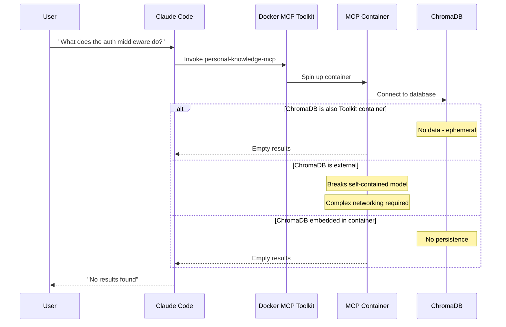
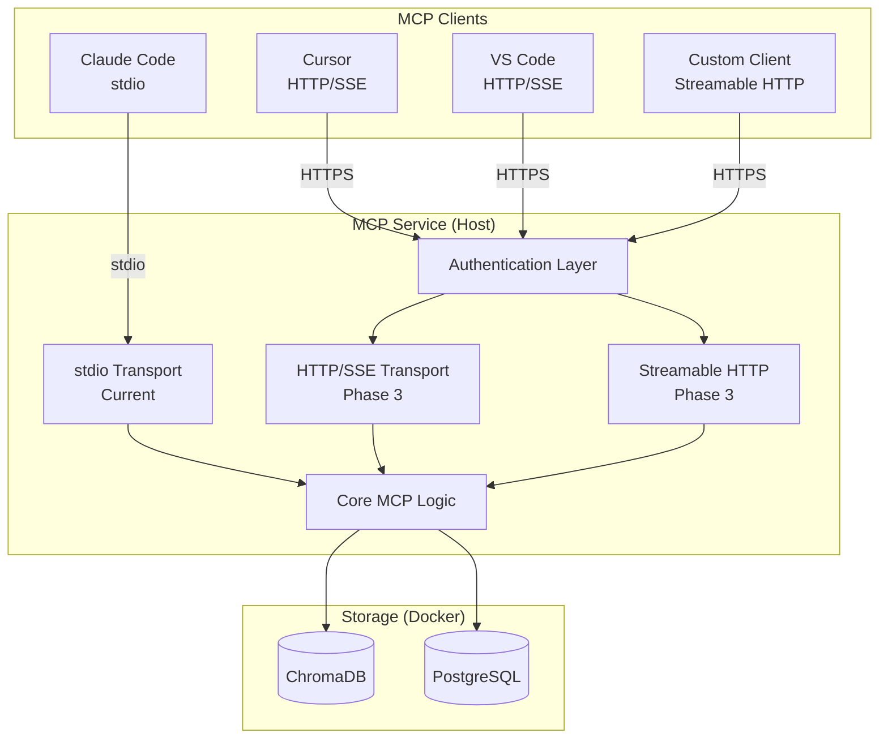
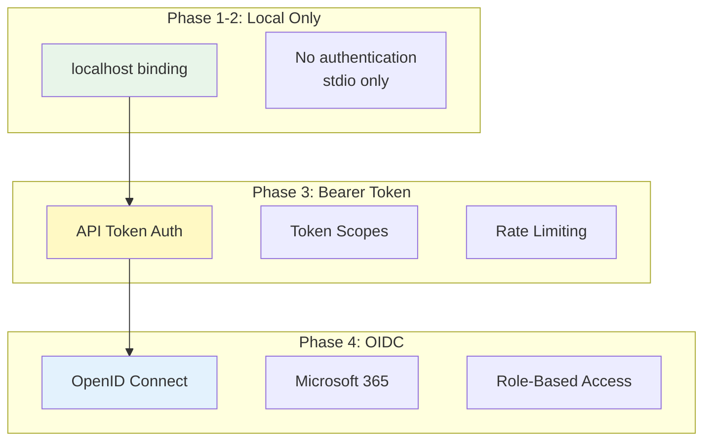
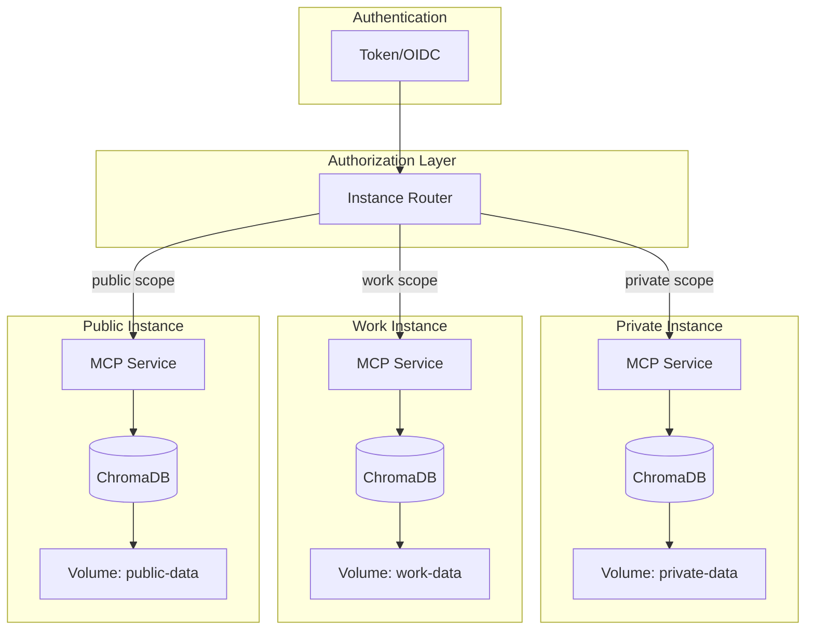
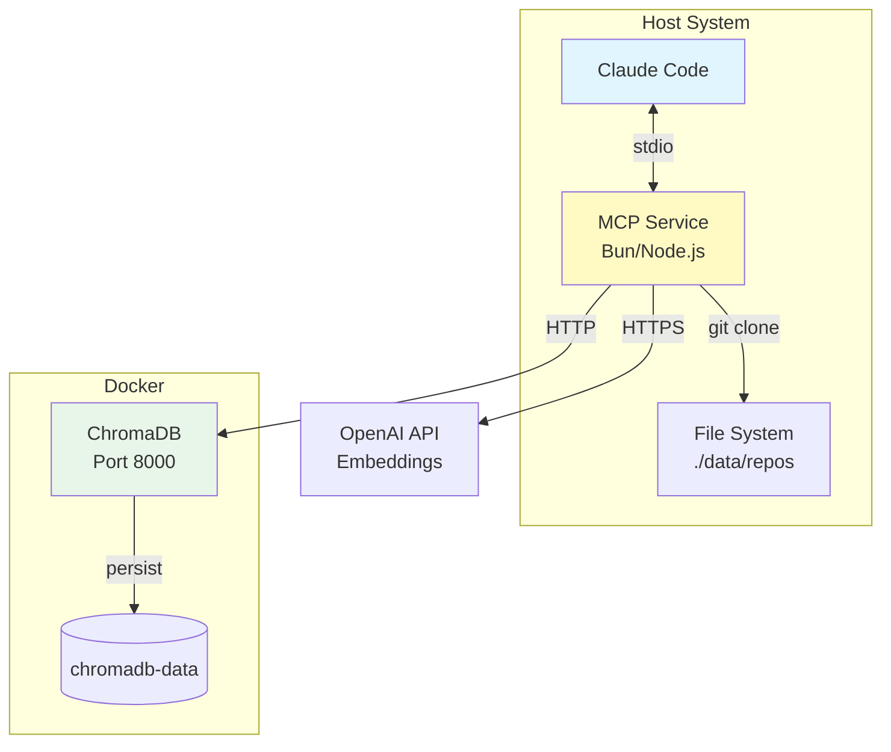
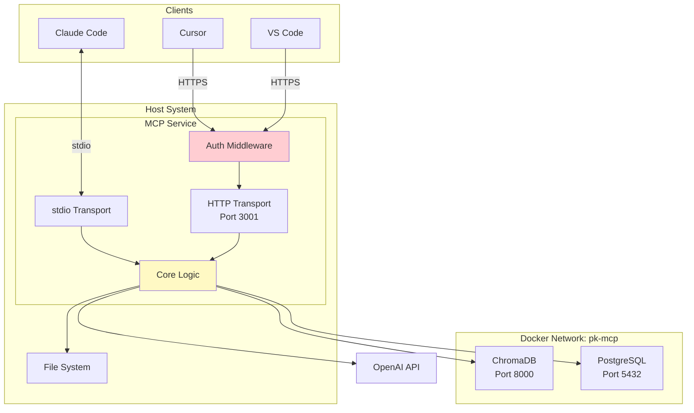
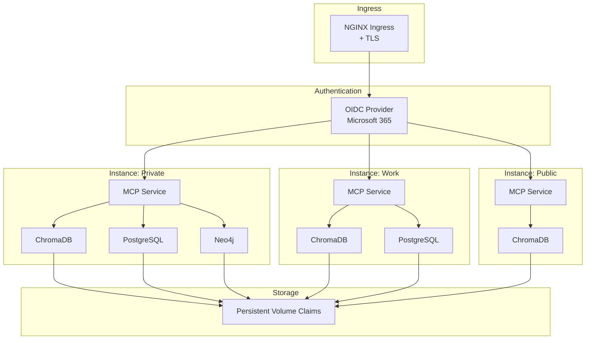

# Docker Containerization PRD - Personal Knowledge MCP

**Version:** 1.0
**Date:** December 20, 2025
**Status:** Draft
**Author:** Product Team
**Parent Document:** [High-level Personal Knowledge MCP PRD](../High-level-Personal-Knowledge-MCP-PRD.md)

---

## Table of Contents

1. [Executive Summary](#executive-summary)
2. [Goals and Non-Goals](#goals-and-non-goals)
3. [Why NOT Docker MCP Toolkit](#why-not-docker-mcp-toolkit)
4. [Technical Requirements](#technical-requirements)
5. [Security Architecture](#security-architecture)
6. [Architecture Diagrams](#architecture-diagrams)
7. [Phase Implementation Plan](#phase-implementation-plan)
8. [Success Metrics](#success-metrics)
9. [Risks and Mitigations](#risks-and-mitigations)
10. [Open Questions](#open-questions)
11. [References](#references)

---

## Executive Summary

This PRD defines the containerization strategy for Personal Knowledge MCP, a stateful AI knowledge management service. The document addresses container deployment for storage backends, multi-transport MCP support for cross-client compatibility, and security implementation for network-exposed endpoints.

**Key Decisions:**

| Decision | Choice | Rationale |
|----------|--------|-----------|
| Docker MCP Toolkit | **Not Used** | Architectural mismatch - service requires persistent indexed data |
| Primary Deployment | Docker Compose | Appropriate for stateful services with persistent storage |
| Multi-Client Support | HTTP/SSE Transport | Added in Phase 3 alongside stdio; protocol-native solution |
| Authentication | Bearer Token (Phase 3), OIDC (Phase 4) | Progressive security - simple to robust |
| Kubernetes | Phase 4+ | Deferred until multi-instance scaling required |

**Architecture Summary:**

```
Phase 1-2: [Claude Code] <--stdio--> [MCP Service (host)] <--HTTP--> [ChromaDB (Docker)]

Phase 3+:  [Claude Code] <--stdio--> [MCP Service (host)] <--HTTP--> [ChromaDB (Docker)]
           [Cursor/VSCode] <--HTTP--> [MCP Service (host)]
```

---

## Goals and Non-Goals

### Goals

**Phase 1-2 Goals (Docker Compose Hardening):**
1. Harden ChromaDB container with health checks, resource limits, and restart policies
2. Establish volume backup/restore patterns for data persistence
3. Prepare PostgreSQL and Neo4j container configurations for future phases
4. Document operational procedures for container lifecycle management

**Phase 3 Goals (Multi-Transport + Security):**
1. Add HTTP/SSE transport to MCP service for network-accessible clients
2. Implement Streamable HTTP transport per MCP 2025-03-26 specification
3. Implement bearer token authentication for HTTP endpoints
4. Enable multi-instance deployment with security isolation
5. Support cross-client compatibility (Claude Code, Cursor, VS Code, etc.)

**Phase 4 Goals (Enterprise Readiness):**
1. Implement OIDC authentication with Microsoft 365 integration
2. Create Kubernetes deployment manifests and Helm charts
3. Enable horizontal scaling for high-availability deployments

### Non-Goals

1. **Docker MCP Toolkit integration** - Explicitly rejected (see analysis below)
2. **Containerizing the MCP service itself** - stdio transport requires host process
3. **Public internet exposure** - VPN/Tailscale required for remote access
4. **Mobile-specific optimizations** - Desktop/development focus
5. **Enterprise compliance certifications** - SOC2/HIPAA deferred
6. **Real-time collaborative editing** - Not in scope

---

## Why NOT Docker MCP Toolkit

### The Architectural Mismatch

Docker MCP Toolkit is designed for **stateless, ephemeral operations**. Personal Knowledge MCP requires **persistent, pre-indexed data** to provide any value. This is a fundamental mismatch that cannot be worked around without compromising the product's core value proposition.

**Docker MCP Toolkit Design Philosophy:**
- Transient containers that spin up on demand
- Self-contained operations (fetch a webpage, convert a file, API calls)
- Each invocation is independent - no state between calls
- Resource-limited (1 CPU, 2GB RAM) - appropriate for quick operations
- Value delivered immediately per invocation

**Personal Knowledge MCP Reality:**
- Value comes from pre-indexed, persistent embeddings in ChromaDB
- ChromaDB must be running AND populated before any query is useful
- Indexing a repository takes minutes to hours depending on size
- Embeddings represent significant compute cost (OpenAI API calls)
- Query value is only realized after substantial upfront investment

### The Cold Start Problem

Consider what happens if Personal Knowledge MCP is containerized as a Toolkit server:



This is not a minor issue to work around - it defeats the product's entire purpose.

### When to Revisit This Decision

This decision should be revisited if:

1. **Docker MCP Toolkit adds persistent volume support** - Official support for stateful services with persistent data
2. **Toolkit adds sidecar/dependency patterns** - Ability to declare and manage dependent containers
3. **Cold start latency requirements change** - If 30+ second cold starts become acceptable
4. **Embedded vector DB becomes viable** - If a fully embedded solution (no external container) emerges with acceptable performance

Until then, Docker Compose is the correct deployment model for Personal Knowledge MCP.

---

## Technical Requirements

### Phase 1-2: Docker Compose Hardening

#### ChromaDB Container Configuration

**Current State:** Basic container with volume persistence.

**Target State:** Production-hardened container with monitoring.

```yaml
# docker-compose.yml - Phase 2 Configuration
services:
  chromadb:
    image: chromadb/chroma:0.4.22  # Pin version for reproducibility
    container_name: pk-mcp-chromadb
    ports:
      - "127.0.0.1:8000:8000"  # Bind to localhost only
    volumes:
      - chromadb-data:/chroma/chroma
    environment:
      - IS_PERSISTENT=TRUE
      - ANONYMIZED_TELEMETRY=FALSE
      - ALLOW_RESET=FALSE  # Disable in production
      - CHROMA_SERVER_AUTH_PROVIDER=token
      - CHROMA_SERVER_AUTH_CREDENTIALS=${CHROMADB_AUTH_TOKEN}
    deploy:
      resources:
        limits:
          cpus: '2'
          memory: 2G
        reservations:
          cpus: '0.5'
          memory: 512M
    healthcheck:
      test: ["CMD-SHELL", "python -c 'import urllib.request; urllib.request.urlopen(\"http://localhost:8000/api/v2/heartbeat\")'"]
      interval: 30s
      timeout: 10s
      retries: 3
      start_period: 40s
    networks:
      - pk-mcp-network
    restart: unless-stopped
    logging:
      driver: "json-file"
      options:
        max-size: "10m"
        max-file: "3"
```

#### Volume Management and Backup Patterns

**Backup Strategy:**

```bash
# Automated backup script: scripts/backup-chromadb.sh
#!/bin/bash
set -euo pipefail

BACKUP_DIR="${BACKUP_DIR:-./backups}"
TIMESTAMP=$(date +%Y%m%d-%H%M%S)
BACKUP_FILE="chromadb-backup-${TIMESTAMP}.tar.gz"

# Create backup directory
mkdir -p "${BACKUP_DIR}"

# Stop writes (optional - for consistency)
# docker-compose exec chromadb chroma-admin pause

# Create backup
docker run --rm \
  -v personalknowledgemcp_chromadb-data:/data:ro \
  -v "${BACKUP_DIR}":/backup \
  alpine \
  tar czf "/backup/${BACKUP_FILE}" -C /data .

# Resume writes
# docker-compose exec chromadb chroma-admin resume

echo "Backup created: ${BACKUP_DIR}/${BACKUP_FILE}"

# Retention: Keep last 7 daily, 4 weekly
find "${BACKUP_DIR}" -name "chromadb-backup-*.tar.gz" -mtime +30 -delete
```

**Restore Procedure:**

```bash
# scripts/restore-chromadb.sh
#!/bin/bash
set -euo pipefail

BACKUP_FILE="$1"

if [[ -z "${BACKUP_FILE}" ]]; then
  echo "Usage: $0 <backup-file.tar.gz>"
  exit 1
fi

echo "WARNING: This will replace all existing data."
read -p "Continue? (y/N) " confirm
[[ "${confirm}" =~ ^[Yy]$ ]] || exit 0

# Stop container
docker-compose stop chromadb

# Clear existing data
docker run --rm \
  -v personalknowledgemcp_chromadb-data:/data \
  alpine \
  sh -c "rm -rf /data/*"

# Restore from backup
docker run --rm \
  -v personalknowledgemcp_chromadb-data:/data \
  -v "$(pwd)":/backup:ro \
  alpine \
  tar xzf "/backup/${BACKUP_FILE}" -C /data

# Restart container
docker-compose up -d chromadb

echo "Restore complete. Verify with: curl http://localhost:8000/api/v2/heartbeat"
```

#### Future Storage Containers (Phase 2+)

**PostgreSQL (Phase 2 - Document Store):**

```yaml
postgres:
  image: postgres:17.2-alpine
  container_name: pk-mcp-postgres
  ports:
    - "127.0.0.1:5432:5432"
  volumes:
    - postgres-data:/var/lib/postgresql/data
    - ./init-scripts:/docker-entrypoint-initdb.d:ro
  environment:
    - POSTGRES_USER=${POSTGRES_USER:-pk_mcp}
    - POSTGRES_PASSWORD=${POSTGRES_PASSWORD}
    - POSTGRES_DB=${POSTGRES_DB:-personal_knowledge}
  deploy:
    resources:
      limits:
        cpus: '2'
        memory: 1G
  healthcheck:
    test: ["CMD-SHELL", "pg_isready -U ${POSTGRES_USER:-pk_mcp}"]
    interval: 30s
    timeout: 10s
    retries: 3
  networks:
    - pk-mcp-network
  restart: unless-stopped
```

**Neo4j (Phase 4 - Graph Database):**

```yaml
neo4j:
  image: neo4j:5.25.1-community
  container_name: pk-mcp-neo4j
  ports:
    - "127.0.0.1:7474:7474"  # HTTP
    - "127.0.0.1:7687:7687"  # Bolt
  volumes:
    - neo4j-data:/data
    - neo4j-logs:/logs
  environment:
    - NEO4J_AUTH=${NEO4J_USER:-neo4j}/${NEO4J_PASSWORD}
    - NEO4J_ACCEPT_LICENSE_AGREEMENT=yes
    - NEO4J_server_memory_heap_initial__size=512m
    - NEO4J_server_memory_heap_max__size=1G
    - NEO4J_server_memory_pagecache_size=512m
  deploy:
    resources:
      limits:
        cpus: '2'
        memory: 2G
  healthcheck:
    test: ["CMD-SHELL", "wget -q --spider http://localhost:7474"]
    interval: 30s
    timeout: 10s
    retries: 3
  networks:
    - pk-mcp-network
  restart: unless-stopped
```

### Phase 3: Multi-Transport MCP Support

#### Transport Architecture

The MCP service will support multiple transports simultaneously:



#### Transport Implementation

**Streamable HTTP Transport (MCP 2025-03-26 Spec):**

This is the recommended HTTP transport per the MCP specification. It uses a single HTTP endpoint that can handle both request/response and streaming patterns.

```typescript
// src/mcp/transports/http-transport.ts
import { Server } from "@modelcontextprotocol/sdk/server/index.js";
import { StreamableHTTPServerTransport } from "@modelcontextprotocol/sdk/server/streamablehttp.js";
import express from "express";
import { authenticateRequest } from "../auth/middleware.js";

interface HttpTransportConfig {
  port: number;
  host: string;
  basePath: string;
  authRequired: boolean;
}

export class HttpMcpTransport {
  private app: express.Application;
  private transport: StreamableHTTPServerTransport;
  private config: HttpTransportConfig;

  constructor(config: HttpTransportConfig) {
    this.config = config;
    this.app = express();
    this.transport = new StreamableHTTPServerTransport({
      sessionIdGenerator: () => crypto.randomUUID(),
    });

    this.setupRoutes();
  }

  private setupRoutes(): void {
    // Health check (unauthenticated)
    this.app.get("/health", (req, res) => {
      res.json({ status: "healthy", timestamp: new Date().toISOString() });
    });

    // MCP endpoint with authentication
    this.app.all(
      `${this.config.basePath}/mcp`,
      this.config.authRequired ? authenticateRequest : (req, res, next) => next(),
      async (req, res) => {
        await this.transport.handleRequest(req, res);
      }
    );

    // SSE endpoint for backward compatibility
    this.app.get(
      `${this.config.basePath}/sse`,
      this.config.authRequired ? authenticateRequest : (req, res, next) => next(),
      async (req, res) => {
        // SSE transport for legacy clients
        await this.handleSseConnection(req, res);
      }
    );
  }

  async connectServer(server: Server): Promise<void> {
    await server.connect(this.transport);
  }

  start(): void {
    this.app.listen(this.config.port, this.config.host, () => {
      console.log(`HTTP transport listening on ${this.config.host}:${this.config.port}`);
    });
  }
}
```

**Multi-Transport Server Initialization:**

```typescript
// src/index.ts (Phase 3 update)
import { PersonalKnowledgeMCPServer } from "./mcp/server.js";
import { StdioServerTransport } from "@modelcontextprotocol/sdk/server/stdio.js";
import { HttpMcpTransport } from "./mcp/transports/http-transport.js";

async function main(): Promise<void> {
  const config = loadConfig();

  // Initialize core services
  const searchService = await initializeSearchService();
  const repositoryService = await initializeRepositoryService();

  // Create MCP server (transport-agnostic)
  const mcpServer = new PersonalKnowledgeMCPServer(searchService, repositoryService, {
    name: "personal-knowledge-mcp",
    version: "1.0.0",
    capabilities: { tools: true },
  });

  // Transport: stdio (always enabled for Claude Code)
  if (config.transports.stdio.enabled) {
    const stdioTransport = new StdioServerTransport();
    await mcpServer.connectTransport(stdioTransport);
    logger.info("stdio transport enabled");
  }

  // Transport: HTTP/SSE (Phase 3+)
  if (config.transports.http.enabled) {
    const httpTransport = new HttpMcpTransport({
      port: config.transports.http.port,
      host: config.transports.http.host,
      basePath: "/api/v1",
      authRequired: config.auth.required,
    });
    await mcpServer.connectTransport(httpTransport);
    httpTransport.start();
    logger.info(`HTTP transport enabled on port ${config.transports.http.port}`);
  }

  logger.info("Personal Knowledge MCP Server started with configured transports");
}
```

#### Client Configuration Examples

**Claude Code (stdio - existing):**
```json
{
  "mcpServers": {
    "personal-knowledge": {
      "command": "bun",
      "args": ["run", "C:/src/PersonalKnowledgeMCP/dist/index.js"],
      "env": {
        "OPENAI_API_KEY": "${OPENAI_API_KEY}",
        "TRANSPORT_MODE": "stdio"
      }
    }
  }
}
```

**Cursor (HTTP):**
```json
{
  "mcpServers": {
    "personal-knowledge": {
      "url": "http://localhost:3001/api/v1/mcp",
      "transport": "streamable-http",
      "headers": {
        "Authorization": "Bearer ${PK_MCP_TOKEN}"
      }
    }
  }
}
```

**VS Code with Continue (SSE):**
```json
{
  "continue.mcpServers": {
    "personal-knowledge": {
      "transport": "sse",
      "endpoint": "http://localhost:3001/api/v1/sse",
      "authToken": "${PK_MCP_TOKEN}"
    }
  }
}
```

---

## Security Architecture

### Authentication Strategy

The authentication strategy follows a progressive model: simple for MVP, robust for production.



### Phase 3: Bearer Token Authentication

**Recommendation:** Bearer token is the right choice for Phase 3 because:
- Simple to implement and debug
- Compatible with all HTTP clients
- Low operational overhead
- Sufficient for single-user/small-team use

**Token Format and Generation:**

```typescript
// src/auth/token-service.ts
import { createHash, randomBytes } from "crypto";

interface TokenMetadata {
  name: string;
  createdAt: Date;
  expiresAt?: Date;
  scopes: TokenScope[];
  instanceAccess: InstanceAccess[];
}

type TokenScope = "read" | "write" | "admin";
type InstanceAccess = "private" | "work" | "public";

interface TokenRecord {
  tokenHash: string;
  metadata: TokenMetadata;
}

export class TokenService {
  private tokens: Map<string, TokenRecord> = new Map();
  private tokenStorePath: string;

  /**
   * Generate a new API token
   * Format: pk_mcp_<32 random hex chars>
   */
  generateToken(metadata: Omit<TokenMetadata, "createdAt">): string {
    const tokenValue = `pk_mcp_${randomBytes(16).toString("hex")}`;
    const tokenHash = this.hashToken(tokenValue);

    const record: TokenRecord = {
      tokenHash,
      metadata: {
        ...metadata,
        createdAt: new Date(),
      },
    };

    this.tokens.set(tokenHash, record);
    this.persistTokens();

    return tokenValue; // Only returned once at creation
  }

  /**
   * Validate a token and return its metadata
   */
  validateToken(token: string): TokenMetadata | null {
    if (!token.startsWith("pk_mcp_")) {
      return null;
    }

    const tokenHash = this.hashToken(token);
    const record = this.tokens.get(tokenHash);

    if (!record) {
      return null;
    }

    // Check expiration
    if (record.metadata.expiresAt && record.metadata.expiresAt < new Date()) {
      return null;
    }

    return record.metadata;
  }

  /**
   * Check if token has required scope for operation
   */
  hasScope(metadata: TokenMetadata, requiredScope: TokenScope): boolean {
    if (metadata.scopes.includes("admin")) return true;
    if (requiredScope === "read") return metadata.scopes.includes("read") || metadata.scopes.includes("write");
    return metadata.scopes.includes(requiredScope);
  }

  /**
   * Check if token can access specific instance
   */
  canAccessInstance(metadata: TokenMetadata, instance: InstanceAccess): boolean {
    return metadata.instanceAccess.includes(instance);
  }

  private hashToken(token: string): string {
    return createHash("sha256").update(token).digest("hex");
  }
}
```

**Authentication Middleware:**

```typescript
// src/auth/middleware.ts
import { Request, Response, NextFunction } from "express";
import { TokenService } from "./token-service.js";

const tokenService = new TokenService();

export interface AuthenticatedRequest extends Request {
  tokenMetadata?: TokenMetadata;
}

export function authenticateRequest(
  req: AuthenticatedRequest,
  res: Response,
  next: NextFunction
): void {
  const authHeader = req.headers.authorization;

  if (!authHeader || !authHeader.startsWith("Bearer ")) {
    res.status(401).json({
      error: "authentication_required",
      message: "Missing or invalid Authorization header",
    });
    return;
  }

  const token = authHeader.slice(7); // Remove "Bearer "
  const metadata = tokenService.validateToken(token);

  if (!metadata) {
    res.status(401).json({
      error: "invalid_token",
      message: "Token is invalid or expired",
    });
    return;
  }

  req.tokenMetadata = metadata;
  next();
}

export function requireScope(scope: TokenScope) {
  return (req: AuthenticatedRequest, res: Response, next: NextFunction) => {
    if (!req.tokenMetadata) {
      res.status(401).json({ error: "not_authenticated" });
      return;
    }

    if (!tokenService.hasScope(req.tokenMetadata, scope)) {
      res.status(403).json({
        error: "insufficient_scope",
        message: `Required scope: ${scope}`,
      });
      return;
    }

    next();
  };
}
```

**Token Management CLI:**

```bash
# Generate a new token
pk-mcp token create --name "cursor-dev" --scopes read,write --instances work,public

# List tokens (shows only metadata, not values)
pk-mcp token list

# Revoke a token
pk-mcp token revoke --name "cursor-dev"

# Rotate a token (revoke old, create new)
pk-mcp token rotate --name "cursor-dev"
```

### Phase 4: OpenID Connect (OIDC)

**Why OIDC for Phase 4:**
- User has Microsoft 365 Business Standard tenant (bibler.us)
- Enables SSO with existing identity
- Proper audit trail for compliance
- Scales to team access

**OIDC Configuration:**

```typescript
// src/auth/oidc-provider.ts
import { Issuer, Client, generators } from "openid-client";

interface OidcConfig {
  issuer: string;      // https://login.microsoftonline.com/{tenant}/v2.0
  clientId: string;
  clientSecret: string;
  redirectUri: string;
  scopes: string[];
}

export class OidcProvider {
  private client: Client;
  private config: OidcConfig;

  async initialize(config: OidcConfig): Promise<void> {
    this.config = config;

    const issuer = await Issuer.discover(config.issuer);
    this.client = new issuer.Client({
      client_id: config.clientId,
      client_secret: config.clientSecret,
      redirect_uris: [config.redirectUri],
      response_types: ["code"],
    });
  }

  getAuthorizationUrl(state: string): string {
    const codeVerifier = generators.codeVerifier();
    const codeChallenge = generators.codeChallenge(codeVerifier);

    return this.client.authorizationUrl({
      scope: this.config.scopes.join(" "),
      state,
      code_challenge: codeChallenge,
      code_challenge_method: "S256",
    });
  }

  async handleCallback(code: string, codeVerifier: string): Promise<UserInfo> {
    const tokenSet = await this.client.callback(
      this.config.redirectUri,
      { code },
      { code_verifier: codeVerifier }
    );

    const userInfo = await this.client.userinfo(tokenSet.access_token!);
    return userInfo;
  }
}
```

**Microsoft 365 Registration:**

1. Register application in Azure AD (Entra ID)
2. Configure redirect URIs: `http://localhost:3001/auth/callback`
3. Grant permissions: `openid`, `profile`, `email`
4. Create client secret
5. Configure in `.env`:

```bash
# OIDC Configuration (Phase 4)
OIDC_ENABLED=true
OIDC_ISSUER=https://login.microsoftonline.com/{tenant-id}/v2.0
OIDC_CLIENT_ID=your-client-id
OIDC_CLIENT_SECRET=your-client-secret
OIDC_REDIRECT_URI=http://localhost:3001/auth/callback
```

### Multi-Instance Authorization

**Instance Isolation Model:**



**Instance-Aware Request Handling:**

```typescript
// src/mcp/instance-router.ts
interface InstanceConfig {
  name: string;
  chromadbPort: number;
  dataPath: string;
}

const INSTANCES: Record<string, InstanceConfig> = {
  private: { name: "private", chromadbPort: 8000, dataPath: "./data/private" },
  work: { name: "work", chromadbPort: 8001, dataPath: "./data/work" },
  public: { name: "public", chromadbPort: 8002, dataPath: "./data/public" },
};

export function routeToInstance(
  req: AuthenticatedRequest,
  requestedInstance: string
): InstanceConfig {
  const metadata = req.tokenMetadata!;

  if (!metadata.instanceAccess.includes(requestedInstance as InstanceAccess)) {
    throw new AuthorizationError(
      `Token does not have access to instance: ${requestedInstance}`
    );
  }

  return INSTANCES[requestedInstance];
}
```

### Secrets Management

**Development (.env file):**

```bash
# .env (NEVER commit to version control)

# Core API Keys
OPENAI_API_KEY=sk-...
GITHUB_PAT=ghp_...

# ChromaDB Authentication (Phase 2+)
CHROMADB_AUTH_TOKEN=chroma_...

# PostgreSQL (Phase 2+)
POSTGRES_PASSWORD=...

# Neo4j (Phase 4+)
NEO4J_PASSWORD=...

# Authentication (Phase 3+)
PK_MCP_MASTER_TOKEN=pk_mcp_...  # For initial token generation

# OIDC (Phase 4+)
OIDC_CLIENT_SECRET=...
```

**Production (Docker Secrets):**

```yaml
# docker-compose.prod.yml
services:
  chromadb:
    secrets:
      - chromadb_auth_token
    environment:
      - CHROMA_SERVER_AUTH_CREDENTIALS_FILE=/run/secrets/chromadb_auth_token

secrets:
  chromadb_auth_token:
    file: ./secrets/chromadb_auth_token.txt
  postgres_password:
    file: ./secrets/postgres_password.txt
  openai_api_key:
    file: ./secrets/openai_api_key.txt
```

**Secret Rotation Procedure:**

```bash
# scripts/rotate-secrets.sh
#!/bin/bash

# 1. Generate new secrets
NEW_TOKEN=$(openssl rand -hex 32)

# 2. Update secrets file
echo "${NEW_TOKEN}" > ./secrets/chromadb_auth_token.txt.new

# 3. Rolling update (zero-downtime)
docker-compose -f docker-compose.prod.yml up -d --no-deps chromadb

# 4. Verify health
curl -f http://localhost:8000/api/v2/heartbeat

# 5. Move new secret into place
mv ./secrets/chromadb_auth_token.txt.new ./secrets/chromadb_auth_token.txt

# 6. Update MCP service configuration
pk-mcp config set chromadb.authToken "${NEW_TOKEN}"
```

---

## Architecture Diagrams

### Phase 1-2: Current Architecture



### Phase 3: Multi-Transport Architecture



### Phase 4: Multi-Instance + Kubernetes



---

## Phase Implementation Plan

### Phase 1: Current State (Complete)

**Status:** Implemented

- [x] Basic Docker Compose with ChromaDB
- [x] MCP service runs on host with stdio transport
- [x] Volume persistence for ChromaDB data
- [x] Basic restart policy (`unless-stopped`)

### Phase 2: Docker Compose Hardening

**Target:** Q1 2026

**Features:**
1. ChromaDB hardening
   - [ ] Pin image version
   - [ ] Add resource limits
   - [ ] Implement health checks
   - [ ] Enable ChromaDB authentication
   - [ ] Bind to localhost only

2. Backup/restore automation
   - [ ] Create backup scripts
   - [ ] Document restore procedures
   - [ ] Implement retention policy

3. PostgreSQL preparation
   - [ ] Create container configuration
   - [ ] Set up initialization scripts
   - [ ] Document migration path

4. Operational improvements
   - [ ] Structured logging configuration
   - [ ] Monitoring integration (optional)
   - [ ] Update documentation

### Phase 3: Multi-Transport + Authentication

**Target:** Q2 2026

**Features:**
1. HTTP transport implementation
   - [ ] Add Streamable HTTP transport
   - [ ] Add SSE transport for compatibility
   - [ ] Implement CORS configuration
   - [ ] Add rate limiting

2. Bearer token authentication
   - [ ] Implement token service
   - [ ] Create auth middleware
   - [ ] Add CLI for token management
   - [ ] Document client configuration

3. Multi-instance support
   - [ ] Instance routing logic
   - [ ] Separate Docker Compose profiles
   - [ ] Instance-specific volumes
   - [ ] Authorization enforcement

4. Client configuration
   - [ ] Claude Code (verify stdio still works)
   - [ ] Cursor configuration guide
   - [ ] VS Code configuration guide
   - [ ] Generic HTTP client guide

### Phase 4: OIDC + Kubernetes

**Target:** Q3-Q4 2026

**Features:**
1. OIDC implementation
   - [ ] Microsoft 365 integration
   - [ ] Token refresh handling
   - [ ] User-to-instance mapping
   - [ ] Audit logging

2. Kubernetes deployment
   - [ ] Create Helm charts
   - [ ] Configure ingress
   - [ ] Set up persistent volumes
   - [ ] Implement rolling updates

3. High availability
   - [ ] ChromaDB clustering (if supported)
   - [ ] PostgreSQL replication
   - [ ] MCP service replicas

---

## Success Metrics

### Phase 2 Metrics

| Metric | Target | Measurement |
|--------|--------|-------------|
| Container uptime | 99.9% | Docker stats over 30 days |
| Backup success rate | 100% | Automated backup logs |
| Restore time | < 5 minutes | Manual testing |
| Resource utilization | < 80% of limits | Docker stats |

### Phase 3 Metrics

| Metric | Target | Measurement |
|--------|--------|-------------|
| HTTP query latency (p95) | < 600ms | Response time monitoring |
| Authentication success rate | > 99.9% | Auth middleware logs |
| Multi-client compatibility | 3+ clients | Manual testing |
| Token generation/validation | < 10ms | Unit test benchmarks |

### Phase 4 Metrics

| Metric | Target | Measurement |
|--------|--------|-------------|
| OIDC login success rate | > 99% | Auth provider logs |
| Kubernetes deployment time | < 30 minutes | From scratch deployment |
| Pod restart recovery | < 60 seconds | Kubernetes events |
| Cross-instance isolation | 100% verified | Security audit |

---

## Risks and Mitigations

| Risk | Impact | Probability | Mitigation |
|------|--------|-------------|------------|
| **HTTP transport adds latency** | Medium | Medium | Benchmark early; optimize if needed; keep stdio as primary for Claude Code |
| **Token security breach** | High | Low | Hash tokens at rest; implement rotation; audit logging |
| **Multi-instance complexity** | Medium | Medium | Start with single instance; add isolation incrementally |
| **OIDC integration complexity** | Medium | Medium | Use well-tested library (openid-client); extensive testing |
| **Kubernetes learning curve** | Low | Medium | Defer to Phase 4; use managed K8s initially |
| **ChromaDB version upgrades** | Medium | Medium | Pin versions; test upgrades in staging; backup before upgrade |
| **Backup corruption** | High | Low | Verify backups periodically; multiple retention copies |

---

## Open Questions

### Resolved Questions

1. **Q: Should we use Docker MCP Toolkit?**
   **A: No** - Architectural mismatch with stateful service requirements.

2. **Q: Which HTTP transport to implement?**
   **A: Both** - Streamable HTTP (primary) + SSE (backward compatibility).

3. **Q: Bearer token vs OIDC for Phase 3?**
   **A: Bearer token** - Simpler, sufficient for single-user; OIDC in Phase 4.

### Open Questions for Future Resolution

1. **Remote access strategy** - VPN vs Tailscale vs CloudFlare Tunnel?
   - PRD recommends Tailscale for simplicity
   - Defer final decision to implementation

2. **ChromaDB clustering** - Is ChromaDB clustering mature enough for Phase 4?
   - Monitor ChromaDB roadmap
   - May need to evaluate alternatives (Qdrant, Weaviate)

3. **Kubernetes managed vs self-hosted** - Which approach for Phase 4?
   - Evaluate based on home lab capabilities
   - Consider cloud-managed K8s (AKS, EKS) for reliability

---

## References

### Internal Documents
- [High-level Personal Knowledge MCP PRD](../High-level-Personal-Knowledge-MCP-PRD.md)
- [Docker Operations Guide](../docker-operations.md)
- [Phase 1 System Design Document](../architecture/Phase1-System-Design-Document.md)

### External References
- [Docker MCP Toolkit Documentation](https://docs.docker.com/ai/mcp-catalog-and-toolkit/toolkit/)
- [MCP Transports Specification (2025-03-26)](https://modelcontextprotocol.io/specification/2025-03-26/basic/transports)
- [MCP Streamable HTTP Transport](https://modelcontextprotocol.io/specification/2025-03-26/basic/transports#streamable-http)
- [ChromaDB Docker Documentation](https://docs.trychroma.com/deployment/docker)
- [OpenID Connect Core Specification](https://openid.net/specs/openid-connect-core-1_0.html)

---

## Document History

| Version | Date | Author | Changes |
|---------|------|--------|---------|
| 1.0 | 2025-12-20 | Product Team | Initial PRD with Docker MCP Toolkit analysis, multi-transport design, and security architecture |

---

## Appendix A: Docker MCP Toolkit Analysis Summary

For reference, this section summarizes the key findings from the Docker MCP Toolkit fit analysis that informed the decision to not use it:

**Toolkit Characteristics:**
- Designed for transient, stateless operations
- Containers spin up on-demand, spin down when idle
- 1 CPU, 2GB RAM resource limits
- Self-contained - no external dependencies expected
- Examples: web fetch, file conversion, GitHub API calls

**Personal Knowledge MCP Characteristics:**
- Requires persistent, pre-indexed data in ChromaDB
- ChromaDB must be running AND populated for queries to work
- Indexing takes minutes to hours per repository
- Embeddings represent significant compute investment (OpenAI API costs)
- Cold start without data defeats entire purpose

**Why Workarounds Fail:**

| Workaround | Problem |
|------------|---------|
| Embedded ChromaDB in container | Data lost every session - must re-index constantly |
| External ChromaDB | Breaks Toolkit's self-contained model; complex networking |
| Sidecar with persistent volume | Toolkit doesn't support this pattern; cold start delay |

**Conclusion:** The mismatch is architectural, not configurational. Docker Compose remains the correct deployment model for stateful MCP services with persistent storage requirements.
