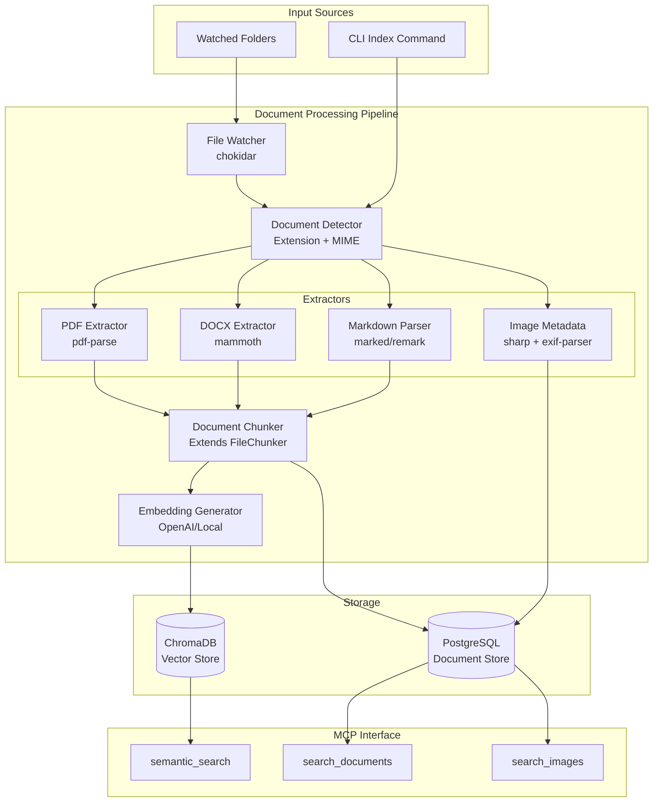
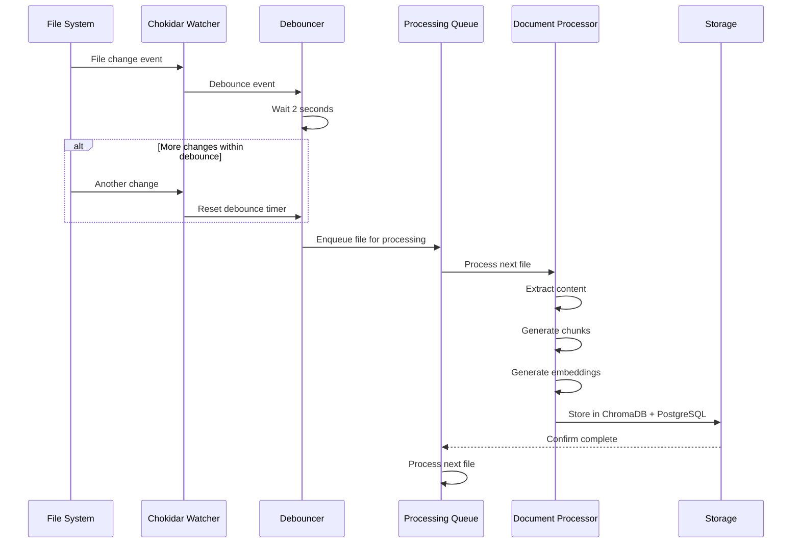

# Phase 6: Unstructured Document Ingestion PRD - Personal Knowledge MCP

**Version:** 1.1
**Date:** January 18, 2026
**Status:** Draft
**Author:** Product Team
**Parent Document:** [High-level Personal Knowledge MCP PRD](../High-level-Personal-Knowledge-MCP-PRD.md)

---

## Table of Contents

1. [Executive Summary](#1-executive-summary)
2. [Goals and Non-Goals](#2-goals-and-non-goals)
3. [User Stories and Use Cases](#3-user-stories-and-use-cases)
4. [Functional Requirements](#4-functional-requirements)
5. [Technical Requirements](#5-technical-requirements)
6. [Architecture and Design Considerations](#6-architecture-and-design-considerations)
7. [MCP Tool Design](#7-mcp-tool-design)
8. [CLI Commands](#8-cli-commands)
9. [Dependencies and Libraries](#9-dependencies-and-libraries)
10. [Success Metrics](#10-success-metrics)
11. [Implementation Milestones](#11-implementation-milestones)
12. [Risks and Mitigations](#12-risks-and-mitigations)
13. [Future Considerations](#13-future-considerations)

---

## 1. Executive Summary

This PRD defines the implementation of unstructured document ingestion capabilities for the Personal Knowledge MCP system. Building upon the existing code repository ingestion pipeline, Phase 6 extends the system to support educational materials, documentation, and other non-code content types including PDF documents, Microsoft Word files, Markdown, and images with metadata extraction.

### The Core Value Proposition

The Personal Knowledge MCP currently excels at indexing and searching code repositories. However, the system's secondary use case - educational material organization and documentation management - requires robust support for unstructured document formats that are common in academic and professional settings.

**Phase 6 enables:**
1. **Educational Material Integration**: Index college notes, textbooks, and academic papers in PDF, DOCX, and Markdown formats
2. **Documentation Search**: Make product documentation, design docs, and reference materials semantically searchable
3. **Local Folder Monitoring**: Automatically update the knowledge base when files change in watched directories
4. **Image Context Capture**: Extract and index metadata from images to enable discovery of visual assets

### Key Decisions

| Decision | Choice | Rationale |
|----------|--------|-----------|
| PDF Parser | pdf-parse (pdf.js-based) | Pure JavaScript, well-maintained, good text extraction quality |
| DOCX Parser | mammoth | Clean API, preserves document structure, converts to HTML/text |
| Image Metadata | sharp + exif-parser | sharp for dimensions/format, exif-parser for EXIF data |
| File Watcher | chokidar | Industry standard, cross-platform, handles edge cases well |
| OCR for Images | Stretch Goal (tesseract.js) | Significant complexity; defer to future phase |
| Document Chunking | Extend existing FileChunker | Leverage existing infrastructure, maintain consistency |

---

## 2. Goals and Non-Goals

### Goals

**Primary Goals:**
1. **PDF Document Ingestion**: Extract text content, structure (headings, paragraphs), and metadata from PDF files
2. **Markdown File Processing**: Process Markdown files with proper structure preservation (headings, lists, code blocks)
3. **DOCX Document Support**: Extract text and structure from Microsoft Word documents
4. **Local Folder Watching**: Monitor configured directories for file changes and trigger incremental indexing
5. **Image Metadata Extraction**: Capture dimensions, format, EXIF data, and creation dates from image files
6. **Incremental Updates**: Efficiently update index when files are added, modified, or deleted

**Secondary Goals:**
7. **Configurable Ignore Patterns**: Support .gitignore-style patterns for excluding files from watched folders
8. **Nested Folder Structure Support**: Preserve folder hierarchy as metadata for organization context
9. **Document Metadata Indexing**: Capture and index document properties (author, creation date, title)
10. **Progress Reporting**: Provide visibility into document processing status
11. **Embedding Provider Observability**: Basic operational logging for embedding operations during document ingestion (see [GitHub Issue #28](https://github.com/sethb75/PersonalKnowledgeMCP/issues/28))

### Non-Goals

1. **OCR for scanned documents**: Text recognition in image-based PDFs is a stretch goal, not MVP
2. **Complex table extraction**: Structured table data extraction from PDFs is out of scope
3. **Image content analysis**: AI-based image content understanding (what's in the image) is deferred
4. **Document format conversion**: Converting between formats (e.g., DOCX to PDF) is not in scope
5. **Real-time collaborative document editing**: No concurrent editing support
6. **Cloud storage integration**: OneDrive, Google Drive, Dropbox sync is deferred
7. **Video/audio file processing**: Multimedia content is out of scope for this phase
8. **Advanced PDF form extraction**: Extracting form field data is not supported

---

## 3. User Stories and Use Cases

### 3.1 Primary User Stories

#### US-1: Index College Notes
**As a** student using Claude Code for research
**I want to** index my college course notes stored in various formats (PDF, DOCX, Markdown)
**So that** I can semantically search across all my academic materials

**Acceptance Criteria:**
- PDF documents are extracted with text content preserved
- DOCX files are converted to searchable text
- Markdown files retain structure (headings become navigable)
- Folder structure (e.g., Course > Semester > Topic) is captured as metadata
- Search returns relevant sections with file path and location context

#### US-2: Watch Documentation Folder
**As a** developer working on multiple projects
**I want to** set up a watched folder for project documentation
**So that** new or updated documents are automatically indexed

**Acceptance Criteria:**
- File watcher detects new, modified, and deleted files
- New files are automatically processed and indexed
- Modified files trigger re-indexing of changed content
- Deleted files are removed from the index
- Configurable debounce to avoid excessive re-indexing during active editing

#### US-3: Search Image Assets by Metadata
**As a** developer maintaining documentation with screenshots
**I want to** find images by their metadata (date taken, dimensions, camera info)
**So that** I can locate specific visual assets without manual browsing

**Acceptance Criteria:**
- Image dimensions (width, height) are extracted and indexed
- EXIF data (date taken, camera model, GPS coordinates if present) is captured
- File creation/modification dates are stored
- Search can filter by image properties (e.g., "screenshots from last week")

#### US-4: Exclude Specific Files and Folders
**As a** user organizing my knowledge library
**I want to** configure patterns to exclude certain files from indexing
**So that** private notes, draft documents, or irrelevant files are not indexed

**Acceptance Criteria:**
- Support .gitignore-style pattern syntax
- Per-folder .pkignore files are respected
- Global exclusion patterns configurable in system settings
- Exclusions work for both initial indexing and watched folders

### 3.2 Secondary User Stories

#### US-5: Re-process Failed Documents
**As a** user troubleshooting indexing issues
**I want to** see which documents failed to process and retry them
**So that** I can ensure complete coverage of my knowledge base

#### US-6: Preserve Document Structure
**As a** user searching through long documents
**I want to** find specific sections within documents (chapters, headings)
**So that** I can navigate directly to relevant content

#### US-7: Monitor Indexing Progress
**As a** user importing a large document collection
**I want to** see progress during bulk indexing operations
**So that** I know how long the process will take and can verify completion

#### US-8: Diagnose Embedding Failures
**As a** user troubleshooting why documents are not being indexed
**I want to** see operational metrics for embedding operations (errors, latency warnings)
**So that** I can identify if the embedding provider is causing issues

**Acceptance Criteria:**
- Embedding errors are logged with context (provider, model, error type)
- Slow embedding operations (>5s) generate latency warnings
- Errors are visible through CLI status commands
- Follows existing logging framework patterns

*Reference: [GitHub Issue #28](https://github.com/sethb75/PersonalKnowledgeMCP/issues/28)*

### 3.3 Use Case Scenarios

**Scenario 1: Graduate Student Research**
```
Student: "I need to review what my coursework covered about machine learning regularization."

Action:
1. User has indexed their MS program notes folder containing:
   - CS500-Machine-Learning/Week5-Regularization.pdf (lecture slides)
   - CS500-Machine-Learning/Homework3.docx (assignment with notes)
   - CS500-Machine-Learning/notes/regularization-summary.md (personal notes)
2. Claude Code queries: semantic_search("machine learning regularization techniques")
3. Returns relevant chunks from all three documents with:
   - File paths showing course context
   - Page/section numbers for navigation
   - Similarity scores for relevance ranking
```

**Scenario 2: Living Documentation**
```
Developer: "I update our API documentation frequently and want it always searchable."

Action:
1. User configures folder watch: pk-mcp watch add ./docs/api --patterns "*.md,*.pdf"
2. Developer edits ./docs/api/authentication.md
3. File watcher detects change after 2-second debounce
4. System re-indexes only authentication.md (incremental update)
5. Claude Code immediately has access to updated content
6. Deletion of deprecated.md removes it from search results
```

**Scenario 3: Visual Asset Discovery**
```
Developer: "Find the architecture diagram I took a photo of at the whiteboard session last Tuesday."

Action:
1. User has image folder watched: ~/work/diagrams
2. Query: search_images(date_range="2026-01-14 to 2026-01-14", type="photo")
3. Returns images with matching EXIF date
4. User can narrow by dimensions or other metadata
```

---

## 4. Functional Requirements

### 4.1 Document Extraction

#### FR-1: PDF Document Processing

| Requirement | Description | Priority |
|-------------|-------------|----------|
| FR-1.1 | Extract text content from text-based PDF documents | P0 |
| FR-1.2 | Preserve paragraph and heading structure where detectable | P0 |
| FR-1.3 | Extract document metadata (title, author, creation date, page count) | P1 |
| FR-1.4 | Handle multi-page documents with page number tracking | P0 |
| FR-1.5 | Support password-protected PDFs with user-provided password | P2 |
| FR-1.6 | Gracefully handle corrupt or unreadable PDFs with error reporting | P0 |
| FR-1.7 | Detect image-only PDFs and flag for potential OCR (stretch goal) | P2 |

#### FR-2: Markdown File Processing

| Requirement | Description | Priority |
|-------------|-------------|----------|
| FR-2.1 | Parse Markdown syntax preserving heading hierarchy | P0 |
| FR-2.2 | Extract frontmatter metadata (YAML header) if present | P1 |
| FR-2.3 | Preserve code blocks with language annotation | P0 |
| FR-2.4 | Handle GitHub Flavored Markdown (GFM) extensions | P1 |
| FR-2.5 | Extract internal links and references as metadata | P2 |
| FR-2.6 | Support CommonMark and GFM specifications | P0 |

#### FR-3: DOCX Document Processing

| Requirement | Description | Priority |
|-------------|-------------|----------|
| FR-3.1 | Extract text content preserving paragraph structure | P0 |
| FR-3.2 | Convert heading styles to structured hierarchy | P0 |
| FR-3.3 | Extract document metadata (author, title, creation date) | P1 |
| FR-3.4 | Handle embedded images (extract metadata, not content) | P2 |
| FR-3.5 | Preserve list structure (numbered, bulleted) | P1 |
| FR-3.6 | Handle .docx files only (legacy .doc format not supported) | P0 |

### 4.2 Local Folder Ingestion

#### FR-4: Folder Watching

| Requirement | Description | Priority |
|-------------|-------------|----------|
| FR-4.1 | Monitor configured directories for file changes | P0 |
| FR-4.2 | Detect file creation, modification, and deletion events | P0 |
| FR-4.3 | Support nested folder structures with arbitrary depth | P0 |
| FR-4.4 | Configurable file extension filters per watched folder | P0 |
| FR-4.5 | Debounce rapid changes (configurable, default 2 seconds) | P0 |
| FR-4.6 | Persist watch configurations across service restarts | P1 |
| FR-4.7 | Handle renamed files as delete + create | P1 |
| FR-4.8 | Support multiple watched folders simultaneously | P0 |
| FR-4.9 | Survive temporary folder unavailability (network drives, USB) | P2 |

#### FR-5: Incremental Updates

| Requirement | Description | Priority |
|-------------|-------------|----------|
| FR-5.1 | Only re-index files that have changed (based on modification time + hash) | P0 |
| FR-5.2 | Remove deleted files from ChromaDB and PostgreSQL | P0 |
| FR-5.3 | Batch changes to avoid overwhelming storage backends | P1 |
| FR-5.4 | Provide statistics on incremental update (added, modified, deleted counts) | P1 |
| FR-5.5 | Support forced full re-index via CLI command | P0 |

#### FR-6: Ignore Patterns

| Requirement | Description | Priority |
|-------------|-------------|----------|
| FR-6.1 | Support .gitignore-style glob patterns | P0 |
| FR-6.2 | Respect per-folder .pkignore files | P1 |
| FR-6.3 | Global exclusion patterns in configuration | P0 |
| FR-6.4 | Default exclusions for common unwanted files (.DS_Store, Thumbs.db, etc.) | P0 |
| FR-6.5 | Pattern debugging via CLI (test which files would be excluded) | P2 |

### 4.3 Image Metadata Extraction

#### FR-7: Image Processing

| Requirement | Description | Priority |
|-------------|-------------|----------|
| FR-7.1 | Extract dimensions (width, height) from images | P0 |
| FR-7.2 | Detect image format (PNG, JPEG, GIF, WebP) | P0 |
| FR-7.3 | Extract EXIF metadata (date taken, camera model, orientation) | P0 |
| FR-7.4 | Extract GPS coordinates if present (with privacy warning) | P2 |
| FR-7.5 | Store file-level metadata (size, modification date) | P0 |
| FR-7.6 | Support common formats: JPEG, PNG, GIF, WebP, TIFF | P0 |
| FR-7.7 | Handle images without EXIF data gracefully | P0 |
| FR-7.8 | (Stretch) OCR text extraction from images via tesseract.js | P3 |

#### FR-8: Embedding Provider Observability (GitHub Issue #28)

| Requirement | Description | Priority |
|-------------|-------------|----------|
| FR-8.1 | Log embedding errors with context (provider name, model, error type, affected document) | P2 |
| FR-8.2 | Generate latency warnings for embedding operations exceeding 5 seconds | P2 |
| FR-8.3 | Track simple success/failure counters per indexing session | P3 |
| FR-8.4 | Integrate with existing logging framework (`src/logging/`) | P2 |
| FR-8.5 | Surface embedding operation status through CLI status commands | P2 |

*Note: These requirements implement the reduced scope from [GitHub Issue #28](https://github.com/sethb75/PersonalKnowledgeMCP/issues/28). Advanced metrics (token usage, cost estimation, histograms) are explicitly out of scope.*

---

## 5. Technical Requirements

### 5.1 Document Parser Evaluation

#### PDF Parsing Options

| Library | Pros | Cons | Recommendation |
|---------|------|------|----------------|
| **pdf-parse** | Pure JS, based on pdf.js, good extraction quality, maintained | Large dependency tree | **Recommended** |
| **pdfjs-dist** | Mozilla's official library, excellent parsing | Complex API, more low-level | Alternative for complex cases |
| **pdf2json** | Preserves layout information | Less maintained, heavier | Not recommended |
| **unpdf** | Modern, uses pdf.js under the hood | Newer, less battle-tested | Watch for maturity |

**Recommendation:** Start with `pdf-parse` for simplicity. It wraps pdf.js with a clean API suitable for text extraction. If advanced layout preservation is needed later, evaluate migrating to raw `pdfjs-dist`.

#### DOCX Parsing Options

| Library | Pros | Cons | Recommendation |
|---------|------|------|----------------|
| **mammoth** | Clean API, preserves structure, converts to HTML/text | Limited styling preservation | **Recommended** |
| **docx** | Full read/write, detailed document model | More complex for read-only use | Overkill for extraction |
| **officegen** | Creates documents, not for reading | Wrong tool for this job | Not suitable |
| **docx4js** | Cross-platform, browser support | Less maintained | Not recommended |

**Recommendation:** Use `mammoth` for DOCX extraction. Its `extractRawText` and `convertToHtml` methods provide exactly what we need with minimal complexity.

#### Image Metadata Options

| Library | Pros | Cons | Recommendation |
|---------|------|------|----------------|
| **sharp** | Fast, comprehensive, dimensions + basic metadata | Native bindings (larger install) | **Recommended** |
| **image-size** | Lightweight, dimensions only | No EXIF support | Combine with exif-parser |
| **exif-parser** | Lightweight EXIF extraction | JPEG only for EXIF | **Recommended** for EXIF |
| **exifr** | Modern, supports many formats | Larger than exif-parser | Alternative |

**Recommendation:** Use `sharp` for dimensions and format detection (it handles all image types well), combined with `exif-parser` or `exifr` for EXIF metadata extraction from JPEG/TIFF files.

#### File Watching Options

| Library | Pros | Cons | Recommendation |
|---------|------|------|----------------|
| **chokidar** | Industry standard, cross-platform, handles edge cases | Larger dependency | **Recommended** |
| **fs.watch** | Built-in, no dependencies | Inconsistent across platforms | Not recommended |
| **node-watch** | Simpler API than chokidar | Less robust edge case handling | Alternative |
| **watchman** | Facebook's solution, very robust | External dependency, complex setup | Overkill |

**Recommendation:** Use `chokidar`. It is the de facto standard for Node.js file watching, handles cross-platform quirks, and provides a clean event-based API.

### 5.2 Performance Requirements

| Metric | Target | Rationale |
|--------|--------|-----------|
| PDF extraction (10 pages) | < 2 seconds | Typical lecture notes size |
| PDF extraction (100 pages) | < 10 seconds | Textbook chapter |
| DOCX extraction | < 1 second | Documents are typically smaller |
| Markdown parsing | < 100ms | Text-only, fast |
| Image metadata extraction | < 200ms | No content processing |
| File watcher latency | < 500ms event detection | Near-real-time updates |
| Debounce period | Configurable, default 2s | Avoid rapid re-indexing |
| Incremental index update | < 30 seconds for 100 files | Batch processing efficiency |

### 5.3 Resource Requirements

| Resource | Limit | Notes |
|----------|-------|-------|
| Memory per document | < 100MB peak | PDF extraction can be memory-intensive |
| Concurrent document processing | 4 parallel | Prevent memory exhaustion |
| File watcher handles | < 10,000 files per folder | OS limits vary by platform |
| Maximum document size | 50MB | Prevent processing extremely large files |
| ChromaDB chunk storage | ~2KB per chunk average | Embeddings + metadata |

### 5.4 Data Storage Requirements

#### ChromaDB (Vector Store)

Document chunks stored with metadata:

```typescript
interface DocumentChunk {
  id: string;                    // {source}:{filePath}:{chunkIndex}
  repository: string;            // "local-folder" or folder identifier
  filePath: string;              // Relative path within watched folder
  content: string;               // Extracted text content
  chunkIndex: number;
  totalChunks: number;
  startOffset: number;           // Character offset in document
  endOffset: number;
  metadata: {
    documentType: "pdf" | "docx" | "markdown" | "txt";
    extension: string;
    language: string;            // For markdown code blocks
    pageNumber?: number;         // For PDFs
    sectionHeading?: string;     // Nearest heading
    documentTitle?: string;
    documentAuthor?: string;
    fileSizeBytes: number;
    contentHash: string;
    fileModifiedAt: Date;
  };
}
```

#### PostgreSQL (Document Store)

Full document metadata and extracted content:

```sql
-- Document metadata table
CREATE TABLE documents (
  id UUID PRIMARY KEY DEFAULT gen_random_uuid(),
  source_id VARCHAR(255) NOT NULL,        -- Watched folder identifier
  file_path VARCHAR(1024) NOT NULL,       -- Relative path
  document_type VARCHAR(50) NOT NULL,     -- pdf, docx, markdown, image

  -- Extracted metadata
  title VARCHAR(512),
  author VARCHAR(255),
  created_at TIMESTAMP,
  page_count INTEGER,
  word_count INTEGER,

  -- Image-specific metadata
  image_width INTEGER,
  image_height INTEGER,
  image_format VARCHAR(50),
  exif_data JSONB,

  -- File metadata
  file_size_bytes BIGINT NOT NULL,
  content_hash VARCHAR(64) NOT NULL,
  file_modified_at TIMESTAMP NOT NULL,

  -- Processing metadata
  indexed_at TIMESTAMP NOT NULL DEFAULT NOW(),
  processing_status VARCHAR(50) NOT NULL DEFAULT 'pending',
  processing_error TEXT,

  -- Constraints
  UNIQUE(source_id, file_path),
  INDEX idx_documents_source (source_id),
  INDEX idx_documents_type (document_type),
  INDEX idx_documents_hash (content_hash)
);

-- Watched folders configuration
CREATE TABLE watched_folders (
  id UUID PRIMARY KEY DEFAULT gen_random_uuid(),
  path VARCHAR(1024) NOT NULL UNIQUE,
  name VARCHAR(255) NOT NULL,
  enabled BOOLEAN NOT NULL DEFAULT true,
  include_patterns TEXT[],                -- Glob patterns to include
  exclude_patterns TEXT[],                -- Glob patterns to exclude
  debounce_ms INTEGER NOT NULL DEFAULT 2000,
  created_at TIMESTAMP NOT NULL DEFAULT NOW(),
  last_scan_at TIMESTAMP,
  file_count INTEGER DEFAULT 0
);
```

---

## 6. Architecture and Design Considerations

### 6.1 System Architecture



### 6.2 Integration with Existing Components

#### Extending FileChunker

The existing `FileChunker` class handles code file chunking. For documents, we extend this with document-aware chunking:

```typescript
/**
 * Document-aware chunking that respects document structure.
 *
 * Key differences from code chunking:
 * - Respects page boundaries in PDFs
 * - Prefers breaking at paragraph boundaries
 * - Tracks section headings for context
 * - Handles longer natural language content appropriately
 */
interface DocumentChunkerConfig extends ChunkerConfig {
  /**
   * Prefer breaking at paragraph boundaries.
   * @default true
   */
  respectParagraphs?: boolean;

  /**
   * Include section heading in each chunk for context.
   * @default true
   */
  includeSectionContext?: boolean;

  /**
   * For PDFs: try to keep page content together when possible.
   * @default true
   */
  respectPageBoundaries?: boolean;
}
```

#### Extending FileScanner

The existing `FileScanner` supports code file extensions. Document support requires:

1. Adding document extensions to DEFAULT_EXTENSIONS:
   - `.pdf`, `.docx`, `.doc` (flagged as unsupported), `.md`, `.txt`, `.rtf`
   - Image extensions: `.jpg`, `.jpeg`, `.png`, `.gif`, `.webp`, `.tiff`

2. Extending `FileInfo` with document-specific metadata:
   ```typescript
   interface ExtendedFileInfo extends FileInfo {
     documentType?: "code" | "document" | "image";
     mimeType?: string;
   }
   ```

### 6.3 Folder Watcher Architecture



### 6.4 Error Handling Strategy

| Error Type | Handling | User Notification |
|------------|----------|-------------------|
| Corrupt PDF | Skip file, log error, store in PostgreSQL with error status | Visible in `pk-mcp status --documents` |
| Password-protected PDF | Skip unless password provided via config | Log warning |
| Unsupported format | Skip file, log debug | None unless verbose mode |
| File too large | Skip file, log warning | Visible in scan summary |
| Watcher disconnected | Attempt reconnect with backoff | Log error, continue monitoring other folders |
| Embedding API failure | Retry with exponential backoff | Log error, queue for retry |
| Storage write failure | Retry, then fail with error | Log error |

---

## 7. MCP Tool Design

### 7.1 New MCP Tools

#### Tool 1: search_documents

**Purpose:** Search across indexed documents (PDFs, DOCX, Markdown) with semantic similarity.

```json
{
  "name": "search_documents",
  "description": "Search indexed documents (PDFs, Word docs, Markdown) using semantic similarity. Returns relevant passages with document context. Use this to find information in educational materials, documentation, or notes.",
  "inputSchema": {
    "type": "object",
    "properties": {
      "query": {
        "type": "string",
        "description": "Natural language search query describing the information you're looking for"
      },
      "document_types": {
        "type": "array",
        "items": {
          "type": "string",
          "enum": ["pdf", "docx", "markdown", "txt", "all"]
        },
        "description": "Filter by document type. Defaults to all types.",
        "default": ["all"]
      },
      "folder": {
        "type": "string",
        "description": "Limit search to a specific watched folder by name or path"
      },
      "limit": {
        "type": "integer",
        "description": "Maximum number of results to return",
        "default": 10,
        "minimum": 1,
        "maximum": 50
      },
      "threshold": {
        "type": "number",
        "description": "Minimum similarity score (0.0-1.0). Higher values return more relevant results.",
        "default": 0.7,
        "minimum": 0,
        "maximum": 1
      }
    },
    "required": ["query"]
  }
}
```

**Response Schema:**
```typescript
interface SearchDocumentsResponse {
  results: Array<{
    content: string;              // Matched text passage
    documentPath: string;         // Relative path to document
    documentTitle?: string;       // Extracted title if available
    documentType: string;         // pdf, docx, markdown
    pageNumber?: number;          // For PDFs
    sectionHeading?: string;      // Nearest heading
    similarity: number;           // 0.0-1.0 similarity score
    folder: string;               // Source folder name
  }>;
  metadata: {
    totalResults: number;
    queryTimeMs: number;
    searchedFolders: string[];
    searchedDocumentTypes: string[];
  };
}
```

#### Tool 2: search_images

**Purpose:** Search for images by metadata (date, dimensions, format, EXIF data).

```json
{
  "name": "search_images",
  "description": "Search indexed images by metadata including date, dimensions, format, and EXIF data. Use this to find screenshots, photos, diagrams, or other visual assets.",
  "inputSchema": {
    "type": "object",
    "properties": {
      "folder": {
        "type": "string",
        "description": "Limit search to a specific watched folder"
      },
      "format": {
        "type": "array",
        "items": {
          "type": "string",
          "enum": ["jpeg", "png", "gif", "webp", "tiff", "all"]
        },
        "description": "Filter by image format",
        "default": ["all"]
      },
      "date_from": {
        "type": "string",
        "format": "date",
        "description": "Filter images taken/modified on or after this date (YYYY-MM-DD)"
      },
      "date_to": {
        "type": "string",
        "format": "date",
        "description": "Filter images taken/modified on or before this date (YYYY-MM-DD)"
      },
      "min_width": {
        "type": "integer",
        "description": "Minimum image width in pixels"
      },
      "min_height": {
        "type": "integer",
        "description": "Minimum image height in pixels"
      },
      "filename_pattern": {
        "type": "string",
        "description": "Glob pattern to match filenames (e.g., 'screenshot*', '*.diagram.*')"
      },
      "limit": {
        "type": "integer",
        "description": "Maximum number of results",
        "default": 20,
        "minimum": 1,
        "maximum": 100
      }
    }
  }
}
```

**Response Schema:**
```typescript
interface SearchImagesResponse {
  results: Array<{
    path: string;                 // Relative path to image
    filename: string;             // Just the filename
    format: string;               // jpeg, png, etc.
    width: number;
    height: number;
    sizeBytes: number;
    dateTaken?: Date;             // From EXIF if available
    dateModified: Date;           // File modification date
    exif?: {
      camera?: string;
      orientation?: number;
      gpsLatitude?: number;       // If present and not stripped
      gpsLongitude?: number;
    };
    folder: string;               // Source folder name
  }>;
  metadata: {
    totalResults: number;
    queryTimeMs: number;
  };
}
```

#### Tool 3: list_watched_folders

**Purpose:** List configured watched folders and their status.

```json
{
  "name": "list_watched_folders",
  "description": "List all configured watched folders and their indexing status. Use this to understand what document sources are available for search.",
  "inputSchema": {
    "type": "object",
    "properties": {}
  }
}
```

**Response Schema:**
```typescript
interface ListWatchedFoldersResponse {
  folders: Array<{
    id: string;
    name: string;
    path: string;
    enabled: boolean;
    documentCount: number;
    imageCount: number;
    lastScanAt?: Date;
    watcherStatus: "active" | "paused" | "error";
    includePatterns: string[];
    excludePatterns: string[];
  }>;
}
```

### 7.2 Updated Existing Tools

#### Enhanced semantic_search

The existing `semantic_search` tool should be enhanced to optionally include document results:

```typescript
// Add to existing semantic_search input schema
{
  "include_documents": {
    "type": "boolean",
    "description": "Include results from indexed documents (PDFs, DOCX, Markdown) in addition to code",
    "default": false
  }
}
```

---

## 8. CLI Commands

### 8.1 Document Indexing Commands

```bash
# Index a folder of documents (one-time, no watching)
pk-mcp documents index <folder-path> [options]

Options:
  --name <name>           Friendly name for this document source
  --include <patterns>    Glob patterns to include (comma-separated)
  --exclude <patterns>    Glob patterns to exclude (comma-separated)
  --recursive             Include nested folders (default: true)
  --dry-run               Show what would be indexed without actually indexing

Examples:
  pk-mcp documents index ~/Documents/College --name "college-notes"
  pk-mcp documents index ./docs --include "*.md,*.pdf" --exclude "drafts/**"
```

### 8.2 Folder Watch Commands

```bash
# Add a watched folder
pk-mcp watch add <folder-path> [options]

Options:
  --name <name>           Friendly name for this folder
  --include <patterns>    File patterns to include (default: *.pdf,*.docx,*.md)
  --exclude <patterns>    File patterns to exclude
  --debounce <ms>         Debounce delay in milliseconds (default: 2000)
  --no-initial-scan       Skip initial indexing, only watch for changes

Examples:
  pk-mcp watch add ~/Documents/API-Docs --name "api-docs" --include "*.md"
  pk-mcp watch add ./notes --exclude "*.draft.md,private/**"

# List watched folders
pk-mcp watch list

Output:
  NAME          PATH                      STATUS   DOCUMENTS   IMAGES
  college-notes ~/Documents/College       active   347         52
  api-docs      ~/Documents/API-Docs      active   23          0
  diagrams      ~/work/diagrams           paused   0           128

# Remove a watched folder
pk-mcp watch remove <name-or-path>

# Pause/resume watching
pk-mcp watch pause <name-or-path>
pk-mcp watch resume <name-or-path>

# Force re-scan a watched folder
pk-mcp watch rescan <name-or-path> [--full]
```

### 8.3 Document Status Commands

```bash
# Show document indexing status
pk-mcp documents status [options]

Options:
  --folder <name>         Filter by folder name
  --type <type>           Filter by document type (pdf, docx, markdown, image)
  --errors                Show only documents with processing errors

Output:
  DOCUMENT INDEXING STATUS

  Total Documents: 370
  By Type:
    PDF:      156  (42%)
    DOCX:      34  (9%)
    Markdown: 180  (49%)

  Total Images: 180
  By Format:
    JPEG:     120  (67%)
    PNG:       58  (32%)
    GIF:        2  (1%)

  Processing Errors: 3
    ~/Documents/corrupt.pdf - Invalid PDF structure
    ~/Documents/protected.pdf - Password protected
    ~/Documents/huge.pdf - Exceeds 50MB size limit

# Show processing errors in detail
pk-mcp documents errors

# Retry failed documents
pk-mcp documents retry [--all | --file <path>]
```

### 8.4 Configuration Commands

```bash
# Set global document processing options
pk-mcp config set documents.maxSizeMb 50
pk-mcp config set documents.defaultDebounceMs 2000
pk-mcp config set documents.includePatterns "*.pdf,*.docx,*.md"

# Set default exclusion patterns
pk-mcp config set documents.globalExclusions "*.draft.*,~*,._*,.DS_Store"
```

---

## 9. Dependencies and Libraries

### 9.1 Core Dependencies

| Package | Version | Purpose | License |
|---------|---------|---------|---------|
| `pdf-parse` | ^1.1.1 | PDF text extraction | MIT |
| `mammoth` | ^1.6.0 | DOCX to text/HTML conversion | BSD-2-Clause |
| `marked` | ^12.0.0 | Markdown parsing | MIT |
| `sharp` | ^0.33.0 | Image processing and metadata | Apache-2.0 |
| `exif-parser` | ^0.1.12 | EXIF metadata extraction | MIT |
| `chokidar` | ^3.6.0 | File system watching | MIT |
| `ignore` | ^5.3.0 | .gitignore-style pattern matching | MIT |

### 9.2 Optional/Stretch Dependencies

| Package | Version | Purpose | License | Notes |
|---------|---------|---------|---------|-------|
| `tesseract.js` | ^5.0.0 | OCR text extraction | Apache-2.0 | Stretch goal - large (~50MB models) |
| `gray-matter` | ^4.0.3 | Markdown frontmatter parsing | MIT | Optional enhancement |
| `pdfjs-dist` | ^4.0.0 | Advanced PDF parsing | Apache-2.0 | Alternative if pdf-parse insufficient |

### 9.3 Dependency Risk Assessment

| Dependency | Maintenance Status | Risk | Mitigation |
|------------|-------------------|------|------------|
| pdf-parse | Moderate (based on pdf.js) | Low | pdfjs-dist as fallback |
| mammoth | Active, stable | Low | Well-maintained |
| marked | Very active | Low | Industry standard |
| sharp | Very active | Low | Most popular image library |
| chokidar | Active, stable | Low | Industry standard |
| exif-parser | Stable but less active | Medium | exifr as alternative |

### 9.4 Bundle Size Considerations

| Package | Size Impact | Notes |
|---------|-------------|-------|
| sharp | ~30MB | Native bindings, platform-specific |
| pdf-parse | ~5MB | Includes pdf.js worker |
| mammoth | ~1MB | Pure JavaScript |
| marked | ~300KB | Lightweight |
| chokidar | ~500KB | Includes fsevents on macOS |
| tesseract.js | ~50MB+ | Only if OCR enabled (stretch) |

**Total estimated addition:** ~37MB (without OCR), ~87MB (with OCR)

---

## 10. Success Metrics

### 10.1 Functional Success Criteria

| Criterion | Measurement | Target |
|-----------|-------------|--------|
| PDF extraction accuracy | Manual sampling of 50 documents | >95% text correctly extracted |
| DOCX extraction accuracy | Manual sampling of 20 documents | >95% text correctly extracted |
| Markdown parsing accuracy | Automated tests against known content | 100% structure preserved |
| Image metadata extraction | Automated tests against test images | 100% dimensions, >90% EXIF |
| File watcher reliability | 24-hour stability test | Zero missed events |
| Incremental update correctness | Add/modify/delete 100 files | 100% correct index state |

### 10.2 Performance Success Criteria

| Metric | Target | Measurement Method |
|--------|--------|-------------------|
| PDF extraction (10 pages) | < 2 seconds | Automated benchmark |
| PDF extraction (100 pages) | < 10 seconds | Automated benchmark |
| DOCX extraction | < 1 second | Automated benchmark |
| Document search latency (p95) | < 500ms | MCP query timing |
| Image metadata search (p95) | < 200ms | MCP query timing |
| File watcher event latency | < 1 second | Event timestamp comparison |
| Bulk indexing (1000 docs) | < 30 minutes | End-to-end timing |

### 10.3 Quality Success Criteria

| Criterion | Target |
|-----------|--------|
| Test coverage for document processing | >= 90% |
| No P0 bugs in document extraction | 0 for 2 weeks post-launch |
| Documentation completeness | All new tools and commands documented |
| CLI help text accuracy | All commands have accurate help |

### 10.4 User Value Success Criteria

| Criterion | Measurement |
|-----------|-------------|
| Document findability | User can locate specific content in indexed documents |
| Search relevance | Top-3 results contain relevant content >80% of queries |
| Folder sync reliability | Watched folders stay synchronized without manual intervention |
| Error transparency | Users can identify and resolve indexing failures |

---

## 11. Implementation Milestones

### 11.1 Phase Overview

| Milestone | Focus | Duration | Key Deliverables |
|-----------|-------|----------|------------------|
| **M1** | Core Extractors | 2 weeks | PDF, DOCX, Markdown extractors |
| **M2** | Document Chunking | 1 week | Document-aware chunking, integration with embedding pipeline |
| **M3** | MCP Tools | 1 week | search_documents, search_images tools |
| **M4** | Folder Watching | 2 weeks | chokidar integration, incremental updates |
| **M5** | CLI & Polish | 1 week | CLI commands, documentation, testing |

### 11.2 Milestone 1: Core Extractors (Weeks 1-2)

**Goal:** Implement document content extraction for all supported formats.

**Deliverables:**
1. PDF extractor with text and metadata extraction
2. DOCX extractor with structure preservation
3. Markdown parser with frontmatter support
4. Image metadata extractor

**Tasks:**
- [ ] Create `src/documents/` module structure
- [ ] Implement `PdfExtractor` class with pdf-parse
- [ ] Implement `DocxExtractor` class with mammoth
- [ ] Implement `MarkdownParser` class with marked
- [ ] Implement `ImageMetadataExtractor` class with sharp + exif-parser
- [ ] Create `DocumentTypeDetector` for format identification
- [ ] Add error handling for corrupt/unreadable files
- [ ] Write unit tests for all extractors (>90% coverage)

### 11.3 Milestone 2: Document Chunking (Week 3)

**Goal:** Adapt chunking pipeline for document content.

**Deliverables:**
1. Document-aware chunker extending FileChunker
2. Integration with existing embedding pipeline
3. PostgreSQL schema for document metadata

**Tasks:**
- [ ] Create `DocumentChunker` extending chunking logic
- [ ] Implement paragraph-boundary-aware chunking
- [ ] Add section heading context preservation
- [ ] Create PostgreSQL migration for documents table
- [ ] Integrate with existing `IngestionService`
- [ ] Add document-specific metadata to ChromaDB storage
- [ ] Write integration tests for chunking pipeline

### 11.4 Milestone 3: MCP Tools (Week 4)

**Goal:** Expose document search capabilities via MCP.

**Deliverables:**
1. `search_documents` MCP tool
2. `search_images` MCP tool
3. `list_watched_folders` MCP tool

**Tasks:**
- [ ] Implement `search_documents` tool handler
- [ ] Implement `search_images` tool handler
- [ ] Implement `list_watched_folders` tool handler
- [ ] Update `semantic_search` with `include_documents` option
- [ ] Register new tools in MCP tool registry
- [ ] Add comprehensive tool documentation
- [ ] Write integration tests for MCP tools

### 11.5 Milestone 4: Folder Watching (Weeks 5-6)

**Goal:** Implement real-time folder monitoring and incremental updates.

**Deliverables:**
1. Folder watcher service using chokidar
2. Incremental update processing
3. Ignore pattern support

**Tasks:**
- [ ] Implement `FolderWatcherService` with chokidar
- [ ] Add debouncing for rapid file changes
- [ ] Implement change detection (add/modify/delete)
- [ ] Create processing queue for batched updates
- [ ] Implement incremental index updates
- [ ] Add .pkignore file support
- [ ] Create PostgreSQL table for watch configurations
- [ ] Handle watcher lifecycle (start/stop/restart)
- [ ] Write integration tests for watcher scenarios

### 11.6 Milestone 5: CLI & Polish (Week 7)

**Goal:** Complete CLI commands and finalize documentation.

**Deliverables:**
1. All CLI commands implemented
2. User documentation
3. Performance optimization

**Tasks:**
- [ ] Implement `pk-mcp documents index` command
- [ ] Implement `pk-mcp watch add/list/remove` commands
- [ ] Implement `pk-mcp documents status` command
- [ ] Add progress reporting for bulk operations
- [ ] Performance testing and optimization
- [ ] Write user documentation for document features
- [ ] Update README with document ingestion guide
- [ ] Final polish and bug fixes
- [ ] (Optional/P2) Add embedding provider observability logging ([GitHub Issue #28](https://github.com/sethb75/PersonalKnowledgeMCP/issues/28)):
  - [ ] Add error logging with context to embedding provider
  - [ ] Add latency warning logs for operations >5s
  - [ ] Surface embedding status in CLI status commands

---

## 12. Risks and Mitigations

### 12.1 Technical Risks

| Risk | Impact | Probability | Mitigation |
|------|--------|-------------|------------|
| **PDF extraction quality varies** | High | Medium | Test against diverse PDFs early; document limitations; provide manual re-index option |
| **Large PDF memory consumption** | Medium | Medium | Implement streaming extraction; enforce size limits; test with 100+ page documents |
| **File watcher platform differences** | Medium | Low | Use chokidar (handles cross-platform); test on Windows, macOS, Linux |
| **Image metadata extraction inconsistency** | Low | Medium | Handle missing EXIF gracefully; document which metadata is reliable |
| **DOCX format variations** | Low | Medium | mammoth handles most cases; document unsupported features |
| **Sharp native binding issues** | Medium | Low | Test in CI across platforms; have fallback to image-size + exifr |

### 12.2 Product Risks

| Risk | Impact | Probability | Mitigation |
|------|--------|-------------|------------|
| **User expects OCR for scanned PDFs** | Medium | High | Clear documentation that OCR is stretch goal; detect and warn about image-only PDFs |
| **Watched folder fills with irrelevant files** | Low | Medium | Good default exclusion patterns; easy pattern configuration |
| **Index grows too large** | Medium | Low | Document size limits; provide index management tools |

### 12.3 Operational Risks

| Risk | Impact | Probability | Mitigation |
|------|--------|-------------|------------|
| **Watcher consumes too many file handles** | Medium | Low | Implement handle pooling; test with large folder trees |
| **Disk space consumption** | Low | Medium | Store extracted text, not full documents; compression in PostgreSQL |
| **Embedding API costs for documents** | Low | Medium | Track embedding token usage; support local embeddings |

---

## 13. Future Considerations

### 13.1 Near-Term Enhancements (Post-Phase 6)

| Feature | Description | Priority |
|---------|-------------|----------|
| **OCR for scanned PDFs** | tesseract.js integration for image-based PDF text extraction | P2 |
| **Table extraction** | Structured table data from PDFs and DOCX | P2 |
| **Presentation files** | PowerPoint (.pptx) support | P2 |
| **Rich text format** | RTF document support | P3 |
| **ePub support** | E-book format for reference materials | P3 |

### 13.2 Medium-Term Enhancements

| Feature | Description | Priority |
|---------|-------------|----------|
| **Cloud storage sync** | OneDrive, Google Drive, Dropbox integration | P2 |
| **Document versioning** | Track document changes over time | P2 |
| **Document relationships** | Link related documents via knowledge graph | P2 |
| **Citation extraction** | Extract bibliographic references from academic papers | P3 |
| **Image content analysis** | AI-based description of image content | P3 |

### 13.3 Long-Term Vision

| Feature | Description |
|---------|-------------|
| **Collaborative document annotation** | Share notes and highlights across team |
| **Document summarization** | AI-generated summaries for long documents |
| **Cross-document knowledge graph** | Connect concepts across all indexed content |
| **Document recommendation** | Suggest related documents based on current context |

---

## Document History

| Version | Date | Author | Changes |
|---------|------|--------|---------|
| 1.0 | 2026-01-18 | Product Team | Initial Phase 6 Document Ingestion PRD |
| 1.1 | 2026-01-18 | Product Team | Added embedding provider observability (GitHub Issue #28) as optional P2 scope in M5 |

---

**Next Steps:**

1. Review and approve this PRD with stakeholders
2. Create GitHub issues for Milestone 1 implementation tasks
3. Set up development environment with new dependencies
4. Begin PDF extractor implementation
5. Establish test fixture library for document testing
6. Benchmark memory usage with large PDFs
