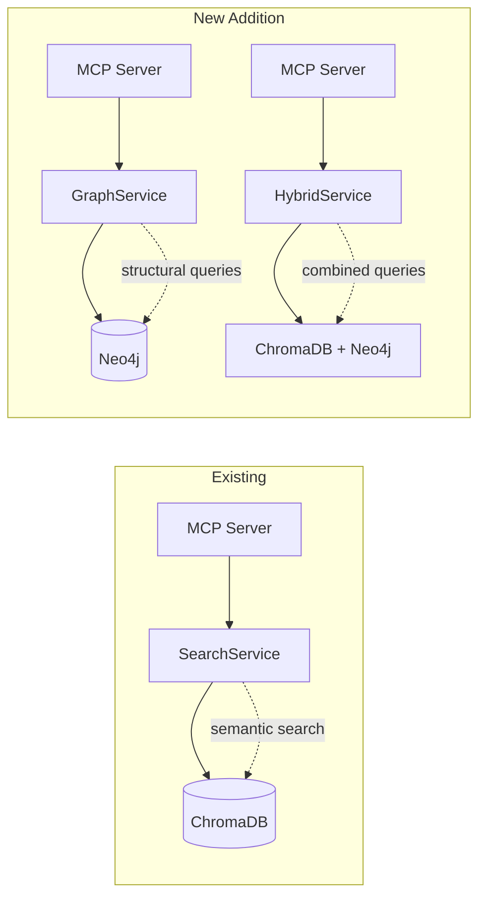
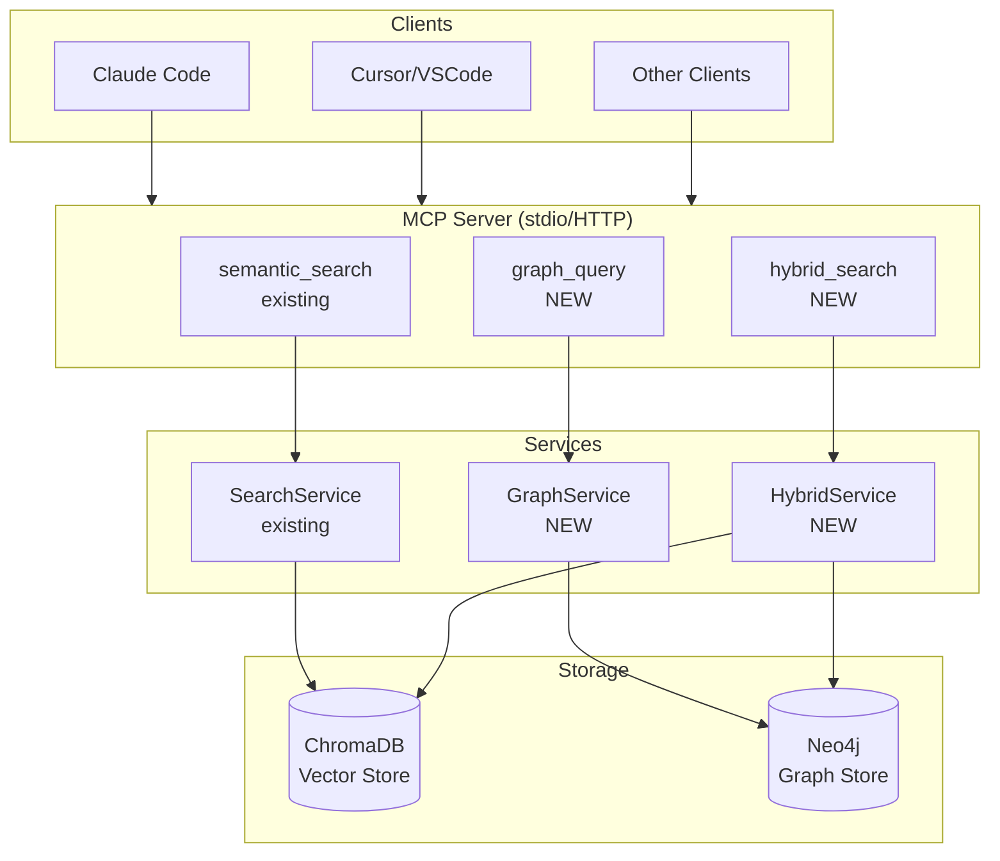
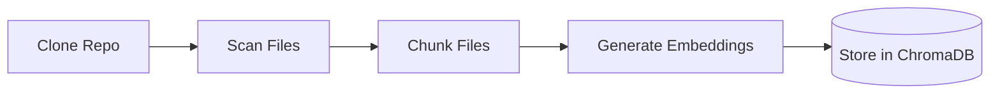
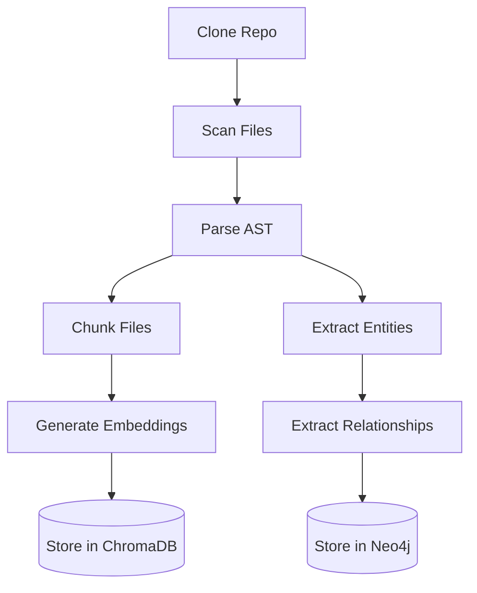
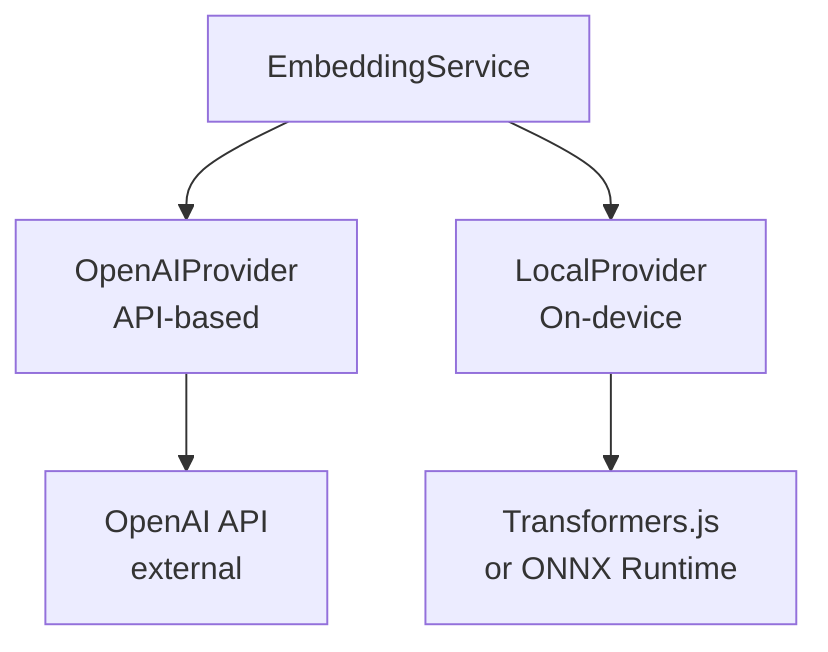

# Knowledge Graph Feature PRD - Personal Knowledge MCP

**Version:** 1.0
**Date:** January 1, 2026
**Status:** Draft
**Author:** Product Team
**Parent Document:** [High-level Personal Knowledge MCP PRD](../High-level-Personal-Knowledge-MCP-PRD.md)

---

## Table of Contents

1. [Executive Summary](#1-executive-summary)
2. [Problem Statement](#2-problem-statement)
3. [User Stories and Use Cases](#3-user-stories-and-use-cases)
4. [Technical Requirements](#4-technical-requirements)
5. [Architecture Recommendations](#5-architecture-recommendations)
6. [MCP Tool Design](#6-mcp-tool-design)
7. [Data Model](#7-data-model)
8. [Integration Strategy](#8-integration-strategy)
9. [Success Criteria](#9-success-criteria)
10. [Risks and Mitigations](#10-risks-and-mitigations)
11. [Local Embeddings Provider](#11-local-embeddings-provider)
12. [Implementation Roadmap](#12-implementation-roadmap)

---

## 1. Executive Summary

This PRD defines the addition of knowledge graph capabilities to the Personal Knowledge MCP system. While the existing ChromaDB vector search excels at semantic similarity queries ("find code that does X"), it lacks the ability to answer structural and relational questions ("what depends on X?", "what modules does file Y import?", "show the call chain from A to B").

### The Core Value Proposition

**Vector Search answers:** "What code is semantically similar to my query?"
**Knowledge Graph answers:** "How are things connected and what depends on what?"
**Local Embeddings answers:** "How can I generate embeddings without external API dependencies?"

Together, they enable Claude Code and other AI assistants to:
1. Find relevant code (vector search - existing)
2. Understand code structure and dependencies (graph - new)
3. Navigate relationships across repositories (graph - new)
4. Discover architectural patterns and anti-patterns (graph - new)
5. Generate embeddings locally without external API costs or privacy concerns (local embeddings - new)

### Key Decisions

| Decision | Choice | Rationale |
|----------|--------|-----------|
| Graph Storage | Neo4j Community Edition | Mature, Cypher query language, already configured in docker-compose.yml, property graph model fits code relationships |
| Integration Model | Complementary (not replacement) | ChromaDB for semantic search, Neo4j for structural queries |
| Primary Use Cases | Code dependencies, file relationships, cross-repo connections | Highest value-add over vector search |
| Initial Scope | Repository-level entities and code dependencies | Foundation for future concept hierarchies |
| Embedding Provider | Configurable (OpenAI + Local) | Support both OpenAI API and local models for flexibility in cost, latency, and privacy trade-offs |
| Local Embedding Models | ONNX Runtime / Transformers.js | JavaScript-native, no Python dependency, good quality-to-speed ratio |

---

## 2. Problem Statement

### 2.1 What Vector Search Cannot Answer

The current ChromaDB-based semantic search is excellent for:
- Finding code snippets by natural language description
- Locating similar implementations across repositories
- Discovering documentation related to a concept

However, it fundamentally cannot answer structural questions:

| Question Type | Example | Why Vector Search Fails |
|---------------|---------|------------------------|
| **Dependency Tracking** | "What modules import this function?" | Requires traversing import relationships, not semantic similarity |
| **Impact Analysis** | "What will break if I change this interface?" | Need to follow dependency chains through the codebase |
| **Architecture Understanding** | "Show me the module dependency graph for this package" | Requires relationship representation, not content similarity |
| **Cross-Repository Connections** | "Which repos depend on this shared library?" | Need explicit dependency relationships between repositories |
| **Call Chain Analysis** | "What's the execution path from API endpoint to database?" | Requires function call relationship traversal |
| **Concept Hierarchies** | "What are all the authentication-related components?" | Need explicit categorization relationships |

### 2.2 The Knowledge Gap

Consider this scenario:

**User asks Claude Code:** "I want to refactor the AuthMiddleware class. What else might be affected?"

**With only vector search:**
- Claude searches for "AuthMiddleware" and similar terms
- Returns code snippets that mention authentication
- Cannot determine which files actually import AuthMiddleware
- Cannot show the dependency chain of what uses AuthMiddleware
- User must manually trace dependencies through the codebase

**With knowledge graph:**
- Claude queries for all files that import AuthMiddleware
- Graph traversal shows all transitive dependencies
- Impact analysis reveals exactly which components need updating
- User gets a complete picture of the refactoring scope

### 2.3 User Pain Points Addressed

**Pain Point 1: Blind Refactoring**
Developers currently lack visibility into the full impact of changes. The knowledge graph provides dependency impact analysis.

**Pain Point 2: Onboarding Complexity**
New team members struggle to understand codebase architecture. The knowledge graph enables "show me how X connects to Y" queries.

**Pain Point 3: Cross-Repository Blindness**
With multiple projects, understanding shared dependencies is difficult. The graph tracks cross-repository relationships.

**Pain Point 4: Lost Tribal Knowledge**
Architectural decisions and component relationships exist only in developers' heads. The graph makes structure explicit and queryable.

---

## 3. User Stories and Use Cases

### 3.1 Primary User Stories

#### US-1: Dependency Impact Analysis
**As a** developer using Claude Code
**I want to** query what code depends on a specific file, function, or class
**So that** I can understand the impact of my changes before refactoring

**Acceptance Criteria:**
- Query by file path returns all files that import/reference it
- Query by function/class name returns all call sites
- Results include transitive dependencies (N levels deep, configurable)
- Results indicate the type of dependency (import, call, extends, implements)

#### US-2: Architecture Exploration
**As a** developer onboarding to a new project
**I want to** visualize the module/package structure and dependencies
**So that** I can understand the codebase architecture quickly

**Acceptance Criteria:**
- Query returns hierarchical structure (package > module > file > function)
- Dependencies between modules are explicitly represented
- Can filter by depth and module scope
- Results are structured for AI consumption and explanation

#### US-3: Cross-Repository Dependency Tracking
**As a** developer managing multiple related projects
**I want to** understand how repositories depend on each other
**So that** I can coordinate changes across projects

**Acceptance Criteria:**
- Explicit relationships between repositories (e.g., shared libraries)
- Query for "what repos use this shared module"
- Identify version compatibility concerns
- Track external dependency usage across projects

#### US-4: Call Chain Analysis
**As a** developer debugging an issue
**I want to** trace the execution path from an API endpoint to its data sources
**So that** I can understand the full request flow

**Acceptance Criteria:**
- Query an entry point (route, handler) and get call chain
- Chain shows function-to-function calls in order
- Includes file paths and line numbers where available
- Works across file boundaries within a repository

### 3.2 Local Embeddings User Stories

#### US-5: Cost-Free Local Embeddings
**As a** developer using Personal Knowledge MCP
**I want to** generate embeddings locally without incurring OpenAI API costs
**So that** I can index unlimited repositories without worrying about API expenses

**Acceptance Criteria:**
- System supports at least one local embedding model
- Local embeddings can be generated without any external API calls
- CLI and configuration clearly indicate when local mode is active
- Indexing performance remains acceptable (<2x slower than API for typical repos)

#### US-6: Privacy-Preserving Code Indexing
**As a** developer with privacy concerns (proprietary code, sensitive projects)
**I want to** keep my code entirely on my machine without sending it to external APIs
**So that** I can use semantic search on confidential codebases

**Acceptance Criteria:**
- All embedding generation happens locally when configured
- No network calls to external APIs for embedding generation
- Clear documentation on privacy guarantees
- Works in air-gapped environments

#### US-7: Quality vs Cost Trade-off Selection
**As a** user
**I want to** choose between high-quality (OpenAI) and cost-effective (local) embeddings
**So that** I can optimize for my specific needs (quality, speed, cost, privacy)

**Acceptance Criteria:**
- Configuration option to select embedding provider
- Can use different providers for different repositories
- Clear documentation of quality/performance trade-offs
- Easy switching between providers without re-indexing entire system

#### US-8: Hybrid Embedding Strategy
**As a** power user
**I want to** use OpenAI for important/public repositories and local for private/experimental ones
**So that** I can balance quality and cost across my knowledge base

**Acceptance Criteria:**
- Per-repository embedding provider configuration
- Mixed provider usage within single system
- Query time handles mixed embedding sources gracefully
- Status command shows which provider each repository uses

### 3.3 Secondary User Stories (Graph)

#### US-9: Concept Tagging and Discovery
**As a** developer
**I want to** tag code components with concepts (e.g., "authentication", "caching")
**So that** I can find all components related to a domain concept

#### US-10: Documentation-to-Code Linking
**As a** developer
**I want to** see explicit links between documentation and the code it describes
**So that** I can find relevant docs or verify doc accuracy

#### US-11: Test Coverage Relationships
**As a** developer
**I want to** query which tests cover a specific function or module
**So that** I can ensure adequate test coverage exists

### 3.4 Use Case Scenarios

**Scenario 1: Safe Refactoring**
```
Developer: "I want to rename the `validateUser` function in auth-utils.ts.
           What will be affected?"

Claude Code (using graph):
- Queries Neo4j for all CALLS relationships to validateUser
- Returns: 5 files directly call this function
- Queries for transitive dependencies
- Returns: 12 files indirectly affected through the call chain
- Provides file paths and specific usage locations
```

**Scenario 2: Understanding a New Codebase**
```
Developer: "Show me the high-level architecture of this repository"

Claude Code (using graph):
- Queries for all Package nodes and their relationships
- Identifies core modules vs. utility modules
- Maps the dependency flow (which packages depend on which)
- Returns structured summary of architectural layers
```

**Scenario 3: Cross-Project Impact**
```
Developer: "If I update the shared-types package, which projects need updating?"

Claude Code (using graph):
- Queries for all Repository nodes that DEPENDS_ON shared-types
- Returns: project-a, project-b, project-c all import this package
- Shows specific files in each project that use shared-types
```

**Scenario 4: Privacy-First Indexing**
```
Developer: "I need to index our proprietary trading algorithm repository,
           but I cannot send code to external APIs."

User Action:
1. Configure local embeddings in settings
2. Run: pk-mcp index --provider local https://internal-git/trading-algo
3. All embedding generation happens on local machine
4. No code or text sent to OpenAI or any external service
5. Semantic search works identically to API-generated embeddings
```

**Scenario 5: Cost-Optimized Multi-Repo Setup**
```
Developer: "I have 50 repositories to index. OpenAI costs would be significant."

User Action:
1. Use OpenAI for 5 high-priority public repos (best quality)
2. Use local embeddings for 45 internal/experimental repos (no cost)
3. Configure per-repo settings in config file
4. System handles mixed embedding sources transparently at query time
```

---

## 4. Technical Requirements

### 4.1 Graph Storage Technology Evaluation

The project's existing `docker-compose.yml` already includes Neo4j Community Edition configuration. This section evaluates whether Neo4j remains the optimal choice.

#### Neo4j Community Edition (Recommended)

| Aspect | Assessment |
|--------|------------|
| **Maturity** | Industry-leading graph database, 10+ years of development |
| **Query Language** | Cypher - expressive, readable, well-documented |
| **Property Graph Model** | Perfect fit for code entities with attributes |
| **Containerization** | Already configured in project's docker-compose.yml |
| **Performance** | Excellent for traversals up to 3-4 hops (our primary use case) |
| **Ecosystem** | Rich tooling, visualization (Neo4j Browser), drivers for all languages |
| **Licensing** | Community Edition is GPLv3 - acceptable for internal use |
| **Cost** | Free for community edition |

**Recommendation:** Continue with Neo4j Community Edition as already planned.

#### Alternatives Considered

| Alternative | Why Not Chosen |
|-------------|----------------|
| **ArangoDB** | Multi-model complexity not needed; Cypher is more mature for our use case |
| **JanusGraph** | Overkill for our scale; complex distributed architecture |
| **EdgeDB** | Interesting but less mature; would require learning new query language |
| **DGraph** | GraphQL interface interesting but Cypher is more expressive for code analysis |
| **NebulaGraph** | Designed for massive scale we don't need; less mature ecosystem |
| **ChromaDB with metadata** | Not a graph database; cannot express or traverse relationships |

#### Why Not ChromaDB Alone?

ChromaDB stores documents with metadata, but:
1. **No relationship types** - Cannot express "A imports B" vs "A calls B"
2. **No traversal** - Cannot follow paths through relationships
3. **No graph algorithms** - Cannot compute shortest paths, centrality, or clustering
4. **Metadata is flat** - Cannot represent hierarchical or connected data

A knowledge graph is architecturally distinct from a vector store. They serve different purposes and should remain separate, complementary systems.

### 4.2 Integration Requirements

#### Integration with Existing Services



#### Neo4j Client Integration

```typescript
// New dependency: neo4j-driver (official JavaScript driver)
// Already configured in docker-compose.yml:
//   - Port 7687 for Bolt protocol
//   - Port 7474 for HTTP interface (Neo4j Browser)
//   - Authentication via NEO4J_PASSWORD environment variable
```

### 4.3 Performance Requirements

| Metric | Target | Rationale |
|--------|--------|-----------|
| Simple relationship query | < 100ms | Single-hop lookups should be instant |
| Dependency tree (3 levels) | < 300ms | Typical refactoring impact analysis |
| Cross-repository query | < 500ms | May span multiple subgraphs |
| Full module graph | < 1000ms | Larger result sets acceptable for architecture overview |
| Graph update (single relationship) | < 50ms | During incremental indexing |

### 4.4 Data Extraction Requirements

To populate the graph, the ingestion pipeline must extract:

| Entity Type | Extraction Method | Languages Supported (MVP) |
|-------------|-------------------|---------------------------|
| **Files** | File system scan | All (language-agnostic) |
| **Functions/Methods** | AST parsing | TypeScript, JavaScript, Python |
| **Classes/Interfaces** | AST parsing | TypeScript, JavaScript, Python |
| **Imports** | AST parsing | TypeScript, JavaScript, Python |
| **Function Calls** | AST parsing (limited) | TypeScript, JavaScript, Python |
| **Packages/Modules** | Package manifest parsing | npm, pip |

**MVP Language Focus:** TypeScript and JavaScript, with Python support as secondary priority. This aligns with the current project's primary language focus.

**AST Parsing Tool:** tree-sitter (already mentioned in parent PRD) provides consistent AST parsing across languages with excellent TypeScript/JavaScript support.

### 4.5 Embedding Provider Requirements

To support both external API and local embedding generation, the system requires a pluggable embedding provider architecture.

#### 4.5.1 Provider Interface

```typescript
/**
 * Abstract embedding provider interface
 * Implementations: OpenAIEmbeddingProvider, LocalEmbeddingProvider
 */
interface EmbeddingProvider {
  /**
   * Provider identifier (e.g., "openai", "local-onnx", "local-transformers")
   */
  readonly providerId: string;

  /**
   * Embedding dimension (must match ChromaDB collection config)
   */
  readonly dimension: number;

  /**
   * Generate embeddings for text chunks
   */
  generateEmbeddings(texts: string[]): Promise<number[][]>;

  /**
   * Check if provider is available and configured
   */
  healthCheck(): Promise<boolean>;

  /**
   * Provider capabilities and limitations
   */
  getCapabilities(): ProviderCapabilities;
}

interface ProviderCapabilities {
  maxBatchSize: number;           // Max texts per batch
  maxTokensPerText: number;       // Token limit per text
  supportsGPU: boolean;           // Can use GPU acceleration
  requiresNetwork: boolean;       // Needs external API
  estimatedLatencyMs: number;     // Per-batch latency estimate
}
```

#### 4.5.2 Local Embedding Model Evaluation

| Option | Pros | Cons | Recommendation |
|--------|------|------|----------------|
| **Transformers.js** | Pure JavaScript, runs in Node.js, no native deps, good model selection | Slower than native, larger memory footprint | **Recommended for simplicity** |
| **ONNX Runtime Node** | Fast inference, cross-platform, TypeScript support | Requires native bindings, model conversion needed | **Recommended for performance** |
| **Ollama** | Easy setup, many models, local LLM infrastructure | Separate service, overkill if only embeddings needed | Good if already using Ollama |
| **Sentence Transformers (Python)** | Highest quality, most models | Python dependency, complicates deployment | Not recommended (breaks Bun-only goal) |

**MVP Recommendation:** Start with Transformers.js for zero-dependency simplicity, with ONNX Runtime as a Phase 2 optimization for users who need better performance.

#### 4.5.3 Recommended Local Models

| Model | Dimension | Size | Quality | Speed | Notes |
|-------|-----------|------|---------|-------|-------|
| `all-MiniLM-L6-v2` | 384 | ~23MB | Good | Fast | Best balance for code |
| `all-mpnet-base-v2` | 768 | ~420MB | Better | Medium | Higher quality, larger |
| `e5-small-v2` | 384 | ~33MB | Good | Fast | Good for code search |
| `nomic-embed-text-v1` | 768 | ~274MB | Very Good | Medium | Strong code understanding |

**MVP Default:** `all-MiniLM-L6-v2` - proven quality, fast inference, small download.

#### 4.5.4 Dimension Compatibility

**Critical Consideration:** Different embedding models produce different dimension vectors. ChromaDB collections are dimension-specific.

| Provider | Model | Dimension |
|----------|-------|-----------|
| OpenAI | text-embedding-3-small | 1536 |
| OpenAI | text-embedding-3-large | 3072 |
| Local | all-MiniLM-L6-v2 | 384 |
| Local | all-mpnet-base-v2 | 768 |

**Strategy Options:**

1. **Separate Collections**: Each provider/model uses its own ChromaDB collection
   - Pros: Clean separation, no compatibility issues
   - Cons: Cannot mix providers for same repository

2. **Dimension Normalization**: Pad/project to common dimension
   - Pros: Single collection, can mix providers
   - Cons: Quality loss, complexity

3. **Per-Repository Provider**: Lock each repository to its indexed provider
   - Pros: Simple, maintains quality
   - Cons: Must re-index to switch providers

**MVP Recommendation:** Option 3 (Per-Repository Provider) - simplest implementation, clear user expectations.

#### 4.5.5 Performance Requirements (Local Embeddings)

| Metric | Target | Notes |
|--------|--------|-------|
| Single text embedding | < 100ms | For query-time embedding |
| Batch embedding (100 chunks) | < 5s | During indexing |
| Model load time | < 10s | First-use only, then cached |
| Memory usage (model loaded) | < 500MB | all-MiniLM-L6-v2 target |
| Memory usage (inference) | < 1GB peak | During batch processing |

---

## 5. Architecture Recommendations

### 5.1 System Architecture



### 5.2 Service Layer Design

#### GraphService Interface

```typescript
/**
 * Service for graph-based structural queries
 */
interface GraphService {
  /**
   * Query direct dependencies of an entity
   */
  getDependencies(query: DependencyQuery): Promise<DependencyResult>;

  /**
   * Query what depends on an entity (reverse dependencies)
   */
  getDependents(query: DependentQuery): Promise<DependentResult>;

  /**
   * Trace call/import chain between two points
   */
  getPath(query: PathQuery): Promise<PathResult>;

  /**
   * Get module/package structure overview
   */
  getArchitecture(query: ArchitectureQuery): Promise<ArchitectureResult>;

  /**
   * Health check for Neo4j connection
   */
  healthCheck(): Promise<boolean>;
}
```

#### HybridService Interface (Future)

```typescript
/**
 * Service combining vector search with graph context
 */
interface HybridService {
  /**
   * Semantic search with graph context enrichment
   * - Finds semantically similar code (vector)
   * - Enriches results with dependency information (graph)
   */
  searchWithContext(query: HybridQuery): Promise<HybridResult>;
}
```

### 5.3 Client Library Selection

**neo4j-driver (Official):**
- Official Anthropic-approved driver
- TypeScript support with type definitions
- Connection pooling built-in
- Transaction support
- Well-maintained and documented

```typescript
// Example usage
import neo4j from 'neo4j-driver';

const driver = neo4j.driver(
  'bolt://localhost:7687',
  neo4j.auth.basic('neo4j', process.env.NEO4J_PASSWORD!)
);

const session = driver.session();
const result = await session.run(
  'MATCH (f:File {path: $path})-[:IMPORTS]->(dep) RETURN dep',
  { path: 'src/auth/middleware.ts' }
);
```

---

## 6. MCP Tool Design

### 6.1 New MCP Tools

Four new MCP tools are proposed for graph-based queries. Each tool is designed for a specific use case pattern.

#### Tool 1: get_dependencies

**Purpose:** Query what a given entity depends on (forward dependencies).

```json
{
  "name": "get_dependencies",
  "description": "Get all dependencies of a file, function, or class. Returns what the entity imports, calls, or extends. Use this to understand what a piece of code relies on.",
  "inputSchema": {
    "type": "object",
    "properties": {
      "entity_type": {
        "type": "string",
        "enum": ["file", "function", "class"],
        "description": "Type of entity to query dependencies for"
      },
      "entity_path": {
        "type": "string",
        "description": "For files: relative path (e.g., 'src/auth/middleware.ts'). For functions/classes: fully qualified name (e.g., 'src/auth/middleware.ts::AuthMiddleware')"
      },
      "repository": {
        "type": "string",
        "description": "Repository name to scope the query"
      },
      "depth": {
        "type": "integer",
        "description": "Depth of transitive dependencies to include (1 = direct only, 2+ = transitive)",
        "default": 1,
        "minimum": 1,
        "maximum": 5
      },
      "relationship_types": {
        "type": "array",
        "items": {
          "type": "string",
          "enum": ["imports", "calls", "extends", "implements", "uses"]
        },
        "description": "Filter to specific relationship types. Omit for all types."
      }
    },
    "required": ["entity_type", "entity_path", "repository"]
  }
}
```

**Response Schema:**
```typescript
interface GetDependenciesResponse {
  entity: {
    type: string;
    path: string;
    repository: string;
  };
  dependencies: Array<{
    type: string;           // "file", "function", "class", "package"
    path: string;           // Path or identifier
    relationship: string;   // "imports", "calls", "extends", etc.
    depth: number;          // 1 = direct, 2+ = transitive
    metadata?: {
      line_number?: number;
      external?: boolean;   // true if from node_modules, etc.
    };
  }>;
  metadata: {
    total_count: number;
    query_time_ms: number;
    max_depth_reached: number;
  };
}
```

#### Tool 2: get_dependents

**Purpose:** Query what depends on a given entity (reverse dependencies / impact analysis).

```json
{
  "name": "get_dependents",
  "description": "Get all code that depends on a file, function, or class. Returns what imports, calls, or extends the entity. Use this for impact analysis before refactoring.",
  "inputSchema": {
    "type": "object",
    "properties": {
      "entity_type": {
        "type": "string",
        "enum": ["file", "function", "class", "package"],
        "description": "Type of entity to find dependents for"
      },
      "entity_path": {
        "type": "string",
        "description": "Path or identifier of the entity"
      },
      "repository": {
        "type": "string",
        "description": "Repository name (omit to search all repositories)"
      },
      "depth": {
        "type": "integer",
        "description": "Depth of transitive dependents to include",
        "default": 1,
        "minimum": 1,
        "maximum": 5
      },
      "include_cross_repo": {
        "type": "boolean",
        "description": "Include dependents from other repositories",
        "default": false
      }
    },
    "required": ["entity_type", "entity_path"]
  }
}
```

#### Tool 3: get_architecture

**Purpose:** Get a structural overview of a repository or module.

```json
{
  "name": "get_architecture",
  "description": "Get the architectural structure of a repository, package, or module. Returns hierarchical organization and inter-module dependencies. Use this to understand codebase organization.",
  "inputSchema": {
    "type": "object",
    "properties": {
      "repository": {
        "type": "string",
        "description": "Repository name"
      },
      "scope": {
        "type": "string",
        "description": "Specific package or directory to focus on (e.g., 'src/services'). Omit for full repository."
      },
      "detail_level": {
        "type": "string",
        "enum": ["packages", "modules", "files", "entities"],
        "description": "Level of detail to return",
        "default": "modules"
      },
      "include_external": {
        "type": "boolean",
        "description": "Include external dependencies (node_modules, etc.)",
        "default": false
      }
    },
    "required": ["repository"]
  }
}
```

**Response Schema:**
```typescript
interface GetArchitectureResponse {
  repository: string;
  scope: string | null;
  structure: {
    name: string;
    type: "package" | "module" | "directory" | "file";
    path: string;
    children?: StructureNode[];
    dependencies?: Array<{
      target: string;
      relationship: string;
      count: number;
    }>;
    metrics?: {
      file_count?: number;
      function_count?: number;
      class_count?: number;
    };
  };
  inter_module_dependencies: Array<{
    from: string;
    to: string;
    relationship_count: number;
  }>;
  metadata: {
    query_time_ms: number;
  };
}
```

#### Tool 4: find_path

**Purpose:** Find the relationship path between two entities (e.g., call chain, import chain).

```json
{
  "name": "find_path",
  "description": "Find the connection path between two code entities. Returns the chain of relationships linking them. Use this to trace execution flow or understand how components are connected.",
  "inputSchema": {
    "type": "object",
    "properties": {
      "from_entity": {
        "type": "string",
        "description": "Starting entity (e.g., 'src/routes/api.ts::handleLogin')"
      },
      "to_entity": {
        "type": "string",
        "description": "Target entity (e.g., 'src/db/users.ts::findUser')"
      },
      "repository": {
        "type": "string",
        "description": "Repository name"
      },
      "max_hops": {
        "type": "integer",
        "description": "Maximum path length to search",
        "default": 10,
        "minimum": 1,
        "maximum": 20
      },
      "relationship_types": {
        "type": "array",
        "items": {
          "type": "string"
        },
        "description": "Limit path to specific relationship types"
      }
    },
    "required": ["from_entity", "to_entity", "repository"]
  }
}
```

### 6.2 Tool Usage Patterns

**Pattern 1: Pre-Refactoring Impact Analysis**
```
User: "I want to change the signature of validateToken()"

Claude Code:
1. Call get_dependents(entity_type="function", entity_path="validateToken", depth=2)
2. Review all callers and transitive callers
3. Provide impact summary before proceeding
```

**Pattern 2: Codebase Exploration**
```
User: "How is this repository organized?"

Claude Code:
1. Call get_architecture(repository="my-api", detail_level="modules")
2. Summarize the module structure
3. Highlight key dependency relationships
```

**Pattern 3: Debugging Flow Tracing**
```
User: "How does a request flow from the API to the database?"

Claude Code:
1. Call find_path(from="routes/users.ts::getUser", to="db/connection.ts::query")
2. Show the call chain with intermediate functions
3. Explain each step in the flow
```

**Pattern 4: Combined Semantic + Structural Query**
```
User: "Find authentication code and show what depends on it"

Claude Code:
1. Call semantic_search(query="authentication middleware validation")
2. For top results, call get_dependents() to show impact
3. Combine semantic relevance with structural importance
```

---

## 7. Data Model

### 7.1 Node Types (Entities)

```cypher
// Repository - Top-level container
(:Repository {
  name: "my-api",
  url: "https://github.com/user/my-api",
  local_path: "/data/repos/my-api",
  indexed_at: datetime(),
  status: "ready"
})

// Package/Module - Logical grouping
(:Package {
  name: "src/services",
  repository: "my-api",
  type: "directory",  // or "npm_package", "python_module"
  path: "src/services"
})

// File - Source file
(:File {
  path: "src/services/auth-service.ts",
  repository: "my-api",
  extension: ".ts",
  language: "typescript",
  size_bytes: 2340,
  indexed_at: datetime(),
  content_hash: "sha256:..."
})

// Function/Method
(:Function {
  name: "validateToken",
  qualified_name: "src/services/auth-service.ts::validateToken",
  repository: "my-api",
  file_path: "src/services/auth-service.ts",
  line_start: 45,
  line_end: 67,
  is_exported: true,
  is_async: true,
  parameters: ["token: string", "options?: ValidateOptions"],
  return_type: "Promise<TokenPayload>"
})

// Class/Interface
(:Class {
  name: "AuthService",
  qualified_name: "src/services/auth-service.ts::AuthService",
  repository: "my-api",
  file_path: "src/services/auth-service.ts",
  line_start: 10,
  line_end: 120,
  is_exported: true,
  is_abstract: false
})

// External Dependency
(:ExternalPackage {
  name: "jsonwebtoken",
  version: "^9.0.0",
  registry: "npm"
})
```

### 7.2 Relationship Types

```cypher
// File-level relationships
(file:File)-[:BELONGS_TO]->(package:Package)
(file:File)-[:IMPORTS {line: 5}]->(other:File)
(file:File)-[:IMPORTS_EXTERNAL {line: 1}]->(pkg:ExternalPackage)

// Code entity relationships
(func:Function)-[:DEFINED_IN]->(file:File)
(func:Function)-[:CALLS {line: 52}]->(other:Function)
(class:Class)-[:DEFINED_IN]->(file:File)
(class:Class)-[:EXTENDS]->(parent:Class)
(class:Class)-[:IMPLEMENTS]->(interface:Interface)
(method:Function)-[:MEMBER_OF]->(class:Class)

// Package/Module relationships
(package:Package)-[:CONTAINS]->(file:File)
(package:Package)-[:DEPENDS_ON]->(other:Package)

// Repository relationships
(repo:Repository)-[:CONTAINS]->(package:Package)
(repo:Repository)-[:DEPENDS_ON {type: "npm"}]->(other:Repository)
(repo:Repository)-[:USES_EXTERNAL]->(pkg:ExternalPackage)
```

### 7.3 Index Design

```cypher
// Unique constraints
CREATE CONSTRAINT file_unique IF NOT EXISTS
FOR (f:File) REQUIRE (f.repository, f.path) IS UNIQUE;

CREATE CONSTRAINT function_unique IF NOT EXISTS
FOR (fn:Function) REQUIRE fn.qualified_name IS UNIQUE;

CREATE CONSTRAINT class_unique IF NOT EXISTS
FOR (c:Class) REQUIRE c.qualified_name IS UNIQUE;

// Performance indexes
CREATE INDEX file_repo_idx IF NOT EXISTS
FOR (f:File) ON (f.repository);

CREATE INDEX function_file_idx IF NOT EXISTS
FOR (fn:Function) ON (fn.file_path);

CREATE INDEX file_extension_idx IF NOT EXISTS
FOR (f:File) ON (f.extension);
```

### 7.4 Sample Queries

**Query 1: Direct imports of a file**
```cypher
MATCH (f:File {path: $filePath, repository: $repo})-[:IMPORTS]->(dep)
RETURN dep.path, dep.repository
```

**Query 2: All dependents with depth 2**
```cypher
MATCH path = (dependent)-[:IMPORTS|CALLS*1..2]->(target:File {path: $filePath})
RETURN DISTINCT nodes(path), relationships(path)
```

**Query 3: Module architecture**
```cypher
MATCH (p:Package {repository: $repo})-[:CONTAINS]->(f:File)
WITH p, count(f) as file_count
MATCH (p)-[:DEPENDS_ON]->(dep:Package)
RETURN p.path, file_count, collect(dep.path) as dependencies
```

**Query 4: Path between two functions**
```cypher
MATCH path = shortestPath(
  (a:Function {qualified_name: $from})-[:CALLS*..10]->(b:Function {qualified_name: $to})
)
RETURN path
```

---

## 8. Integration Strategy

### 8.1 Ingestion Pipeline Enhancement

The existing ingestion pipeline must be enhanced to extract and store graph relationships.

**Current Pipeline:**



**Enhanced Pipeline:**



#### New Ingestion Components

1. **ASTParser** - Parse source files into AST using tree-sitter
2. **EntityExtractor** - Extract functions, classes, interfaces from AST
3. **RelationshipExtractor** - Extract imports, calls, extends, implements from AST
4. **GraphIngestionService** - Store entities and relationships in Neo4j

### 8.2 Incremental Update Strategy

Graph data must be updated alongside vector embeddings during incremental updates.

```typescript
interface GraphUpdateStrategy {
  // For modified files:
  // 1. Delete all nodes and relationships originating from the file
  // 2. Re-parse and re-extract entities and relationships
  // 3. Insert new graph data

  // For deleted files:
  // 1. Delete all nodes associated with the file
  // 2. Relationships are deleted automatically (CASCADE behavior)

  // For new files:
  // 1. Parse and extract entities and relationships
  // 2. Insert into graph
}
```

### 8.3 Data Consistency

ChromaDB and Neo4j must remain consistent during indexing operations.

**Consistency Strategy:**
1. **Transactional boundaries:** Each file's graph extraction is a single Neo4j transaction
2. **Failure handling:** If graph extraction fails, log error but continue (degraded mode)
3. **Re-indexing:** Full re-index clears both ChromaDB collection and Neo4j subgraph
4. **Status tracking:** Repository metadata tracks both vector and graph indexing status

### 8.4 Migration Path

For existing indexed repositories, a migration is needed to populate the graph.

**Migration Approach:**
1. Add new CLI command: `pk-mcp graph populate <repository>`
2. Re-reads files from already-cloned repository
3. Parses AST and extracts graph data
4. Does NOT re-generate embeddings (already in ChromaDB)
5. Stores graph data in Neo4j

**Batch Migration:**
```bash
# Populate graph for all indexed repositories
pk-mcp graph populate-all

# Check graph population status
pk-mcp graph status
```

---

## 9. Success Criteria

### 9.1 Functional Success Criteria

| Criterion | Measurement | Target |
|-----------|-------------|--------|
| **Dependency query accuracy** | Query a known dependency, verify correct results | 100% accuracy for direct dependencies |
| **Impact analysis completeness** | Compare get_dependents results with grep-based search | > 95% recall (find all actual dependents) |
| **Architecture query usefulness** | User survey: "Did get_architecture help understand the codebase?" | > 80% positive response |
| **Path finding accuracy** | Query known call chains, verify correct paths returned | 100% for chains under 5 hops |

### 9.2 Performance Success Criteria

| Metric | Target | Measurement Method |
|--------|--------|-------------------|
| Simple dependency query (1 hop) | < 100ms | Instrumented logging |
| Transitive query (3 hops) | < 300ms | Instrumented logging |
| Architecture overview | < 1000ms | Instrumented logging |
| Graph indexing (per file) | < 100ms | Pipeline timing |
| Full repository graph population | < 30 minutes for 10K files | End-to-end timing |

### 9.3 Quality Success Criteria

| Criterion | Target |
|-----------|--------|
| Test coverage for graph components | >= 90% |
| No P0 bugs in graph queries | 0 for 2 weeks post-launch |
| Graph data freshness | Updated within 5 minutes of vector data |
| Documentation completeness | All new tools fully documented |

### 9.4 User Value Success Criteria

| Criterion | Measurement |
|-----------|-------------|
| **Reduced refactoring risk** | User reports fewer missed dependencies when refactoring |
| **Faster onboarding** | Time to understand new codebase architecture reduced |
| **More confident changes** | Developer confidence score increases when making changes |

### 9.5 Local Embeddings Success Criteria

| Criterion | Target | Measurement |
|-----------|--------|-------------|
| **Offline operation** | 100% functional | Index repository with network disabled |
| **Search quality** | >80% overlap with OpenAI | Compare top-10 results for benchmark queries |
| **Indexing speed** | <2x OpenAI time | Benchmark same repository with both providers |
| **Memory usage** | <1GB peak | Profile during 10K chunk indexing |
| **First-use experience** | Clear progress | Model download shows progress bar |
| **Provider switching** | Config-only | No code changes to switch providers |
| **Query latency** | <100ms | Single query embedding generation time |
| **Test coverage** | >=90% | Coverage for embedding provider components |

---

## 10. Risks and Mitigations

### 10.1 Technical Risks

| Risk | Impact | Probability | Mitigation |
|------|--------|-------------|------------|
| **AST parsing complexity** | High | Medium | Start with TypeScript/JavaScript only; use tree-sitter for consistency; accept partial extraction over failure |
| **Neo4j performance at scale** | Medium | Low | Test with 100K+ node graphs early; implement query timeouts; add caching layer if needed |
| **Data inconsistency between ChromaDB and Neo4j** | Medium | Medium | Implement consistency checks; provide re-sync tool; document recovery procedures |
| **Graph population time too slow** | Medium | Medium | Parallelize file parsing; batch Neo4j operations; make population resumable |
| **Cross-repository relationship complexity** | Low | Medium | Start with single-repo focus; add cross-repo as Phase 2 |

### 10.2 Product Risks

| Risk | Impact | Probability | Mitigation |
|------|--------|-------------|------------|
| **Tools too complex for users** | Medium | Low | Provide clear examples in tool descriptions; add simple query modes |
| **Results too verbose** | Medium | Medium | Implement sensible defaults for depth and limits; paginate large results |
| **Value unclear compared to manual grep** | High | Low | Document specific use cases where graph queries excel; measure time savings |

### 10.3 Operational Risks

| Risk | Impact | Probability | Mitigation |
|------|--------|-------------|------------|
| **Neo4j container resource usage** | Low | Low | Already configured with resource limits in docker-compose.yml |
| **Backup/restore complexity increases** | Low | Medium | Document Neo4j backup alongside ChromaDB; provide unified backup script |
| **Monitoring blind spots** | Low | Medium | Add Neo4j health to existing health check endpoint; log query performance |

### 10.4 Local Embeddings Risks

| Risk | Impact | Probability | Mitigation |
|------|--------|-------------|------------|
| **Lower embedding quality than OpenAI** | Medium | Medium | Document quality trade-offs clearly; benchmark against OpenAI; recommend OpenAI for critical use cases |
| **Model size and download time** | Low | High | Use smallest effective model (MiniLM-L6-v2 ~23MB); cache models locally; show download progress |
| **Memory pressure during inference** | Medium | Medium | Document memory requirements; implement streaming/batching; provide memory configuration options |
| **GPU unavailability on target systems** | Low | High | Ensure CPU fallback works well; document CPU-only performance expectations |
| **Model loading latency** | Low | Medium | Lazy-load models; cache in memory after first use; document first-use delay |
| **Dimension incompatibility confusion** | Medium | Medium | Clear error messages when querying wrong collection; document dimension requirements prominently |
| **Transformers.js compatibility issues** | Medium | Low | Pin to stable version; comprehensive integration tests; fallback to ONNX if needed |
| **Embedding drift between model versions** | High | Low | Lock model versions per collection; require explicit re-index for model updates |
| **Cross-platform native binding issues (ONNX)** | Medium | Medium | Start with Transformers.js (pure JS); add ONNX as optional performance enhancement |

---

## 11. Local Embeddings Provider

This section details the local embeddings capability that enables embedding generation without external API dependencies.

### 11.1 Problem Statement

The current system requires OpenAI API access for embedding generation, which presents several challenges:

| Challenge | Impact | Affected Users |
|-----------|--------|----------------|
| **API Costs** | Ongoing expense for high-volume indexing | Budget-conscious users, large codebases |
| **Privacy Concerns** | Code sent to external servers | Enterprise users, proprietary code, regulated industries |
| **Latency** | Network round-trip for each batch | Users with slow/unreliable internet |
| **Availability** | Dependent on OpenAI uptime | Users requiring offline operation |
| **Rate Limits** | Throttling during bulk indexing | Users indexing many repositories |

### 11.2 Solution Overview

Implement a pluggable embedding provider architecture that supports:

1. **OpenAI Provider** (existing): High-quality embeddings via API
2. **Local Provider** (new): On-device embedding generation using JavaScript-native ML libraries



### 11.3 Architecture Components

#### 11.3.1 Provider Factory

```typescript
/**
 * Factory for creating embedding providers based on configuration
 */
interface EmbeddingProviderFactory {
  /**
   * Create provider based on config
   */
  createProvider(config: EmbeddingConfig): EmbeddingProvider;

  /**
   * List available providers
   */
  listAvailableProviders(): ProviderInfo[];

  /**
   * Get default provider based on environment
   */
  getDefaultProvider(): string;
}

interface EmbeddingConfig {
  provider: 'openai' | 'local-transformers' | 'local-onnx';
  model?: string;           // Model name (provider-specific)
  options?: {
    batchSize?: number;     // Override default batch size
    gpu?: boolean;          // Enable GPU acceleration (if available)
    cacheDir?: string;      // Model cache directory
  };
}
```

#### 11.3.2 Local Provider Implementation

```typescript
/**
 * Local embedding provider using Transformers.js
 */
class LocalTransformersProvider implements EmbeddingProvider {
  readonly providerId = 'local-transformers';
  readonly dimension: number;  // Depends on model

  private pipeline: FeatureExtractionPipeline | null = null;
  private modelName: string;

  constructor(config: LocalProviderConfig) {
    this.modelName = config.model || 'Xenova/all-MiniLM-L6-v2';
    this.dimension = MODEL_DIMENSIONS[this.modelName] || 384;
  }

  async initialize(): Promise<void> {
    // Lazy-load the pipeline (downloads model on first use)
    const { pipeline } = await import('@xenova/transformers');
    this.pipeline = await pipeline('feature-extraction', this.modelName);
  }

  async generateEmbeddings(texts: string[]): Promise<number[][]> {
    if (!this.pipeline) {
      await this.initialize();
    }

    const embeddings: number[][] = [];
    for (const text of texts) {
      const output = await this.pipeline!(text, {
        pooling: 'mean',
        normalize: true
      });
      embeddings.push(Array.from(output.data));
    }
    return embeddings;
  }

  async healthCheck(): Promise<boolean> {
    try {
      if (!this.pipeline) await this.initialize();
      await this.generateEmbeddings(['health check']);
      return true;
    } catch {
      return false;
    }
  }

  getCapabilities(): ProviderCapabilities {
    return {
      maxBatchSize: 32,
      maxTokensPerText: 512,
      supportsGPU: false,  // WebGPU support future
      requiresNetwork: false,
      estimatedLatencyMs: 50  // Per text, CPU
    };
  }
}
```

### 11.4 Configuration

#### 11.4.1 Environment Variables

```bash
# Embedding Provider Configuration
EMBEDDING_PROVIDER=openai          # Default provider: openai, local-transformers, local-onnx
EMBEDDING_MODEL=                   # Provider-specific model (optional, uses default)

# Local Provider Settings
LOCAL_EMBEDDING_MODEL=all-MiniLM-L6-v2    # Model for local provider
LOCAL_EMBEDDING_CACHE_DIR=./models        # Where to cache downloaded models
LOCAL_EMBEDDING_GPU=false                 # Enable GPU acceleration (future)

# OpenAI Provider Settings (existing)
OPENAI_API_KEY=sk-...
OPENAI_EMBEDDING_MODEL=text-embedding-3-small
```

#### 11.4.2 Per-Repository Configuration

```typescript
// Repository can override global embedding provider
interface RepositoryConfig {
  name: string;
  url: string;
  embedding?: {
    provider: 'openai' | 'local-transformers' | 'local-onnx';
    model?: string;
  };
}

// Example: Use OpenAI for main project, local for experiments
const repos = [
  {
    name: 'main-product',
    url: 'https://github.com/org/main-product',
    embedding: { provider: 'openai' }  // Quality matters
  },
  {
    name: 'experiments',
    url: 'https://github.com/org/experiments',
    embedding: { provider: 'local-transformers' }  // Cost matters
  }
];
```

### 11.5 CLI Integration

```bash
# Index with specific provider
pk-mcp index https://github.com/org/repo --provider local
pk-mcp index https://github.com/org/repo --provider openai

# Check provider status
pk-mcp providers status
# Output:
# Provider             Status    Model                    Dimension
# openai               ready     text-embedding-3-small   1536
# local-transformers   ready     all-MiniLM-L6-v2         384
# local-onnx           not-installed

# Download/prepare local models
pk-mcp providers setup local-transformers
pk-mcp providers setup local-transformers --model all-mpnet-base-v2

# Show repository provider usage
pk-mcp status
# Output:
# Repository           Status    Provider              Chunks
# main-product         ready     openai               12,453
# experiments          ready     local-transformers    3,221
```

### 11.6 Query-Time Considerations

When searching, the query must be embedded using the same provider/model as the indexed content:

```typescript
interface SearchRequest {
  query: string;
  repositories?: string[];  // If specified, use those repos' providers
  // If not specified, search all repos grouped by provider
}

// Query routing logic
async function search(request: SearchRequest): Promise<SearchResult[]> {
  // Group repositories by provider
  const reposByProvider = groupByProvider(request.repositories);

  const results: SearchResult[] = [];

  for (const [provider, repos] of reposByProvider) {
    // Embed query with this provider
    const queryEmbedding = await provider.generateEmbeddings([request.query]);

    // Search repos using this provider
    const providerResults = await searchWithEmbedding(queryEmbedding[0], repos);
    results.push(...providerResults);
  }

  // Merge and rank results
  return mergeResults(results);
}
```

### 11.7 Success Criteria (Local Embeddings)

| Criterion | Target | Measurement |
|-----------|--------|-------------|
| **Local indexing works offline** | 100% | Disconnect network, index repo successfully |
| **Quality acceptable for code search** | >80% relevant | Compare top-10 results vs OpenAI baseline |
| **Indexing speed acceptable** | <2x OpenAI time | Benchmark same repo with both providers |
| **Memory usage reasonable** | <1GB peak | Profile during 10K chunk indexing |
| **Model download transparent** | Progress shown | First-run UX with large model |
| **Provider switching seamless** | No code changes | Config-only provider change |

---

## 12. Implementation Roadmap

### 12.1 Phase Overview

| Phase | Focus | Duration | Key Deliverables |
|-------|-------|----------|------------------|
| **Phase 1** | Foundation | 2-3 weeks | Neo4j client, data model, basic entity extraction |
| **Phase 2** | Core Tools | 2-3 weeks | get_dependencies, get_dependents tools |
| **Phase 3** | Advanced Tools | 2 weeks | get_architecture, find_path tools |
| **Phase 4** | Local Embeddings | 2 weeks | Embedding provider abstraction, local provider |
| **Phase 5** | Integration | 1-2 weeks | Incremental updates, migration tooling, polish |

### 12.2 Phase 1: Foundation (Graph)

**Goal:** Establish Neo4j integration and core data model.

**Deliverables:**
1. Neo4j client wrapper with connection pooling
2. Entity extraction for TypeScript/JavaScript files
3. Relationship extraction for imports (file-level)
4. Basic graph population via CLI command
5. Health check integration

**Tasks:**
- [ ] Create `src/graph/` module structure
- [ ] Implement `Neo4jClient` with connection management
- [ ] Implement `EntityExtractor` using tree-sitter
- [ ] Implement `RelationshipExtractor` for imports
- [ ] Add `GraphIngestionService` for storing to Neo4j
- [ ] Create CLI command: `pk-mcp graph populate <repo>`
- [ ] Add Neo4j health to existing health checks
- [ ] Write unit and integration tests (>90% coverage)

### 12.3 Phase 2: Core MCP Tools (Graph)

**Goal:** Deliver the highest-value graph query tools.

**Deliverables:**
1. `get_dependencies` MCP tool
2. `get_dependents` MCP tool
3. GraphService implementation
4. MCP tool documentation

**Tasks:**
- [ ] Implement `GraphService` interface and implementation
- [ ] Create `get_dependencies` tool handler
- [ ] Create `get_dependents` tool handler
- [ ] Register tools in MCP tool registry
- [ ] Write comprehensive tests for new tools
- [ ] Document tools with usage examples

### 12.4 Phase 3: Advanced Tools (Graph)

**Goal:** Add architecture exploration and path finding.

**Deliverables:**
1. `get_architecture` MCP tool
2. `find_path` MCP tool
3. Function-level relationship extraction (calls)

**Tasks:**
- [ ] Enhance relationship extraction to include function calls
- [ ] Implement `get_architecture` tool handler
- [ ] Implement `find_path` tool handler
- [ ] Add Cypher queries for shortest path finding
- [ ] Test with complex multi-module repositories
- [ ] Update documentation

### 12.5 Phase 4: Local Embeddings Provider

**Goal:** Enable local embedding generation without external API dependencies.

**Deliverables:**
1. Embedding provider abstraction layer
2. Refactored OpenAI provider to new interface
3. Local Transformers.js provider implementation
4. CLI integration for provider selection
5. Per-repository provider configuration

**Tasks:**
- [ ] Define `EmbeddingProvider` interface and types
- [ ] Create `EmbeddingProviderFactory` for provider instantiation
- [ ] Refactor existing `OpenAIEmbeddingProvider` to implement new interface
- [ ] Implement `LocalTransformersProvider` using @xenova/transformers
- [ ] Add model download and caching logic
- [ ] Update CLI with `--provider` flag for index command
- [ ] Add `pk-mcp providers status` and `pk-mcp providers setup` commands
- [ ] Store provider info in repository metadata
- [ ] Update search service for provider-aware query embedding
- [ ] Add integration tests for local provider
- [ ] Document provider selection and trade-offs
- [ ] Benchmark quality comparison: local vs OpenAI

### 12.6 Phase 5: Integration and Polish

**Goal:** Integrate graph updates into existing pipelines and finalize local embeddings.

**Deliverables:**
1. Graph updates during incremental indexing
2. Migration tool for existing repositories
3. Unified backup/restore including Neo4j
4. Performance optimization and monitoring
5. ONNX Runtime provider (optional performance upgrade)

**Tasks:**
- [ ] Integrate graph extraction into `IncrementalUpdateCoordinator`
- [ ] Create `pk-mcp graph populate-all` command
- [ ] Update backup scripts to include Neo4j
- [ ] Add graph query timing to metrics
- [ ] Performance testing at scale (10K+ files)
- [ ] (Optional) Implement `LocalONNXProvider` for better performance
- [ ] Final polish on provider switching UX
- [ ] User documentation and guides

### 12.7 Future Considerations (Post-MVP)

| Feature | Description | Priority |
|---------|-------------|----------|
| **Concept tagging** | Allow tagging code with domain concepts | P2 |
| **Cross-repository dependencies** | Track shared library usage across repos | P2 |
| **Test-to-code relationships** | Link tests to the code they test | P2 |
| **Documentation-to-code links** | Explicit links between docs and code | P3 |
| **Graph visualization** | Export graph for visualization tools | P3 |
| **Hybrid search tool** | Combine semantic search with graph context | P3 |
| **Python support** | Extend entity/relationship extraction to Python | P2 |
| **C# support** | Extend entity/relationship extraction to C# | P3 |
| **ONNX Runtime provider** | Higher-performance local embeddings with native bindings | P2 |
| **GPU acceleration for embeddings** | WebGPU or CUDA support for faster local inference | P3 |
| **Embedding model fine-tuning** | Custom models trained on user's code patterns | P3 |
| **Ollama integration** | Use Ollama for embeddings if already deployed | P3 |

---

## Appendix A: Cypher Query Examples

### A.1 Finding All Imports of a File

```cypher
// Direct imports
MATCH (importer:File)-[:IMPORTS]->(target:File {path: $path, repository: $repo})
RETURN importer.path AS importing_file, importer.repository AS repository

// With line numbers
MATCH (importer:File)-[r:IMPORTS]->(target:File {path: $path, repository: $repo})
RETURN importer.path AS importing_file, r.line AS import_line
```

### A.2 Transitive Dependency Chain

```cypher
// All files that directly or transitively depend on a file (up to 3 hops)
MATCH path = (dependent:File)-[:IMPORTS*1..3]->(target:File {path: $path})
WHERE dependent.repository = $repo
RETURN DISTINCT dependent.path AS file_path,
       length(path) AS distance,
       [n IN nodes(path) | n.path] AS dependency_chain
ORDER BY distance
```

### A.3 Module Dependency Matrix

```cypher
// Get inter-package dependencies for architecture overview
MATCH (p1:Package {repository: $repo})-[:CONTAINS]->(f1:File)
MATCH (f1)-[:IMPORTS]->(f2:File)<-[:CONTAINS]-(p2:Package)
WHERE p1 <> p2
RETURN p1.path AS from_package,
       p2.path AS to_package,
       count(*) AS import_count
ORDER BY import_count DESC
```

### A.4 Function Call Chain

```cypher
// Find shortest call path between two functions
MATCH path = shortestPath(
  (start:Function {qualified_name: $fromQualifiedName})-[:CALLS*..10]->
  (end:Function {qualified_name: $toQualifiedName})
)
RETURN [n IN nodes(path) | {name: n.name, file: n.file_path, line: n.line_start}] AS call_chain,
       length(path) AS chain_length
```

---

## Appendix B: Data Extraction Examples

### B.1 TypeScript/JavaScript Import Extraction

**Input:**
```typescript
// src/services/auth-service.ts
import { validateJWT, createJWT } from '../utils/jwt';
import { UserRepository } from '../repositories/user-repository';
import bcrypt from 'bcrypt';
import type { AuthConfig } from '../types/auth';
```

**Extracted Relationships:**
```cypher
(f:File {path: "src/services/auth-service.ts"})-[:IMPORTS {line: 2}]->(j:File {path: "src/utils/jwt.ts"})
(f)-[:IMPORTS {line: 3}]->(u:File {path: "src/repositories/user-repository.ts"})
(f)-[:IMPORTS_EXTERNAL {line: 4}]->(b:ExternalPackage {name: "bcrypt"})
(f)-[:IMPORTS {line: 5, type: "type-only"}]->(t:File {path: "src/types/auth.ts"})
```

### B.2 Function Definition Extraction

**Input:**
```typescript
// src/services/auth-service.ts
export class AuthService {
  private config: AuthConfig;

  async validateToken(token: string): Promise<TokenPayload> {
    // implementation
  }

  private async hashPassword(password: string): Promise<string> {
    // implementation
  }
}
```

**Extracted Nodes:**
```cypher
(:Class {
  name: "AuthService",
  qualified_name: "src/services/auth-service.ts::AuthService",
  is_exported: true,
  line_start: 2,
  line_end: 14
})

(:Function {
  name: "validateToken",
  qualified_name: "src/services/auth-service.ts::AuthService.validateToken",
  is_exported: true,
  is_async: true,
  line_start: 5,
  return_type: "Promise<TokenPayload>"
})-[:MEMBER_OF]->(:Class {name: "AuthService"})

(:Function {
  name: "hashPassword",
  qualified_name: "src/services/auth-service.ts::AuthService.hashPassword",
  is_exported: false,
  is_async: true,
  line_start: 9
})-[:MEMBER_OF]->(:Class {name: "AuthService"})
```

---

## Appendix C: Configuration

### C.1 Environment Variables

```bash
# Neo4j Configuration (already in .env.example)
NEO4J_USER=neo4j
NEO4J_PASSWORD=<secure-password>
NEO4J_HOST=localhost
NEO4J_BOLT_PORT=7687
NEO4J_HTTP_PORT=7474

# Graph Feature Flags
GRAPH_ENABLED=true
GRAPH_EXTRACTION_LANGUAGES=typescript,javascript
GRAPH_MAX_DEPTH=5
GRAPH_QUERY_TIMEOUT_MS=5000

# Embedding Provider Configuration
EMBEDDING_PROVIDER=openai                         # Default: openai, local-transformers, local-onnx
LOCAL_EMBEDDING_MODEL=all-MiniLM-L6-v2           # Model for local provider
LOCAL_EMBEDDING_CACHE_DIR=./models               # Where to cache downloaded models
LOCAL_EMBEDDING_GPU=false                        # Enable GPU acceleration (future)
```

### C.2 Service Configuration

```typescript
// config/graph.ts
export interface GraphConfig {
  enabled: boolean;
  neo4j: {
    uri: string;
    username: string;
    password: string;
    maxConnectionPoolSize: number;
    connectionAcquisitionTimeout: number;
  };
  extraction: {
    supportedLanguages: string[];
    maxFileSize: number;
    parallelism: number;
  };
  query: {
    defaultMaxDepth: number;
    timeoutMs: number;
    maxResults: number;
  };
}

// config/embedding.ts
export interface EmbeddingConfig {
  defaultProvider: 'openai' | 'local-transformers' | 'local-onnx';
  openai: {
    apiKey: string;
    model: string;           // text-embedding-3-small, text-embedding-3-large
    batchSize: number;       // Default: 100
  };
  local: {
    model: string;           // all-MiniLM-L6-v2, all-mpnet-base-v2, etc.
    cacheDir: string;        // Where to store downloaded models
    gpu: boolean;            // Enable GPU acceleration (future)
    batchSize: number;       // Default: 32
  };
}
```

---

## Document History

| Version | Date | Author | Changes |
|---------|------|--------|---------|
| 1.0 | 2026-01-01 | Product Team | Initial Knowledge Graph PRD |
| 1.1 | 2026-01-01 | Product Team | Added Local Embeddings Provider scope (Section 11, updated roadmap) |

---

**Next Steps:**

1. Review and approve this PRD with stakeholders
2. Create GitHub issues for Phase 1 (Graph) implementation tasks
3. Begin Neo4j client implementation
4. Set up tree-sitter for TypeScript/JavaScript parsing
5. Create integration tests using sample repositories
6. Create GitHub issues for Phase 4 (Local Embeddings) implementation tasks
7. Evaluate Transformers.js performance with target embedding models
8. Document provider selection trade-offs for users
