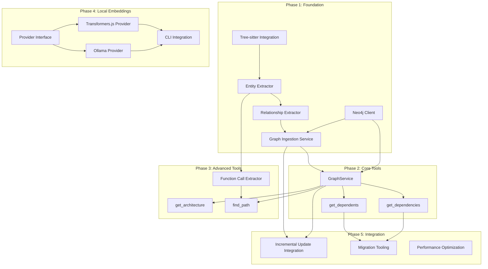

# Knowledge Graph and Local Embeddings Roadmap

**Version:** 1.0
**Date:** 2026-01-01
**Author:** Program Management
**Status:** Active

---

## Executive Summary

This roadmap defines the implementation plan for two major capabilities in the Personal Knowledge MCP system:

1. **Knowledge Graph (Neo4j)**: Add relationship-aware queries enabling dependency analysis, architecture exploration, and call chain tracing - capabilities that complement but cannot be achieved with vector search alone.

2. **Local Embeddings (Transformers.js + Ollama)**: Enable offline, cost-free, and privacy-preserving embedding generation by supporting local models alongside the existing OpenAI provider.

### Business Value

| Capability | Value Proposition |
|------------|-------------------|
| **Knowledge Graph** | Answer structural questions: "What depends on X?", "Show the call chain from A to B", "What would break if I modify this interface?" |
| **Local Embeddings** | Zero API costs, complete privacy, offline operation, no rate limits during heavy indexing |

### Key Decisions (from ADRs)

| Decision | Choice | Reference |
|----------|--------|-----------|
| Graph Database | Neo4j Community Edition | ADR-0002 |
| Primary Local Embeddings | Transformers.js | ADR-0003 |
| Optional GPU Acceleration | Ollama | ADR-0003 |
| Query Language | Cypher | ADR-0002 |
| Default Local Model | all-MiniLM-L6-v2 (384 dimensions) | ADR-0003 |

---

## Timeline Overview

| Phase | Focus | Duration | Target Dates |
|-------|-------|----------|--------------|
| **Phase 1** | Knowledge Graph Foundation | 2-3 weeks | Week 1-3 |
| **Phase 2** | Core Graph MCP Tools | 2-3 weeks | Week 3-6 |
| **Phase 3** | Advanced Graph Tools | 2 weeks | Week 5-7 |
| **Phase 4** | Local Embeddings Provider | 2 weeks | Week 6-8 |
| **Phase 5** | Integration and Polish | 1-2 weeks | Week 8-10 |

**Total Estimated Duration:** 8-10 weeks

### Phase Overlap Opportunities

Phases 2-4 have significant parallelization opportunities:

```
Week:    1    2    3    4    5    6    7    8    9    10
         |----Phase 1----|
                   |----Phase 2----|
                             |--Phase 3--|
                        |----Phase 4----|
                                        |--Phase 5--|
```

---

## Work Streams

This initiative can be organized into four parallel work streams with minimal collision:

### Work Stream A: Graph Infrastructure (Phase 1-2)

**Owner:** Backend/Infrastructure
**Focus:** Neo4j client, data model, connection management

| Task | Phase | Estimate | Dependencies |
|------|-------|----------|--------------|
| Neo4j client wrapper | 1 | M | None |
| Connection pooling | 1 | S | Neo4j client |
| Schema design and migration | 1 | M | Neo4j client |
| Health check integration | 1 | S | Neo4j client |
| GraphService implementation | 2 | M | Neo4j client |

### Work Stream B: Code Analysis Pipeline (Phase 1-3)

**Owner:** Backend/Data
**Focus:** AST parsing, entity extraction, relationship extraction

| Task | Phase | Estimate | Dependencies |
|------|-------|----------|--------------|
| Tree-sitter integration | 1 | M | None |
| Entity extractor (functions, classes) | 1 | M | Tree-sitter |
| Import relationship extractor | 1 | M | Entity extractor |
| Graph ingestion service | 1 | L | Neo4j client, Entity extractor |
| Function call extractor | 3 | M | Entity extractor |

### Work Stream C: MCP Tool Development (Phase 2-3)

**Owner:** Backend/API
**Focus:** MCP tool handlers, response schemas

| Task | Phase | Estimate | Dependencies |
|------|-------|----------|--------------|
| get_dependencies tool | 2 | M | GraphService |
| get_dependents tool | 2 | M | GraphService |
| get_architecture tool | 3 | M | GraphService |
| find_path tool | 3 | M | GraphService |
| Tool documentation | 2-3 | S | All tools |

### Work Stream D: Local Embeddings (Phase 4)

**Owner:** Backend/ML
**Focus:** Embedding provider abstraction, local providers

| Task | Phase | Estimate | Dependencies |
|------|-------|----------|--------------|
| Provider interface refactoring | 4 | S | None |
| Transformers.js provider | 4 | M | Provider interface |
| Ollama provider | 4 | M | Provider interface |
| Model download and caching | 4 | S | Transformers.js provider |
| CLI provider selection | 4 | S | Any provider |
| Provider status command | 4 | S | Any provider |

---

## Dependencies Between Work Items



### Critical Path

The critical path runs through:
1. Neo4j Client -> Graph Ingestion Service -> GraphService -> MCP Tools
2. Tree-sitter -> Entity Extractor -> Relationship Extractor -> Graph Ingestion Service

### Parallelization Opportunities

**Can run in parallel without collision:**

| Stream | Can Parallelize With |
|--------|---------------------|
| Neo4j Client (A) | Tree-sitter Integration (B) |
| Entity Extractor (B) | Neo4j Schema Design (A) |
| GraphService (A) | Function Call Extractor (B) |
| get_dependencies (C) | Transformers.js Provider (D) |
| get_architecture (C) | Ollama Provider (D) |
| All Phase 4 work (D) | Phase 2-3 MCP tools (C) |

**Must run sequentially:**

- Neo4j Client -> GraphService -> MCP Tools
- Tree-sitter -> Entity Extractor -> Relationship Extractor
- Provider Interface -> Provider Implementations

---

## Milestones and Checkpoints

### Milestone 1: Graph Infrastructure Ready (End of Week 2)

**Criteria:**
- [ ] Neo4j container running in Docker Compose
- [ ] Neo4j client successfully connects and executes queries
- [ ] Schema migration creates all required indexes and constraints
- [ ] Health check endpoint reports Neo4j status
- [ ] Unit tests passing with >90% coverage

### Milestone 2: Basic Graph Population (End of Week 3)

**Criteria:**
- [ ] Tree-sitter parses TypeScript/JavaScript files
- [ ] Entity extractor identifies functions and classes
- [ ] Relationship extractor captures import statements
- [ ] CLI command populates graph from repository
- [ ] Sample repository indexed with correct relationships

### Milestone 3: Core MCP Tools Functional (End of Week 5)

**Criteria:**
- [ ] get_dependencies tool returns accurate results
- [ ] get_dependents tool supports transitive queries
- [ ] Tools registered in MCP tool registry
- [ ] Claude Code can execute graph queries
- [ ] Performance within 100ms target for simple queries

### Milestone 4: Advanced Tools Complete (End of Week 7)

**Criteria:**
- [ ] get_architecture tool returns module structure
- [ ] find_path tool traces call chains
- [ ] Function call relationships extracted
- [ ] All tools documented with examples
- [ ] Integration tests with real repositories

### Milestone 5: Local Embeddings Functional (End of Week 8)

**Criteria:**
- [ ] Transformers.js provider generates embeddings
- [ ] Ollama provider connects and functions
- [ ] CLI supports --provider flag
- [ ] Provider status command shows available providers
- [ ] Offline indexing works without network

### Milestone 6: Production Ready (End of Week 10)

**Criteria:**
- [ ] Graph updates integrated with incremental indexing
- [ ] Migration tool for existing repositories
- [ ] Performance benchmarks meet targets
- [ ] All documentation updated
- [ ] End-to-end testing complete

---

## Risk Register

| ID | Risk | Impact | Probability | Mitigation | Owner | Status |
|----|------|--------|-------------|------------|-------|--------|
| R1 | Tree-sitter integration complexity | Medium | Medium | Start with TS/JS only; accept partial extraction | TBD | Open |
| R2 | Neo4j memory usage exceeds home lab limits | Medium | Low | Configure limits; test with large repos early | TBD | Open |
| R3 | Cypher query performance at scale | Medium | Medium | Benchmark regularly; add caching if needed | TBD | Open |
| R4 | Bun + ONNX Runtime compatibility issues | High | Medium | Ollama as fallback; test early with Bun canary | TBD | Open |
| R5 | Local embedding quality degradation | Medium | Medium | Document trade-offs; benchmark against OpenAI | TBD | Open |
| R6 | ChromaDB/Neo4j data consistency | Medium | Medium | Implement sync checks; provide recovery tools | TBD | Open |
| R7 | Model download failures in air-gapped environments | Low | High | Document manual model placement; cache validation | TBD | Open |
| R8 | Dimension mismatch when switching providers | Medium | Medium | Track provider per collection; warn before re-index | TBD | Open |

### Risk Response Plan

**R1 - Tree-sitter complexity:**
- Acceptance criteria: Basic function/class/import extraction working
- Fallback: Regex-based extraction for simple cases
- Timeline impact if realized: +1 week

**R4 - Bun + ONNX compatibility:**
- Test at start of Phase 4, not end
- Ollama provides pure HTTP alternative (no native modules)
- Timeline impact if realized: None (use Ollama)

---

## Assumptions

| ID | Assumption | Validated | Notes |
|----|------------|-----------|-------|
| A1 | Neo4j Community Edition sufficient for scale | Pending | Test with 100K+ nodes |
| A2 | Transformers.js works with current Bun version | Pending | Test early in Phase 4 |
| A3 | Tree-sitter has TypeScript bindings for Bun | Pending | Verify compatibility |
| A4 | Local models provide acceptable search quality | Pending | Benchmark against OpenAI |
| A5 | Developer workstations have 8GB+ RAM | Yes | Per PRD requirements |

---

## Progress Tracking

### Epic Issues

| Epic | GitHub Issue | Description |
|------|--------------|-------------|
| Knowledge Graph Foundation | #138 | Phase 1 - Neo4j infrastructure, AST parsing, and graph ingestion |
| Core MCP Graph Tools | #139 | Phase 2 - GraphService and dependency query tools |
| Advanced Graph Tools | #140 | Phase 3 - Architecture and path finding tools |
| Local Embeddings Provider | #141 | Phase 4 - Transformers.js and Ollama embedding providers |

### Phase 1: Knowledge Graph Foundation (Epic #138)

| Task | GitHub Issue | Dependencies | Status | Assigned | Notes |
|------|--------------|--------------|--------|----------|-------|
| ~~Create src/graph/ module structure~~ | ~~#142~~ | - | ✅ Complete | - | Closed via PR #178 |
| Implement Neo4jClient with connection management | #143 | ~~#142~~ | Not Started | - | |
| Create Neo4j schema and migration tool | #144 | #143 | Not Started | - | |
| Integrate tree-sitter for AST parsing | #145 | - | Not Started | - | |
| Implement EntityExtractor for functions/classes | #146 | #145 | Not Started | - | |
| Implement RelationshipExtractor for imports | #147 | #146 | Not Started | - | |
| Create GraphIngestionService | #148 | #143, #147 | Not Started | - | |
| Add CLI command: pk-mcp graph populate | #149 | #148 | Not Started | - | |
| Integrate Neo4j health into health checks | #150 | #143 | Not Started | - | |
| Write unit and integration tests | #151 | #148 | Not Started | - | |

### Phase 2: Core MCP Tools (Epic #139)

| Task | GitHub Issue | Dependencies | Status | Assigned | Notes |
|------|--------------|--------------|--------|----------|-------|
| Implement GraphService interface | #152 | #148 | Not Started | - | |
| Create get_dependencies tool handler | #153 | #152 | Not Started | - | |
| Create get_dependents tool handler | #154 | #152 | Not Started | - | |
| Register tools in MCP tool registry | #155 | #153, #154 | Not Started | - | |
| Write tests for new tools | #156 | #153, #154 | Not Started | - | |
| Document tools with usage examples | #157 | #155 | Not Started | - | |

### Phase 3: Advanced Tools (Epic #140)

| Task | GitHub Issue | Dependencies | Status | Assigned | Notes |
|------|--------------|--------------|--------|----------|-------|
| Enhance extraction for function calls | #158 | #146 | Not Started | - | |
| Implement get_architecture tool | #159 | #152 | Not Started | - | |
| Implement find_path tool | #160 | #152, #158 | Not Started | - | |
| Add Cypher queries for shortest path | #161 | #160 | Not Started | - | |
| Test with complex repositories | #162 | #159, #160 | Not Started | - | |

### Phase 4: Local Embeddings (Epic #141)

| Task | GitHub Issue | Dependencies | Status | Assigned | Notes |
|------|--------------|--------------|--------|----------|-------|
| Define EmbeddingProvider interface updates | #163 | - | Not Started | - | |
| Refactor OpenAIEmbeddingProvider | #164 | #163 | Not Started | - | |
| Implement TransformersJsEmbeddingProvider | #165 | #163 | Not Started | - | |
| Implement OllamaEmbeddingProvider | #166 | #163 | Not Started | - | |
| Add model download and caching logic | #167 | #165 | Not Started | - | |
| Update CLI with --provider flag | #168 | #165, #166 | Not Started | - | |
| Add provider status command | #169 | #168 | Not Started | - | |
| Store provider info in repository metadata | #170 | #168 | Not Started | - | |
| Update search service for provider routing | #171 | #170 | Not Started | - | |
| Write integration tests for local providers | #172 | #165, #166 | Not Started | - | |
| Document provider selection trade-offs | #173 | #172 | Not Started | - | |

### Phase 5: Integration and Polish

| Task | GitHub Issue | Dependencies | Status | Assigned | Notes |
|------|--------------|--------------|--------|----------|-------|
| Integrate graph into incremental updates | #174 | #152, #148 | Not Started | - | |
| Create graph populate-all command | #175 | #149 | Not Started | - | |
| Update backup scripts for Neo4j | #176 | #143 | Not Started | - | |
| Performance testing at scale | #177 | #162, #172 | Not Started | - | |
| Optional: ONNX Runtime provider | - | #163 | Not Started | - | Stretch goal |
| Final documentation | - | All | Not Started | - | Covers all phases |

---

## Success Criteria

### Technical Success

| Metric | Target | Measurement |
|--------|--------|-------------|
| Graph query latency (1 hop) | <100ms | Instrumented logging |
| Graph query latency (3 hops) | <300ms | Instrumented logging |
| Local embedding latency (single text) | <100ms | Benchmark |
| Test coverage | >90% | Coverage report |
| Memory usage (Neo4j) | <2GB | Container metrics |
| Memory usage (local embeddings) | <1GB peak | Profiling |

### Functional Success

| Criterion | Validation Method |
|-----------|-------------------|
| Dependency queries return accurate results | Compare with grep-based analysis |
| Architecture queries provide useful overview | Manual review of complex repos |
| Local embeddings work offline | Test with network disabled |
| Search quality acceptable | Compare top-10 results vs OpenAI |

### User Value Success

| Criterion | Measurement |
|-----------|-------------|
| Refactoring impact visible | User can see what depends on changed code |
| Architecture understandable | New user can explore codebase structure |
| Cost reduction | Users with local embeddings pay zero API costs |
| Privacy preserved | No code sent externally with local provider |

---

## References

- [Knowledge Graph PRD](./knowledge-graph-PRD.md)
- [ADR-0002: Knowledge Graph Architecture](../architecture/adr/0002-knowledge-graph-architecture.md)
- [ADR-0003: Local Embeddings Architecture](../architecture/adr/0003-local-embeddings-architecture.md)
- [Phase 1 System Design](../architecture/Phase1-System-Design-Document.md)
- [Neo4j TypeScript Driver](https://neo4j.com/docs/javascript-manual/current/)
- [Transformers.js Documentation](https://huggingface.co/docs/transformers.js)
- [Ollama API Documentation](https://github.com/ollama/ollama/blob/main/docs/api.md)

---

## Document History

| Version | Date | Author | Changes |
|---------|------|--------|---------|
| 1.0 | 2026-01-01 | Program Management | Initial roadmap |
| 1.1 | 2026-01-01 | Program Management | Added GitHub issue IDs (#138-177) and dependency tracking to Progress Tracking tables |
| 1.2 | 2026-01-02 | Program Management | Marked #142 (src/graph/ module structure) as complete via PR #178 |
